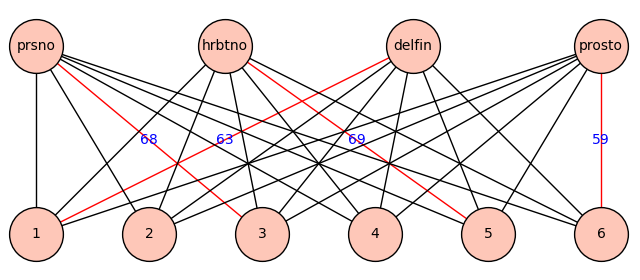
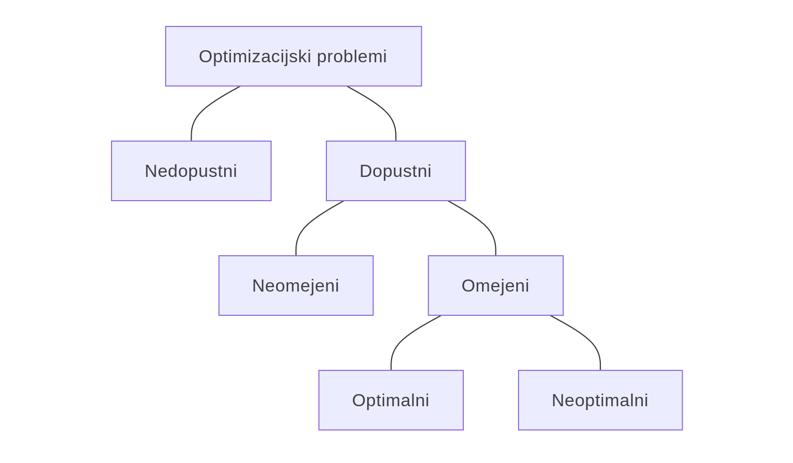

# Optimizacijske metode

* Predavanja:
  - Janoš Vidali ([janos.vidali@fmf.uni-lj.si](mailto:janos.vidali@fmf.uni-lj.si)), kabinet 1.14
  - torek od 11h do 12h v predavalnici 2.01
  - četrtek od 12h do 14h v predavalnici 2.01
* Vaje:
  - Timotej Hrga ([timotej.hrga@fmf.uni-lj.si](mailto:timotej.hrga@fmf.uni-lj.si)), kabinet 5.18
  - torek od 15h do 18h v predavalnici 1.01
  - sreda od 12h do 15h v predavalnici 2.05

---

# Obveznosti študentov

* Sprotno delo - domače naloge.
* Pisni izpit iz nalog. Izpit iz nalog se lahko opravlja tudi z dvema kolokvijema, pri čemer so pogoj za pristop h kolokviju pravočasno oddane domače naloge.
* Izpit iz teorije. Pogoj za pristop k izpitu iz teorije je uspešno opravljen izpit iz nalog.
    - Kot ustni izpit, ali
    - kot pisni izpit, z dodatnim (krajšim) ustnim izpitom za oceno 9 ali 10.

---

# Termini kolokvijev in izpitov

* Kolokviji:
  - 1\. kolokvij:
  - 2\. kolokvij: sreda, 27. maj 2026 ob 16:15 v 2.01 in 2.05
* Pisni izpiti:
  - 1\. pisni izpit: četrtek, 11. junij 2026 v 2.05, vaje ob 9:15, teorija ob 11:30
  - 2\. pisni izpit: petek, 26. junij 2026 v 2.05, vaje ob 9:15, teorija ob 11:30
  - 3\. pisni izpit: četrtek, 20. avgust 2026 v 2.05, vaje ob 9:15, teorija ob 11:30
  - 4\. pisni izpit iz teorije: četrtek, 27. avgust 2026 ob 10:15 v 2.01
* Ustni izpiti: po dogovoru

---

# Optimizacijski problemi

**_Primer._** Od doma do fakultete iščemo pot, ki je

* najkrajša
* najhitrejša
* najcenejša
* najbolj udobna
* ...

---

# Optimizacijski problem - definicija

* **_Definicija._** _Optimizacijski problem_ je trojica $(\Omega, f, \operatorname{opt})$, kjer je

  - $\Omega$ ... množica dopustnih (angl. _feasible_) rešitev
  - $f : \Omega \to \mathbb{R}$ ... ciljna (kriterijska) funkcija
  - $\operatorname{opt} \in \lbrace \min, \max, \inf, \sup \rbrace$ ... tip ekstrema

* Če velja $\Omega = \emptyset$, je problem _nedopusten_, sicer pa je _dopusten_.

---

# Primer 1

* Dan je sledeči optimizacijski problem.
  - $\Omega = [0, 3]$
  - $f(x) = x^2 - 3x + 2$
  - $\operatorname{opt} = \max$

* Metoda reševanja: kandidati za maksimum so ničle odvoda in krajišča dopustnega intervala.

* Pišemo:

  $$
  \begin{aligned}
  \max &\quad x^2 - 3x + 2 \\[1ex]
  \text{p.p.} &\quad 0 \le x \le 3
  \end{aligned}
  $$

  - p.p. ... pri pogojih
  - angl. _s.t._ (_subject to_, tudi _so that_, _such that_)

---

# Primer 2

* Dan je sledeči optimizacijski problem.
  - $\Omega = [0, 2] \times [0, 3]$
  - $f(x, y) = x^2 - y^2$
  - $\operatorname{opt} = \min$

* Metoda reševanja: kandidati za minimum so ničle parcialnih odvodov in rob dopustnega območja.

---

# Optimalna rešitev

* **_Definicija._** _Optimalna rešitev_ $(\Omega, f, \max)$ je $x^\ast \in \Omega$, da velja $\forall x \in \Omega: f(x) \le f(x^\ast)$. Vrednosti $f(x^\ast)$ pravimo _optimalna vrednost_.
* Podobno, če $\operatorname{opt} = \min$.

* **Pozor!** ~~"bolj optimalna rešitev"~~

---

# Primer 3

Na kmetiji velikosti 50 ha želimo gojiti pšenico, koruzo in krompir. Na voljo imamo 5000 človek-ur dela in 24000 € kapitala ter sledeče podatke

|         | delo (človek-ur/ha) | stroški (€/ha) | dobiček (€/ha) |
| ------- | ------------------- | -------------- | -------------- |
| pšenica |  60                 | 240            | 400            |
| koruza  |  80                 | 400            | 600            |
| krompir | 100                 | 320            | 480            |

Koliko ha posameznega pridelka naj posadimo, da bo dobiček čim večji?

---

# Primer 3 - zapis

$$
\begin{aligned}
\max &\ & 400 x_1 + 600 x_2 + 480 x_3 \\[1ex]
\text{p.p.} && x_1 + x_2 + x_3 &\le 50 \\
&&  60 x_1 +  80 x_2 + 100 x_3 &\le 5000 \\
&& 240 x_1 + 400 x_2 + 320 x_3 &\le 24000 \\
&& x_1, x_2, x_3 &\ge 0
\end{aligned}
$$

Taki nalogi rečemo _linearni program_ (LP).

---

# Primer 4

Imamo $2n$ jabolk z masami $w_1, w_2, \dots, w_{2n}$. Jabolka bi radi razdelili v dve košari tako, da je v vsaki košari $n$ jabolk in da sta masi obeh košar čim bliže.

- $\Omega = \lbrace A \subseteq \lbrace 1, 2, \dots, 2n \rbrace \mid \vert A \vert = n\rbrace$
- $f(A) = \vert \sum_{i \in A} w_i - \sum_{i \in A^c} w_i \vert$
- $\operatorname{opt} = \min$

---

# Primer 4 - zapis

Drugače zapisano:

$$
\begin{aligned}
\Omega &= {\lbrace -1, 1 \rbrace}^{2n} \\
x_i &= \begin{cases}
1 & \text{$i$-to jabolko v levi košari} \\
-1 & \text{$i$-to jabolko v desni košari} \\
\end{cases}
\end{aligned}
$$

$$
\begin{aligned}
&& \min \ \left\vert \sum_{i=1}^{2n} w_i x_i \right\vert \\
\text{p.p.} && \sum_{i=1}^{2n} x_i &= 0 \\
&& x_1, x_2, \dots, x_{2n} &\in \lbrace -1, 1 \rbrace
\end{aligned}
$$

---

# Primer 5

Ana, Barbara, Cvetka in Darja želijo prečkati most. Naenkrat lahko most prečkata le dve od njiju, imajo pa eno samo svetilko. Za prečkanje mostu A, B, C, D potrebujejo 1, 2, 5 oziroma 10 minut - pri skupnem prečkanju seveda potrebujejo toliko časa kot počasnejša od njiju. Kako naj prečkajo most, da bodo čim hitrejše?

---

# Primer 5 - predstavitev

* Definiramo graf z množico vozlišč $V = \mathcal{P}\lbrace A, B, C, D, s \rbrace$ - vsako vozlišče predstavlja stanje na eni strani mostu.
* Vozlišči $u$ in $v$ sta sosedni, če lahko z enim prečkanjem pridemo od stanja $u$ do stanja $v$ (tj., $s \in u \oplus v$, $2 \le \vert u \oplus v \vert \le 3$ in $u \subset v$ ali $v \subset u$).
* Uteži povezav so porabljeni časi.
* Iščemo najkrajšo pot med $\emptyset$ in $\lbrace A, B, C, D, s \rbrace$.
* Rešujemo z Dijkstrovim algoritmom - spoznali ga bomo pri predmetu Operacijske raziskave.

---

# Primer 6

Sestaviti želimo čim hitrejšo štafeto.

|   | prsno | hrbtno | delfin | prosto |
| - | ----- | ------ | ------ | ------ |
| 1 | 65    | 73     | 63     | 57     |
| 2 | 67    | 76     | 65     | 58     |
| 3 | 68    | 72     | 69     | 55     |
| 4 | 67    | 75     | 70     | 59     |
| 5 | 71    | 69     | 75     | 57     |
| 6 | 69    | 71     | 66     | 59     |

---

# Primer 6 - dopustna rešitev

Primer rešitve (ne nujno optimalne!):

- prsno 3 (68)
- hrbtno 5 (69)
- delfin 1 (63)
- prosto 6 (59)

---

# Primer 7

* Potujoči trgovec iz Ljubljane želi obiskati London, Pariz, Madrid, Berlin.

  |    | Lj | Lo | P  | M  | B  |
  | -- | -- | -- | -- | -- | -- |
  | Lj |  / |  5 | 10 |  5 | 10 |
  | Lo |  5 |  / | 10 |  1 |  5 |
  | P  | 10 | 10 |  / |  5 |  5 |
  | M  |  5 |  1 |  5 |  / |  1 |
  | B  | 10 |  5 |  5 |  1 |  / |

* Primer poti: Lj - B - P - Lo - M - Lj, cena 10+5+10+1+5 = 31

* Iščemo najcenejšo pot, torej najcenejši Hamiltonov cikel. To je **problem potujočega trgovca** - učinkovit algoritem ni znan!

---

# Optimizacijski problemi

---

# Optimizacijski problemi - primeri

* Nedopustni problemi: $\Omega = \emptyset$

  $$
  \begin{aligned}
  \max \ 2x - y^2 \\
  \text{p.p.} \quad
  x - y &\le 1 \\
  -x + y &\le -2
  \end{aligned}
  $$

* Dopustni problemi: $\Omega \ne \emptyset$
  * Neomejeni problemi

    $$
    \begin{aligned}
    \max \ 2x - y^2 \\
    \text{p.p.} \quad
    x &\ge 0 \\
    y &\le 5
    \end{aligned}
    $$

  * Omejeni problemi

---

# Optimizacijski problemi - primeri (2)

* Omejeni problemi
  * Optimalni problemi

    $$
    \begin{aligned}
    \max \ x^2 + y^2 \\
    \text{p.p.} \quad
    0 \le x &\le 2 \\
    0 \le y &\le 1
    \end{aligned}
    $$

  * Neoptimalni problemi

    $$
    \begin{aligned}
    \max \ x^2 + y^2 \\
    \text{p.p.} \quad
    0 \le x &< 2 \\
    0 \le y &< 1
    \end{aligned}
    $$
