# Problem razvoza

* **_Primer._** Imamo 3 mesta, v mestu $a$ proizvedejo 7 enot mleka, v $b$ ga porabijo 4 enote, v $c$ pa ga porabijo 3 enote.
* Prevoz po cesti ima določeno ceno na enoto:

  - $a \to b: 1$
  - $a \to c: 3$
  - $b \to c: 1$
  - $c \to b: 6$

* Kako najceneje prenesti mleko od proizvajalcev do porabnikov?

---

# Predstavitev z grafom

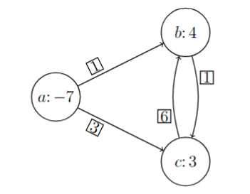

---

# Možni rešitvi

* Rešitev 1:

  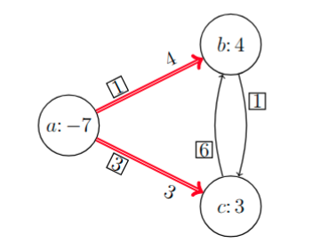

  Cena: $4 \cdot 1 + 3 \cdot 3 = 13$

* Rešitev 2:

  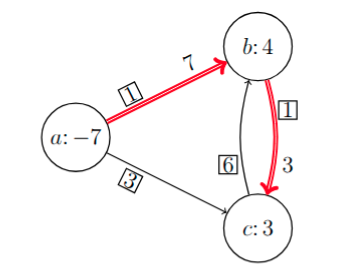

  Cena: $7 \cdot 1 + 3 \cdot 1 = 10$

---

# Pogoji

* Imamo usmerjen utežen graf $G = (V, E)$, kjer je $V$ množica vozlišč in $E$ množica usmerjenih povezav, ter uteži na vozliščih $b_v \in \mathbb{R}$ ($v \in V$) in uteži na povezavah $c_{uv} \in \mathbb{R}$ ($uv \in E$), kjer:

  - $b_v \ge 0$, če je v vozlišču $v$ poraba $b_v$, in
  - $b_v < 0$, če je v vozlišču $v$ proizvodnja $-b_v$.

* Predpostavimo $\sum_{v \in V} b_v = 0$.

* Iščemo $x_{uv} \ge 0$ za vsako povezavo $uv \in E$, tako da velja **_Kirchhoffov zakon_**:

  $$
  \forall v \in V: \sum_{uv \in E} x_{uv} - \sum_{vu \in E} x_{vu} = b_v.
  $$

* Radi bi minimizirali ceno $\sum_{uv \in E} c_{uv} x_{uv}$.

---

# Primer

* V našem primeru:

  $$
  \begin{aligned}
  \min &\ & x_{ab} + 3 x_{ac} + x_{bc} + 6 x_{cb} \\[1ex]
  \text{p.p.} && -x_{ab} - x_{ac} &= -7 \\
  && x_{ab} + x_{cb} - x_{bc} &= 4 \\
  && x_{ac} + x_{bc} - x_{cb} &= 3 \\
  && x_{ab}, x_{ac}, x_{bc}, x_{cb} &\ge 0
  \end{aligned}
  $$

* To je linearni program, lahko ga rešimo z dvofazno simpleksno metodo.
* Spoznali bomo prilagojen algoritem: **simpleksna metoda na omrežjih**.

---

# Problem razvoza kot linearni program

* Naj bo $A \in \mathbb{R}^{V \times E}$ _incidenčna matrika_ usmerjenega grafa $G = (V, E)$, tj., $A = (a_{ve})_{v \in V, e \in E}$, kjer je

  $$
  a_{ve} = \begin{cases}
  1 & \operatorname{konec}(e) = v, \\
  -1 & \operatorname{začetek}(e) = v, \text{in} \\
  0 & \text{sicer,}
  \end{cases}
  $$

  ter $b \in \mathbb{R}^V$ in $c \in \mathbb{R}^E$ vektorja uteži vozlišč in povezav.
* Potem lahko _problem razvoza_ $\Pi$ zapišemo kot

  $$
  \begin{aligned}
  \min \ c^\top x \\[1ex]
  \text{p.p.} \quad A x &= b \\
  x &\ge 0
  \end{aligned}
  $$

---

# Dual problema razvoza

* Ekvivalenten zapis $\Pi$:

  $$
  \begin{aligned}
  \max \ -c^\top x \\[1ex]
  \text{p.p.} \quad -A x &= -b \\
  x &\ge 0
  \end{aligned}
  $$

* Dual $\Pi'$ problema razvoza $\Pi$ je potem

  $$
  \begin{aligned}
  \min \ -b^\top y \\[1ex]
  \text{p.p.} \quad -A^\top y &\ge -c
  \end{aligned}
  $$

* Ekvivalentno ga lahko zapišemo kot

  $$
  \begin{aligned}
  \max \ b^\top y \\[1ex]
  \text{p.p.} \quad A^\top y &\le c
  \end{aligned}
  $$

---

# Dualno dopolnjevanje

* Ker ima matrika $A$ vrednosti v stolpcu, ki ustreza povezavi $uv$, vrednosti $-1$ in $1$ v vrsticah, ki ustrezata vozliščema $u$ oziroma $v$, in $0$ drugod, lahko dual problema razvoza zapišemo tudi kot

  $$
  \begin{aligned}
  \max \ \sum_{v \in V} b_v y_v \\[1ex]
  \text{p.p.} \quad \forall uv \in E: \ y_u + c_{uv} &\ge y_v
  \end{aligned}
  $$

* Opazimo, da če je $y$ dopustna (optimalna) rešitev $\Pi'$, potem je tudi $y + \epsilon$ ($\epsilon \in \mathbb{R}$) dopustna (optimalna) rešitev $\Pi'$, saj velja

  $$
  \sum_{v \in V} b_v (y_v + \epsilon) = \sum_{v \in V} b_v y_v + \epsilon \sum_{v \in V} b_v = \sum_{v \in V} b_v y_v.
  $$

* Vemo tudi (dualno dopolnjevanje): če sta $x$ in $y$ dopustni rešitvi za $\Pi$ oziroma $\Pi'$, potem sta $x, y$ tudi optimalni natanko tedaj, ko velja

  $$
  \forall uv \in E: \ (x_{uv} = 0 \ \lor \ y_u + c_{uv} = y_v)
  $$

---

# Primer

* Rešitev 1 je dopustna, ni pa optimalna:

  $$
  \begin{aligned}
  y_a &= 0 \\
  y_b = y_a + 1 &= 1 \\
  y_c = y_a + 3 &= 3 \\
  y_b + 1 &\not\ge y_c \\
  y_c + 6 &\ge y_b
  \end{aligned}
  $$

* Rešitev 2 je dopustna in tudi optimalna:

  $$
  \begin{aligned}
  y_a &= 0 \\
  y_b = y_a + 1 &= 1 \\
  y_c = y_b + 1 &= 2 \\
  y_a + 3 &\ge y_c \\
  y_c + 6 &\ge y_b
  \end{aligned}
  $$

---

# Dualno dopolnjevanje, drugič

Kdaj je sistem $\forall uv \in E': \ y_u + c_{uv} = y_v$ ($E' \subseteq E$) rešljiv?

* 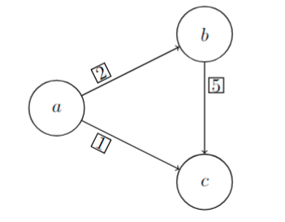

* 
  $$
  \begin{aligned}
  y_a &= 0 \\
  y_b = y_a + 2 &= 2 \\
  y_c = y_a + 1 &= 1 \\
  y_c \ne y_b + 5 &= 7
  \end{aligned}
  $$

---

# Dualno dopolnjevanje, drugič (2)

* 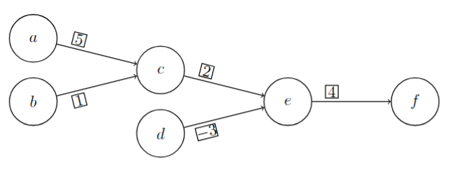

* 
  $$
  \begin{alignedat}{3}
  &&&& y_a &= 0 \\
  && y_c &=& y_a + 5 &= 5 \\
  y_c &= y_b + 1 &&\Rightarrow&\ y_b &= 4 \\
  && y_e &=& y_c + 2 &= 7 \\
  y_e &= y_d + (-3) &&\Rightarrow&\ y_d &= 10 \\
  && y_f &=& y_e + 4 &= 11
  \end{alignedat}
  $$

* Problem so cikli!
* Tak sistem enačb je vedno rešljiv na drevesu (tj., povezanem grafu brez ciklov).
  - V drevesu je med vsakima vozliščema natanko ena pot.

---

# Drevesna dopustna rešitev

* **_Definicija._** Dopustna rešitev $x$ za problem razvoza $\Pi$ na grafu $G = (V, E)$ je _drevesna dopustna rešitev_, če v grafu $G$ obstaja vpeto drevo $T = (V, E')$, da velja $x_e = 0$ za vsak $e \in E \setminus E'$.

  

  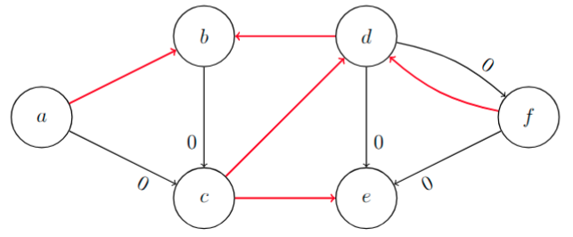

  

* **_Trditev._** Če ima problem razvoza $\Pi$ dopustno rešitev, ima tudi drevesno dopustno rešitev.

---

# Preme in obratne povezave

**_Definicija._** Naj bo $G$ usmerjen graf in $C$ cikel v $G$, ki vsebuje povezavo $f$. Potem je povezava $e$ v ciklu $C$ (glede na povezavo $f$) _prema_, če kaže v isto smer kot $f$, in _obratna_ sicer.

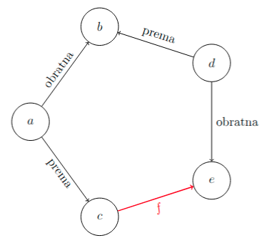

---

# Dokaz obstoja DDR

* Naj bo $x$ dopustna rešitev za problem razvoza $\Pi$ na grafu $G = (V, E)$.
* Naj bo $E^{(0)} = E$ in $x^{(0)} = x$.
* Definirali bomo zaporedje $\lbrace (E^{(i)}, x^{(i)}) \rbrace_{i=0}^k$, tako da v $i$-tem koraku dobimo $E^{(i)}$ tako, da iz $E^{(i-1)}$ odstranimo eno povezavo in določimo novo dopustno rešitev $x^{(i)}$ tako, da velja $x_e^{(i)} = 0$ za vsako povezavo $e \in E \setminus E^{(i)}$, dokler ne dobimo vpetega drevesa $T = (V, E^{(k)})$.
* Denimo, da ima graf $G^{(i-1)} = (V, E^{(i-1)})$ cikel $C$, in naj bo $f$ povezava na $C$ z najmanjšo vrednostjo $x_f^{(i-1)}$.

---

# Dokaz obstoja DDR (2)

* Določimo novo dopustno rešitev

  $$
  x_e^{(i)} = \begin{cases}
  x_e^{(i-1)} - x_f^{(i-1)} & \text{$e$ prema v $C$ glede na $f$,} \\
  x_e^{(i-1)} + x_f^{(i-1)} & \text{$e$ obratna v $C$ glede na $f$,} \\
  x_e^{(i-1)} & \text{sicer}
  \end{cases}
  $$

  in novo množico povezav $E^{(i)} = E^{(i-1)} \setminus \lbrace f \rbrace$.
* Opazimo, da velja $x^{(i)} \ge 0$, $x_f^{(i)} = 0$ in $x_e^{(i)} = 0$ za vsako povezavo $e \in E \setminus E^{(i-1)}$.

---

# Dokaz obstoja DDR (3)

Rešitev ustreza pogojem in je dopustna, saj še vedno velja Kirchhoffov zakon:

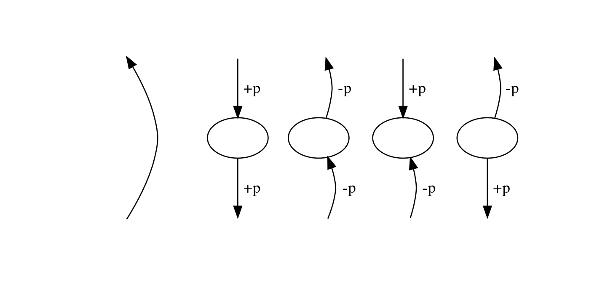

---

# Primer

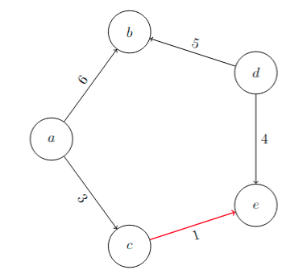

---

# Spremembe razvozov

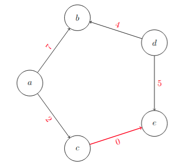

---

# Enoličnost DDR

* **Opomba.** Drevo določa dopustno rešitev, če ta obstaja.
* Naj bo $u$ list v drevesu $T$ in $e$ povezava v $T$ s krajiščem $u$.
* Potem je $x_e$ enolično določen.
* Postopek ponovimo za drevo $T - u$, dokler imamo še kakšno povezavo.

  

  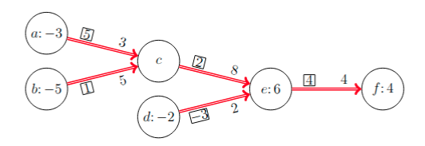

  

---

# Simpleksna metoda na omrežjih

* 1\. Začnemo z neko drevesno dopustno rešitvijo $x$ (jo uganemo; kasneje sistematično) na vpetem drevesu $T = (V, E')$: $x_e = 0$ za vsako povezavo $e \in E \setminus E'$.
* 2\. Rešimo sistem $\forall uv \in E': \ y_u + c_{uv} = y_v$ (vrednosti $y_v$, $v \in V$ so _razvozne cene_).
   * Preverimo, ali velja $y_u + c_{uv} \ge y_v$ za vsako povezavo $uv \in E \setminus E'$.
     * Če velja, je $x$ optimalna rešitev (po dualnem dopolnjevanju).

---

# Simpleksna metoda na omrežjih (2)

* 2\. Rešimo sistem $\forall uv \in E': \ y_u + c_{uv} = y_v$ (nadaljevanje).
   * Sicer obstaja povezava $e = uv \in E \setminus E'$, za katero velja $y_u + c_e < y_v$.
     * Ta povezava (_vstopna povezava_) je v natanko enem (edinem) ciklu $C$ v grafu $H = (V, E' \cup \lbrace e \rbrace)$.
     * Naj bo $f$ obratna povezava v $C$ glede na $e$ z najmanjšo vrednostjo $x_f$ (_izstopna povezava_).
     * Razvoz povečamo za $x_f$ na premih povezavah na $C$ glede na $e$ (obratnih glede na $f$) in zmanjšamo za $x_f$ na obratnih povezavah na $C$ glede na $e$ (premih glede na $f$).
     * V novi rešitvi ima povezava $f$ ničeln razvoz in jo odstranimo iz drevesa.
   * Če obratne povezave na $C$ ni, potem je problem neomejen.
* 3\. Ponavljamo, dokler ne pridemo do optimalne rešitve (ali ugotovimo, da je problem neomejen).

---

# Primer

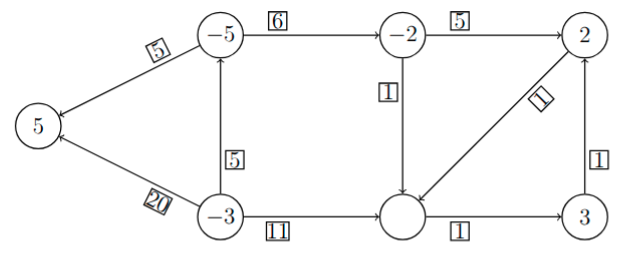

---

# Primer (2)

Določimo začetno drevesno dopustno rešitev, razvozne cene in kandidate za vstop ter izberemo vstopno in izstopno povezavo:

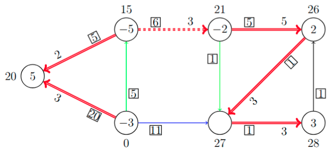

---

# Primer (3)

Povezavam na ciklu spremenimo razvoz za $3$:

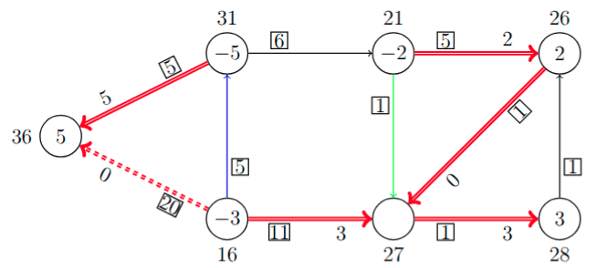

---

# Primer (4)

Izstopna povezava je imela razvoz $0$ - razvozi se ne spremenijo, spremeni se le drevo in razvozne cene (_izrojen korak_):

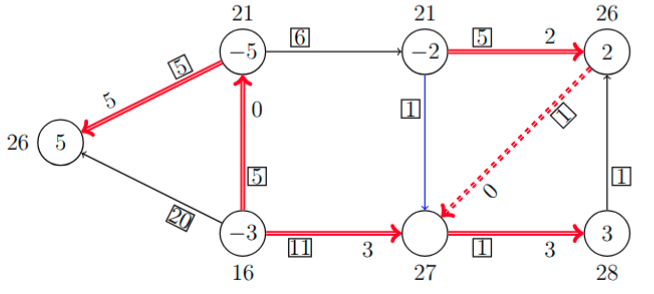

---

# Primer (5)

Še en izrojen korak:

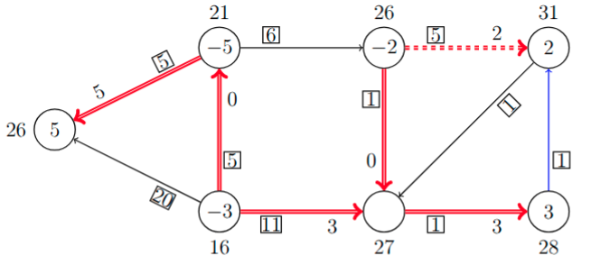

---

# Primer (6)

Povezavam na ciklu spremenimo razvoz za $2$:

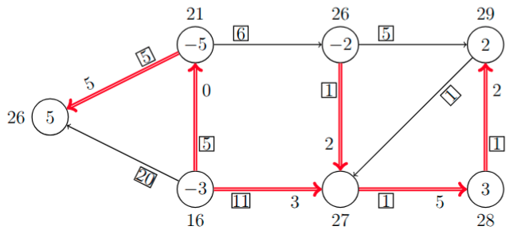

---

# Primer (7)

* Ni več kandidatov za vstop - dobili smo optimalno rešitev s ceno

  $$
  \sum_{e \in E} c_e x_e = 5 \cdot 5 + 5 \cdot 0 + 11 \cdot 3 + 1 \cdot 2 + 1 \cdot 5 + 1 \cdot 2 = 67.
  $$

* Preverimo še optimalno vrednost dualnega problema:
  $$
  \sum_{v \in V} b_v y_v = 5 \cdot 26 + (-5) \cdot 21 + (-3) \cdot 16 + (-2) \cdot 26 + 0 \cdot 27 + 2 \cdot 29 + 3 \cdot 28 = 67
  $$

---

# Korak simpleksne metode na omrežjih

**Opomba.** Če je $y_u + c_{uv} < y_v$ in je $C$ cikel v $H$, ki vsebuje $uv$, to pomeni, da je

$$
\sum_{e \in C \text{ prema}} c_e - \sum_{e \in C \text{ obratna}} c_e < 0.
$$

* 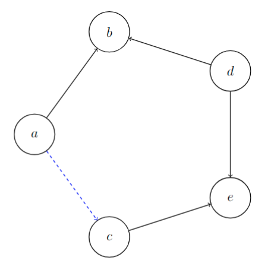

* 
  $$
  \begin{aligned}
  y_b &= y_a + c_{ab} \\
  y_d &= y_b - c_{db} \\
      &= y_a + c_{ab} - c_{db} \\
  y_e &= y_d + c_{de} \\
      &= y_a + c_{ab} - c_{db} + c_{de} \\
  y_c &= y_e - c_{ce} \\
     &= y_a + c_{ab} - c_{db} + c_{de} - c_{ce} \\[1ex]
  y_a + c_{ac} &< y_a + c_{ab} - c_{db} + c_{de} - c_{ce} \\
  0 &> c_{ac} + c_{ce} - c_{de} + c_{db} - c_{ab}
  \end{aligned}
  $$

---

# Korak simpleksne metode na omrežjih (2)

* Ko razvoz na premih povezavah povečamo za $p$ in ga na obratnih povezavah zmanjšamo za $p$, se cena poveča za

  $$
  p (c_{ac} + c_{ce} - c_{de} + c_{db} - c_{ab})
  $$

  oziroma v splošnem za

  $$
  p \left(\sum_{e \in C \text{ prema}} c_e - \sum_{e \in C \text{ obratna}} c_e\right).
  $$

* Če je $p > 0$, se cena torej zmanjša.
* **Opomba.** Če ne moremo izbrati izstopne povezave, so vse povezave na $C$ preme in velja $\sum_{e \in C} c_e < 0$.
  * Našli smo negativen cikel, problem razvoza je torej neomejen.

---

# Optimalnost končne rešitve

* **_Trditev._** Če velja $\forall uv \in E: \ y_u + c_{uv} \ge y_v$ (z enakostjo pri vseh povezavah $uv \in E'$ vpetega drevesa $T = (V, E')$), je rešitev optimalna.

* _Dokaz._ Naj bo $x'$ še ena dopustna rešitev. Potem velja

  $$
  \forall uv \in E: \ (y_u + c_{uv} - y_v) x_{uv}' \ge (y_u + c_{uv} - y_v) x_{uv} = 0,
  $$

  saj

  - če $uv \in E'$, potem $y_u + c_{uv} - y_v = 0$, in
  - če $uv \not\in E'$, potem $x_{uv} = 0$, $(y_u + c_{uv} - y_v) x_{uv}' \ge 0$.

* Če seštejemo za vse povezave, dobimo
  $$
  \begin{aligned}
  0 &\le \sum_{uv \in E} c_{uv} (x_{uv}' - x_{uv}) - \sum_{uv \in E} (y_v - y_u) (x_{uv}' - x_{uv}) = c^\top (x' - x) - (A^\top y)^\top (x' - x) = \\
  &= c^\top x' - c^\top x - y^\top A x' + y^\top A x = c^\top x' - c^\top x - y^\top b + y^\top b .
  \end{aligned}
  $$

* Velja torej $c^\top x' \ge c^\top x$.

---

# Ciklanje

* **Opomba.** Tudi pri simpleksni metodi za omrežja lahko pride do ciklanja.
* Temu se lahko izognemo z uporabo _Cunninghamovega pravila_:

  * izberemo _koren_ $r \in V$;
  * ko izbiramo izstopno povezavo v ciklu $C$ z vstopno povezavo $e = uv$, določimo vozlišče $z$ na $C$, ki leži na poteh (v drevesu - brez $e$) od $r$ do $u$ oziroma $v$, in za izstopno povezavo izberemo prvega kandidata na $C$ od $z$ naprej v smeri $uv$.
    
    

    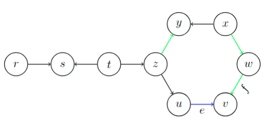

    

---

# Dvofazna simpleksna metoda na omrežjih

* Kako pridemo do začetne dopustne rešitve oziroma dokažemo, da je problem nedopusten?
* Uporabimo **dvofazno simpleksno metodo na omrežjih**.
* Definiramo pomožni problem:
  * Izberemo _koren_ $r \in V$.
  * Za vsako vozlišče $v \in V \setminus \lbrace r \rbrace$:
    - če $b_v \ge 0$ in povezava $rv$ ne obstaja, jo dodamo;
    - če $b_v < 0$ in povezava $vr$ ne obstaja, jo dodamo.
  * Dobimo nov graf $\tilde{G} = (V, \tilde{E})$. Dodanim povezavam (iz $\tilde{E} \setminus E$) pravimo _umetne povezave_, povezavam iz $E$ pa _prvotne povezave_.
  * Definiramo nove cene $\tilde{c}$, in sicer
    - prvotne povezave $e \in E$ imajo ceno $\tilde{c}_e = 0$, in
    - umetne povezave $e \in \tilde{E} \setminus E$ imajo ceno $\tilde{c}_e = 1$.

---

# Dvofazna simpleksna metoda na omrežjih (2)

* Ta problem je vedno dopusten:

  - $x_{rv} = b_v$ za vse $v \in V \setminus \{r\}$ z $b_v \ge 0$,
  - $x_{vr} = -b_v$ za vse $v \in V \setminus \{r\}$ z $b_v < 0$,
  - $x_e = 0$ za vse ostale povezave $e \in \tilde{E}$.

* Kirchhofovi zakoni:

  - $v \ne r$, $b_v \ge 0$: $x_{rv} = b_v$
  - $v \ne r$, $b_v < 0$: $-x_{vr} = b_v$
  - $v = r$: $-\sum_{\substack{u \ne r \\ b_u \ge 0}} x_{ru} + \sum_{\substack{u \ne r \\ b_u < 0}} x_{ur} = -\sum_{\substack{u \ne r \\ b_u \ge 0}} b_u + \sum_{\substack{u \ne r \\ b_u < 0}} (-b_u) = -\sum_{u \ne r} b_u = b_r$

* Prvotni problem je dopusten natanko tedaj, ko je optimalna vrednost pomožnega problema enaka $0$.
* Ker so vse cene v pomožnem problemu nenegativne, je problem omejen.

---

# Primer

Dokažimo, da je problem nedopusten.

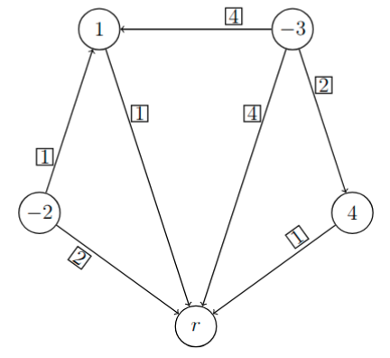

---

# Primer (2)

Narišimo graf za pomožni problem in določimo začetno drevesno rešitev.

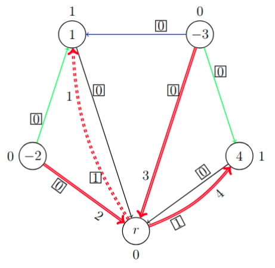

---

# Primer (3)

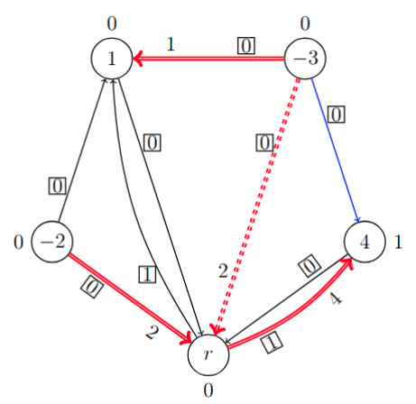

---

# Primer (4)

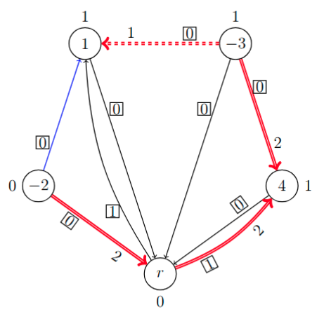

---

# Primer (5)

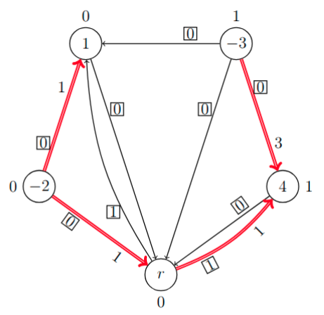

* Ni več kandidatov za vstop - imamo optimalno rešitev pomožnega problema.
* Ker ta vključuje umetno povezavo s pozitivnim razvozom, je prvotni problem nedopusten.

---

# Neuravnotežena povpraševanje in ponudba

* **Opomba.** Če je $\sum_{v \in V} b_v > 0$, ne moremo zadostiti vsem potrebam.
* Če je $\sum_{v \in V} b_v < 0$, dodamo umetno vozlišče $s \not\in V$ ("skladišče") in povezavo od vseh izvorov (vozlišč $v \in V$ z $b_v < 0$) do $s$ s ceno $0$ ter določimo $b_s = -\sum_{v \in V} b_v$.

---

# Izrek o celoštevilskih rešitvah

* Dan je problem razvoza s celoštevilskimi vrednostmi $b_v$ ($v \in V$).

  

  1. Če obstaja dopustna rešitev, obstaja tudi celoštevilska dopustna rešitev.
  2. Če obstaja optimalna rešitev, obstaja tudi celoštevilska optimalna rešitev.

  

* _Dokaz._
  * Naredimo dvofazno simpleksno metodo na omrežjih.
  * Na vsakem koraku imamo celoštevilsko rešitev; če je problem dopusten, dobimo celoštevilsko dopustno rešitev.
  * Tedaj naredimo še drugo fazo, na vsakem koraku imamo celoštevilsko rešitev.
  * Če pridemo do optimalne rešitve, bo ta celoštevilska.

---

# Dvojno stohastične matrike

* **_Definicija._** Matrika $A = (a_{ij})_{i,j=1}^n \in \mathbb{R}^{n \times n}$ je _dvojno stohastična_, če velja $a_{ij} \ge 0$ ($1 \le i, j \le n$) ter $\sum_{j=1}^n a_{ij} = 1$ ($1 \le i \le n$) in $\sum_{i=1}^n a_{ij} = 1$ ($1 \le j \le n$).

* **_Primer_** dvojno stohastične matrike:

  $$
  \begin{bmatrix}
  0   & 0.9 & 0.1 \\
  0.4 & 0.1 & 0.5 \\
  0.6 & 0   & 0.4
  \end{bmatrix}
  $$

---

# Permutacijske matrike

* **_Definicija._** Matrika $P = (p_{ij})_{i,j=1}^n \in {\lbrace 0, 1 \rbrace}^{n \times n}$ je _permutacijska matrika_, če je v vsaki vrstici in v vsakem stolpcu natanko ena enica.

* **_Primeri_** za $n = 3$:

  $$
  \begin{array}{cccccc}
  \begin{bmatrix}
  1 & 0 & 0 \\
  0 & 1 & 0 \\
  0 & 0 & 1
  \end{bmatrix}, &
  \begin{bmatrix}
  1 & 0 & 0 \\
  0 & 0 & 1 \\
  0 & 1 & 0
  \end{bmatrix}, &
  \begin{bmatrix}
  0 & 1 & 0 \\
  1 & 0 & 0 \\
  0 & 0 & 1
  \end{bmatrix}, &
  \begin{bmatrix}
  0 & 1 & 0 \\
  0 & 0 & 1 \\
  1 & 0 & 0
  \end{bmatrix}, &
  \begin{bmatrix}
  0 & 0 & 1 \\
  1 & 0 & 0 \\
  0 & 1 & 0
  \end{bmatrix}, &
  \begin{bmatrix}
  0 & 0 & 1 \\
  0 & 1 & 0 \\
  1 & 0 & 0
  \end{bmatrix} \\
  123 & 132 & 213 & 231 & 312 & 321
  \end{array}
  $$

* Imamo $n!$ permutacijskih matrik velikosti $n \times n$.
* Permutacijske matrike so dvojno stohastične.

---

# Permutacijske in dvojno stohastične matrike

* **_Trditev._** Naj bo $A \in \mathbb{R}^{n \times n}$ dvojno stohastična matrika. Potem obstaja permutacijska matrika $P \in {\lbrace 0, 1 \rbrace}^{n \times n}$, tako da velja $p_{ij} = 1 \Rightarrow a_{ij} > 0$ ($1 \le i, j \le n$).

* _Dokaz._ Naj bo $G = (V, E)$ usmerjen graf z množico vozlišč $V = \lbrace v_i, s_i \mid 1 \le i \le n \rbrace$ in množico povezav $E = \lbrace v_i s_j \mid a_{ij} > 0 \rbrace$.
* Postavimo še $b_{v_i} = -1$, $b_{s_i} = 1$ ($1 \le i \le n$) in $c_{v_i s_j} = 0$ ($v_i s_j \in E$).
* Dobljeni problem razvoza je dopusten, saj obstaja dopustna rešitev z $x_{v_i s_j} = a_{ij}$ ($v_i s_j \in E$):

  $$
  \begin{alignedat}{4}
  v_i&:& -\sum_{v_i s_j \in E} x_{v_i s_j} &=& -\sum_{j=1}^n a_{ij} &=& -1 &= b_{v_i} \\
  s_j&:& \sum_{v_i s_j \in E} x_{v_i s_j} &=& \sum_{i=1}^n a_{ij} &=& 1 &= b_{s_j}
  \end{alignedat}
  $$

---

# Nadaljevanje dokaza

* Ker obstaja dopustna rešitev $x$, obstaja tudi celoštevilska dopustna rešitev $x'$:

  $$
  \begin{alignedat}{3}
  v_i&:& -\sum_{v_i s_j \in E} x_{v_i s_j}' &=& -1 &= b_{v_j}, \\
  s_j&:& \sum_{v_i s_j \in E} x_{v_i s_j}' &=& 1 &= b_{s_j},
  \end{alignedat}
  $$

  kjer je v zgornjih vsotah natanko eden od $x_{v_i s_j}'$ enak $1$, ostali pa so enaki $0$.
* Tako lahko dobimo permutacijsko matriko $P$, kjer je $p_{ij} = 1$, če je $x_{v_i s_j}' = 1$, in $p_{ij} = 0$ sicer.
* Očitno potem velja $p_{ij} = 1 \Rightarrow a_{ij} > 0$ ($1 \le i, j \le n$).
* Tako permutacijsko matriko lahko najdemo z dvofazno simpleksno metodo na omrežjih.

---

# Primer

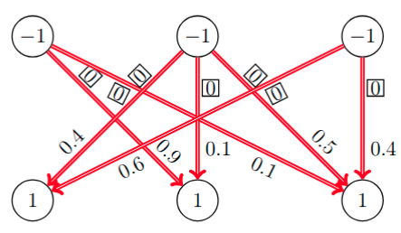

---

# Kőnigov izrek o plesnih parih

* **_Definicija._** Naj bo $G = (V, E)$ neusmerjen graf.
  * Množici $M \subseteq E$ pravimo _prirejanje_, če nobeni dve povezavi iz $M$ nimata skupnega krajišča (tj., $\forall e, f \in M: (e \ne f \Rightarrow e \cap f = \emptyset)$).
  * Prirejanje $M$ je _popolno prirejanje_, če je vsako vozlišče grafa $G$ krajišče povezave iz $M$ (tj., $\forall v \in V \ \exists e \in M: v \in e$).

* **_Kőnigov izrek o plesnih parih._**
  * Naj bo $G = (V, E)$ dvodelen regularen graf (tj., lahko zapišemo $V = X + Y$, tako da $\forall xy \in E: (x \in X \land y \in Y)$, ter $\exists r \in \mathbb{N} \ \forall v \in V: \deg(v) = r$).
  * Potem obstaja popolno prirejanje $M \subseteq E$ v grafu $G$.

---

# Kőnigov izrek o plesnih parih (2)

**Opomba.** Če imamo $n$ deklet in $n$ fantov ter vsako dekle pozna $r$ fantov in vsak fant pozna $r$ deklet, potem lahko vsako dekle pleše s fantom, ki ga pozna.

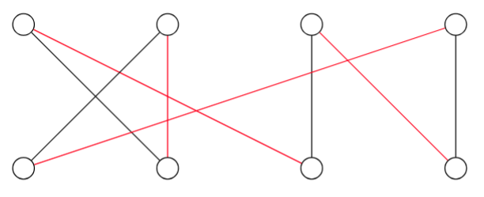

---

# Dokaz

* Naj bo $X = \lbrace x_1, x_2, \dots x_n \rbrace$ in $Y = \lbrace y_1, y_2, \dots y_n \rbrace$.
* Definirajmo matriko $A = (a_{ij})_{i,j=1}^n$ z

  $$
  a_{ij} = \begin{cases}
  {1 \over r} & x_i \sim y_j, \\
  0 & \text{sicer.}
  \end{cases}
  $$

* Matrika $A$ je dvojno stohastična, saj velja

  $$
  \begin{aligned}
  \sum_{j=1}^n a_{ij} &= {1 \over r} \cdot r = 1 & (1 \le i \le n) \\
  \sum_{i=1}^n a_{ij} &= {1 \over r} \cdot r = 1 & (1 \le j \le n)
  \end{aligned}
  $$

---

# Dokaz (2)

* Po prejšnji trditvi obstaja permutacijska matrika $P = (p_{ij})_{i,j=1}^n$, tako da

  $$
  p_{ij} = 1 \ \Rightarrow\ a_{ij} > 0 \ \Rightarrow\ a_{ij} = {1 \over r} \ \Rightarrow\ x_i \sim y_j \quad (1 \le i, j \le n)
  $$

* Matrika $P$ določa popolno prirejanje $M$:

  $$
  p_{ij} = 1 \ \Leftrightarrow\ x_i y_j \in M \quad (1 \le i, j \le n)
  $$

---

# Problem razvoza z omejitvami

* Imamo usmerjen utežen graf $G = (V, E)$, kjer je $V$ množica vozlišč in $E$ množica usmerjenih povezav, ter uteži na vozliščih $b_v \in \mathbb{R}$ ($v \in V$), tako da velja $\sum_{v \in V} b_v = 0$, uteži na povezavah $c_{uv} \in \mathbb{R}$ ($uv \in E$), in omejitve na povezavah $d_{uv} \in [0, \infty]$ ($uv \in E$).

* Problem lahko zapišemo kot linearni program

  $$
  \begin{aligned}
  \min \ c^\top x \\[1ex]
  \text{p.p.} \quad A x &= b \\
  0 \le x &\le d,
  \end{aligned}
  $$

  kjer je $A \in \mathbb{R}^{V \times E}$ incidenčna matrika grafa $G$.

* Uporabili bomo podoben algoritem kot pri problemu razvoza.

---

# Optimalnost rešitve

* **_Definicija._** Naj bo $x$ dopustna rešitev problema razvoza z omejitvami. Potem je (pri rešitvi $x$) povezava $e \in E$ _prazna_, če velja $x_e = 0$, in _nasičena_, če velja $x_e = d_e < \infty$.

* **_Definicija._** Naj bo $x$ dopustna rešitev problema razvoza z omejitvami. Rešitev $x$ je _drevesna dopustna rešitev_, če obstaja vpeto drevo $T = (V, E')$ v grafu $G = (V, E)$, da velja $\forall e \in E \setminus E': (x_e = 0 \lor x_e = d_e)$ (torej, povezave izven drevesa so prazne ali nasičene).

* **_Trditev._** Naj bo $x$ drevesna dopustna rešitev problema razvoza z omejitvami za vpeto drevo $T = (V, E')$ v grafu $G = (V, E)$ ter $y$ razvozne cene (tj., $\forall uv \in E': y_u + c_{uv} = y_v$). Če za vsako povezavo $uv \in E \setminus E'$ velja

  $$
  (x_{uv} = 0 \land y_u + c_{uv} \ge y_v) \lor (x_{uv} = d_{uv} \land y_u + c_{uv} \le y_v),
  $$

  potem je $x$ optimalna rešitev.

---

# Dokaz

* Naj bo $x'$ dopustna rešitev problema razvoza z omejitvami. Potem velja

  $$
  \forall uv \in E: \ (y_u + c_{uv} - y_v) x_{uv}' \ge (y_u + c_{uv} - y_v) x_{uv},
  $$

  saj

  - če $uv \in E'$, potem $y_u + c_{uv} - y_v = 0$,
  - če $uv \not\in E'$ in $x_{uv} = 0$, potem $(y_u + c_{uv} - y_v) x_{uv}' \ge 0$, in
  - če $uv \not\in E'$ in $x_{uv} = d_{uv}$, potem $x_{uv}' \le x_{uv}$ in $y_u + c_{uv} - y_v \le 0$.

* Če seštejemo za vse povezave, dobimo

  $$
  \begin{alignedat}{3}
  \sum_{uv \in E} c_{uv} x_{uv}' - \sum_{uv \in E} (y_v - y_u) x_{uv}' &= c^\top x' - (A^\top y)^\top x' &&= c^\top x' - y^\top A x' &&= c^\top x' - y^\top b \\
  \sum_{uv \in E} c_{uv} x_{uv} - \sum_{uv \in E} (y_v - y_u) x_{uv} &= c^\top x - (A^\top y)^\top x &&= c^\top x - y^\top A x &&= c^\top x - y^\top b
  \end{alignedat}
  $$

* Velja torej $c^\top x' \ge c^\top x$.

---

# Simpleksna metoda na omrežjih za PRO

* 1\. Začnemo z neko drevesno dopustno rešitvijo $x$ na vpetem drevesu $T = (V, E')$: $x_e = 0$ ali $x_e = d_e$ za vsako povezavo $e \in E \setminus E'$.
* 2\. Rešimo sistem $\forall uv \in E': \ y_u + c_{uv} = y_v$ (tj., poiščemo razvozne cene).
   * Preverimo, ali za vsako povezavo $uv \in E \setminus E'$ velja $x_{uv} = 0$ in $y_u + c_{uv} \ge y_v$ oziroma $x_{uv} = d_{uv}$ in $y_u + c_{uv} \le y_v$. Če velja, je $x$ optimalna rešitev (po prejšnji trditvi).
 
---

# Simpleksna metoda na omrežjih za PRO (2)

* 2\. Rešimo sistem $\forall uv \in E': \ y_u + c_{uv} = y_v$ (nadaljevanje).
   * Sicer obstaja povezava $e = uv \in E \setminus E'$ (_vstopna povezava_ - v edinem ciklu $C$ v grafu $H = (V, E' \cup \lbrace e \rbrace)$), za katero velja:
     - $x_{uv} = 0$ in $y_u + c_e < y_v$: nastavimo $p = \min(\lbrace x_f \mid f \in C \text{ obratna} \rbrace \cup \lbrace d_f - x_f \mid f \in C \text{ prema} \rbrace)$ ter premim povezavam povečamo razvoz za $p$, obratnim pa zmanjšamo za $p$; ali
     - $x_{uv} = d_{uv}$ in $y_u + c_e > y_v$: nastavimo $p = \min(\lbrace x_f \mid f \in C \text{ prema} \rbrace \cup \lbrace d_f - x_f \mid f \in C \text{ obratna} \rbrace)$ ter premim povezavam zmanjšamo razvoz za $p$, obratnim pa povečamo za $p$.
   *  Naj bo $f$ povezava v $C$, za katero je dosežena vrednost $p$ (_izstopna povezava_). V novi rešitvi je $f$ prazna ali nasičena in jo odstranimo iz drevesa.
   * Če je $p = \infty$, potem je problem neomejen.
* 3\. Ponavljamo, dokler ne pridemo do optimalne rešitve (ali ugotovimo, da je problem neomejen).

---

# Primer

* 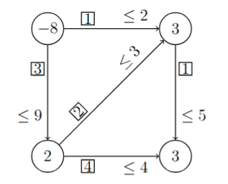

* 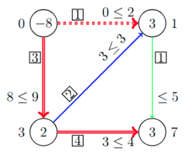

---

# Primer (2)

* Ker vstopi nasičena povezava, imamo $p = \min\lbrace 3, 2-0, 8 \rbrace = 2$.
* Izstopna povezava je obratna, tako da bomo na njej povečali razvoz na $2$ in jo tako zasitili.
  
  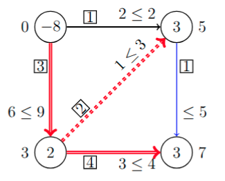

* Ker vstopi prazna povezava, imamo $p = \min\lbrace 5-0, 3, 3-1 \rbrace = 2$.
* Izstopna povezava je prema, tako da bomo na njej povečali razvoz na $2$ in jo tako zasitili.
  
  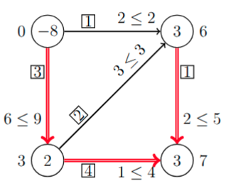

* Ni več kandidatov za vstop - dobili smo optimalno rešitev s ceno

  $$
  \sum_{e \in E} c_e x_e = 3 \cdot 6 + 1 \cdot 2 + 2 \cdot 3 + 4 \cdot 1 + 1 \cdot 2 = 32
  $$

---

# Ista vstopna in izstopna povezava

* **Opomba.** Lahko se zgodi, da je $e = f$, torej je ista povezava tako vstopna kot izstopna.
* Tedaj preide iz prazne v nasičeno povezavo ali obratno.

  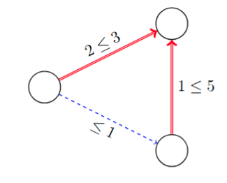

* Ker vstopi prazna povezava, imamo $p = \min\lbrace 1-0, 5-1, 2 \rbrace = 1$.
* Imamo $e = f$, izstopna povezava je prema in jo tako zasitimo.
  
  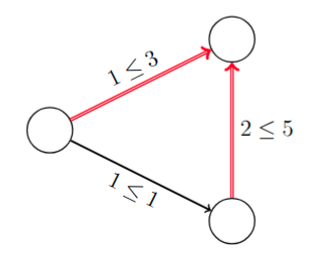

---

# Ciklanje pri PRO

**Opomba.** Cunninghamovo pravilo (preprečuje "ciklanje"):

* izberemo _koren_ $r \in V$;
* ko izbiramo izstopno povezavo v ciklu $C$ z vstopno povezavo $e = uv$, določimo vozlišče $z$ na $C$, ki leži na poteh (v drevesu - brez $e$) od $r$ do $u$ oziroma $v$, in za izstopno povezavo izberemo prvega (zadnjega) kandidata na $C$ od $z$ naprej v smeri $uv$, če je ta prazna (nasičena).

---

# Dvofazna simpleksna metoda za PRO

* Kako poiščemo začetno drevesno dopustno rešitev oziroma dokažemo, da je problem nedopusten?
* Uporabimo **dvofazno simpleksno metodo na omrežjih za problem razvoza z omejitvami**.
* Definiramo pomožni problem:

  * Izberemo _koren_ $r \in V$.
  * Za vsako vozlišče $v \in V \setminus \lbrace r \rbrace$:
    - če $b_v \ge 0$ in povezava $rv$ ne obstaja, jo dodamo; če obstaja in $d_{rv} < b_v$, dodamo še eno tako povezavo;
    - če $b_v < 0$ in povezava $vr$ ne obstaja, jo dodamo; če obstaja in $d_{vr} < -b_v$, dodamo še eno tako povezavo.

---

# Dvofazna simpleksna metoda za PRO (2)

* Dobimo nov graf $\tilde{G} = (V, \tilde{E})$. Dodanim povezavam (iz $\tilde{E} \setminus E$) pravimo _umetne povezave_, povezavam iz $E$ pa _prvotne povezave_.
* Definiramo nove cene $\tilde{c}$, in sicer
  - prvotne povezave $e \in E$ imajo ceno $\tilde{c}_e = 0$, in
  - umetne povezave $e \in \tilde{E} \setminus E$ imajo ceno $\tilde{c}_e = 1$.
* Definiramo nove omejitve $\tilde{d}$:
  - prvotne povezave $e \in E$ imajo nespremenjene omejitve $\tilde{d}_e = d_e$, in
  - umetne povezave $e \in \tilde{E} \setminus E$ niso omejene: $\tilde{d}_e = \infty$.

* Pomožni problem je optimalen, optimalna vrednost je $0$ natanko tedaj, ko je prvotni problem dopusten.
