# Pretoki in prerezi

* **_Primer._** Letalo iz San Francisca v New York je polno. Imamo pa proste sedeže na drugih letih:

  - San Francisco - Denver: 5 mest
  - San Francisco - Houston: 6 mest
  - Denver - Atlanta: 2 mesti
  - Denver - Chicago: 5 mest
  - Houston - Atlanta: 5 mest
  - Atlanta - New York: 7 mest
  - Chicago - New York: 4 mesta

  Koliko dodatnih potnikov lahko prepeljejo?

* 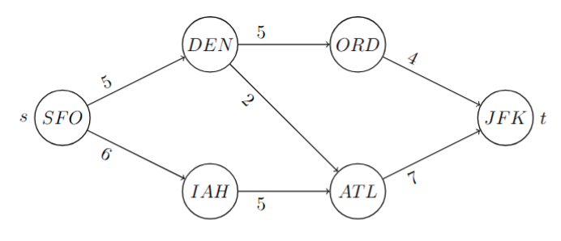

---

# Problem maksimalnega pretoka

* Imamo usmerjen graf $G = (V, E)$ in pretočnosti $d_e$ za vsako povezavo $e \in E$.
* Iščemo maksimalni pretok:

  $$
  \forall e \in E: \ 0 \le x_e \le d_e
  $$

* Imamo dve posebni vozlišči:

  - začetno vozlišče $s$ (angl. _source_)
  - končno vozlišče $t$ (angl. _terminal_)

* Predpostavimo, da v $s$ in iz $t$ ne gre nobena povezava.
* Za ostala vozlišča veljajo Kirchhoffovi zakoni:

  $$
  \forall w \in V \setminus \lbrace s, t \rbrace: \ \sum_{uw \in E} x_{uw} = \sum_{wv \in E} x_{wv}
  $$

---

# Prostornina pretoka

* Seštejmo Kirchhoffove zakone po vseh $w \in V \setminus \lbrace s, t \rbrace$:

  $$
  \begin{aligned}
  \sum_{w \in V \setminus \lbrace s, t \rbrace} \sum_{uw \in E} x_{uw} &= \sum_{w \in V \setminus \lbrace s, t \rbrace} \sum_{wv \in E} x_{wv} \\
  \sum_{\substack{e \in E \\ \operatorname{konec}(e) \ne t}} x_e &= \sum_{\substack{e \in E \\ \operatorname{začetek}(e) \ne s}} x_e
  \end{aligned}
  $$

* _Prostornina pretoka_ je enaka

  $$
  F \quad = \sum_{\substack{e \in E \\ \operatorname{konec}(e) = t}} x_e = \sum_{\substack{e \in E \\ \operatorname{začetek}(e) = s}} x_e
  $$

---

# Linearni program

Iščemo _pretok_ z maksimalno prostornino:

$$
\begin{alignedat}{2}
\max &\ & \sum_{\substack{e \in E \\ \operatorname{začetek}(e) = s}} x_e \\[1ex]
\text{p.p.} \quad \forall w \in V \setminus \lbrace s, t \rbrace &:& \ \sum_{uw \in E} x_{uw} &= \sum_{wv \in E} x_{wv} \\
\forall uv \in E&:& \ 0 \le x_{uv} &\le d_{uv},
\end{alignedat}
$$

---

# Problem razvoza z omejitvami

To je poseben primer problema razvoza z omejitvami: vzamemo $b_v = 0$ ($v \in V$), $c_e = 0$ ($e \in E$) ter dodamo povezavo $ts$ s $c_{ts} = -1$, $d_{ts} = \infty$.

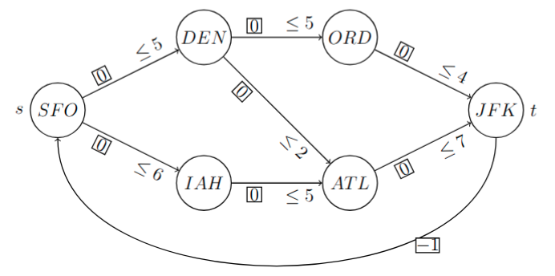

---

# Simpleksna metoda na omrežjih za PRO

Ta problem lahko rešimo s simpleksno metodo na omrežjih za problem razvoza z omejitvami.

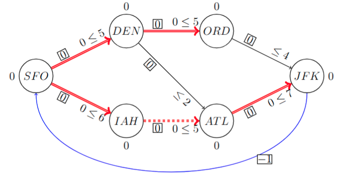

---

# Simpleksna metoda na omrežjih za PRO (2)

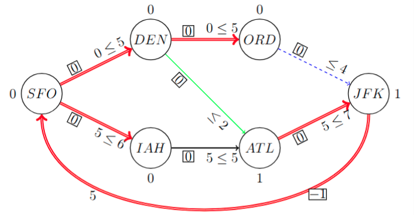

---

# Simpleksna metoda na omrežjih za PRO (3)

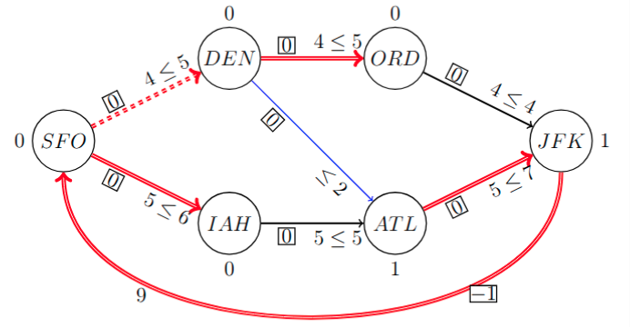

---

# Simpleksna metoda na omrežjih za PRO (4)

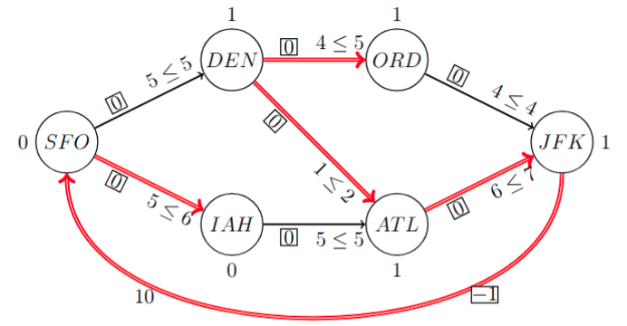

* V praksi uporabljamo **Ford-Fulkersonov algoritem**.

---

# Povečujoče poti

* Naj bo $x$ dopustna rešitev za problem maksimalnega pretoka na usmerjenem grafu $G = (V, E)$ s pretočnostmi $d_e$ ($e \in E$) ter začetnim vozliščem $s$ in končnim vozliščem $t$.
* Rečemo, da je $v_0 v_1 \dots v_k$ ($v_i \in V, 0 \le i \le k$) _povečujoča pot_, če je $v_0 = s$, $v_k = t$ ter, za $1 \le i \le k$,

  - $v_{i-1} v_i \in E$ in $x_{v_{i-1} v_i} < d_{v_{i-1} v_i}$ (_prema povezava_), ali
  - $v_i v_{i-1} \in E$ in $x_{v_i v_{i-1}} > 0$ (_obratna povezava_).

---

# Ideja algoritma

* Vzamemo povečujočo pot z množico povezav $P$.
* Pretok na tej poti povečamo za

  $$
  \begin{multlined}
  p = \min(\lbrace x_e \mid e \in P \text{ obratna} \rbrace \cup \\
   \lbrace d_e - x_e \mid e \in P \text{ prema} \rbrace)
  \end{multlined}
  $$

  (tj., povečamo na premih in zmanjšamo na obratnih povezavah).

* 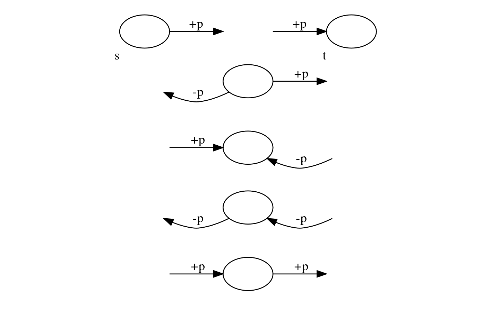

---

# Primer

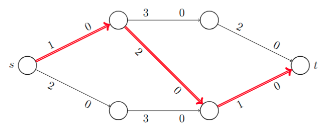

---

# Primer (2)

Povečamo pretok na izbrani poti za 1:

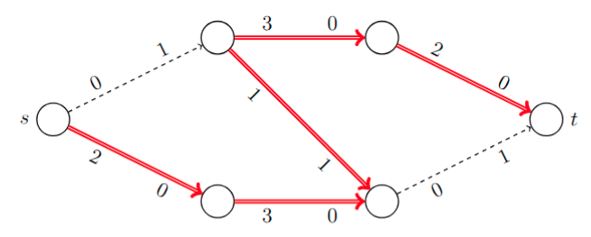

---

# Primer (3)

* Najbolj nas omejuje obratna povezava - spet povečamo pretok za $1$:

  

  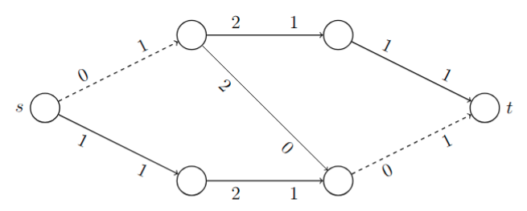

  

* Takih poti ni več - imamo optimalno rešitev.

---

# Prerezi

* **_Definicija._** Za problem maksimalnega pretoka na usmerjenem grafu $G = (V, E)$ ter začetnim vozliščem $s$ in končnim vozliščem $t$ je množica $C \subseteq V$ _prerez_, če velja $s \in C$, $t \not\in C$.

* Za vsaki vozlišči $u, v \in V$, tako da velja $uv \not\in E$, naj velja $d_{uv} = x_{uv} = 0$.
* Potem lahko Kirchhoffove zakone pišemo kot

  $$
  \textstyle
  \forall w \in V \setminus \lbrace s, t \rbrace: \ \sum_{u \in V} x_{uw} = \sum_{v \in V} x_{wv}
  $$

* Seštejmo za vsak $w \in C \setminus \lbrace s \rbrace$:

  $$
  \sum_{\substack{u \in V \\ v \in C \setminus \lbrace s \rbrace}} x_{uv} = \sum_{\substack{u \in C \setminus \lbrace s \rbrace \\ v \in V}} x_{uv}
  $$

* Členi $x_{uv}$, kjer $u, v \in C \setminus \lbrace s \rbrace$, se pojavijo na obeh straneh in se jih lahko znebimo:

  $$
  \sum_{\substack{u \not\in C \setminus \lbrace s \rbrace \\ v \in C \setminus \lbrace s \rbrace}} x_{uv} = \sum_{\substack{u \in C \setminus \lbrace s \rbrace \\ v \not\in C \setminus \lbrace s \rbrace}} x_{uv}
  $$

---

# Kapaciteta prereza

* Ker $s$ ni končno vozlišče nobene povezave, velja

  $$
  \sum_{\substack{u \in C \\ v \not\in C}} x_{uv} - \sum_{\substack{u \not\in C \\ v \in C}} x_{uv} = \sum_{v \not\in C} x_{sv} + \sum_{\substack{u \in C \setminus \lbrace s \rbrace \\ v \not\in C \setminus \lbrace s \rbrace}} x_{uv} - \left(\sum_{\substack{u \not\in C \setminus \lbrace s \rbrace \\ v \in C \setminus \lbrace s \rbrace}} x_{uv} - \sum_{v \in C} x_{sv}\right) = \sum_{v \in V} x_{sv} = F
  $$

* Prostornina pretoka torej zadošča enakosti

  $$
  F = \sum_{\substack{u \in C \\ v \not\in C}} x_{uv} - \sum_{\substack{u \not\in C \\ v \in C}} x_{uv}
  $$

* Definirajmo še _kapaciteto prereza_ $C$ kot

  $$
  K = \sum_{\substack{u \in C \\ v \not\in C}} d_{uv}
  $$

---

# Prostornina pretoka in kapaciteta prereza

* **_Trditev_.** Naj bosta $x$ in $C$ pretok s prostornino $F$ in prerez s kapaciteto $K$ za problem maksimalnega pretoka. Potem velja $F \le K$.

* _Dokaz._

  $$
  F = \sum_{\substack{u \in C \\ v \not\in C}} x_{uv} - \sum_{\substack{u \not\in C \\ v \in C}} x_{uv} \le \sum_{\substack{u \in C \\ v \not\in C}} d_{uv} - \sum_{\substack{u \not\in C \\ v \in C}} 0 = K
  $$

* **Opomba.** Primerjaj s šibkim izrekom o dualnosti!
* **_Posledica._** Če velja $F = K$, je $x$ maksimalen pretok, $C$ pa minimalen prerez.
* Govorimo torej o **problemu maksimalnega pretoka in minimalnega prereza** (angl. _maximal flow/minimal cut_).

---

# Maksimalni pretoki in minimalni prerezi

* **_Izrek._** Za problem maksimalnega pretoka in minimalnega prereza velja natanko ena od sledečih možnosti.

  

  1. Problem maksimalnega pretoka je neomejen, kapaciteta vsakega prereza je $\infty$.
  2. Obstajata maksimalen pretok $x$ in minimalen prerez $C$, tako da je prostornina $x$ enaka kapaciteti $C$.

  

* **Opomba.** Primerjaj s krepkim izrekom o dualnosti!

---

# Dokaz

* Problem maksimalnega pretoka na usmerjenem grafu $G = (V, E)$ s pretočnostmi $d_e$ ($e \in E$) ter začetnim vozliščem $s$ in končnim vozliščem $t$ je dopusten linearni program, saj je ničelni pretok dopustna rešitev.
* Če je neomejen, po zgornji trditvi ne obstaja prerez s končno kapaciteto (sicer bi imeli zgornjo mejo za prostornino).
* V nasprotnem primeru naj bo $x$ optimalna drevesna rešitev pridruženega problema razvoza z omejitvami za drevo $T = (V, E')$.
* Naj bodo $y$ razvozne cene. Ker velja $d_{ts} = \infty$, povezava $ts$ ni nasičena. Ker velja $c_{ts} = -1$, sledi $y_t \ge y_s + 1 > y_s$.

---

# Dokaz (2)

* Potem je

  $$
  C = \lbrace v \in V \mid y_v \le y_s \rbrace
  $$

  prerez, saj velja $s \in C$ in $t \not\in C$. Določimo prostornino pretoka $x$.

  * Če $u \in C$, $v \not\in C$, potem $y_u + c_{uv} \le y_s < y_v$, torej $uv \not\in E'$ in $x_{uv} = d_{uv}$ (nasičena povezava).
  * Če $u \not\in C$, $v \in C$, potem $y_u + c_{uv} > y_s \ge y_v$, torej $uv \not\in E'$ in $x_{uv} = 0$ (prazna povezava).

* Tako velja

  $$
  F = \sum_{\substack{u \in C \\ v \not\in C}} x_{uv} - \sum_{\substack{u \not\in C \\ v \in C}} x_{uv} = \sum_{\substack{u \in C \\ v \not\in C}} d_{uv} = K
  $$

* Sledi, da je $x$ maksimalni pretok in $C$ minimalni prerez.

---

# Iskanje povečujočih poti

* Spomnimo se: povečujoča pot sestoji iz premih povezav, ki niso nasičene, in obratnih povezav, ki niso prazne.

* Kako najdemo povečujočo pot?
  * Začnemo s $C = \lbrace s \rbrace$, nato pa ponavljamo za vsak $v \in C$: ali obstaja $w \not \in C$, da velja $x_{vw} < d_{vw}$ ali $x_{wv} > 0$ - če obstaja, dodamo $w$ v $C$.
  * Če v nekem koraku dobimo $t \in C$, smo našli povečujočo pot od $s$ do $t$, tako da lahko povečamo pretok.
  * Če v nekem koraku tak $w$ ne obstaja, povečujoče poti ni - našli smo maksimalni pretok $x$ in minimalni prerez $C$.

---

# Pridruženi graf

Običajno problem pretoka rešujemo na pridruženem grafu:

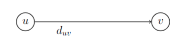

→

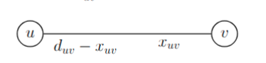

---

# Primer

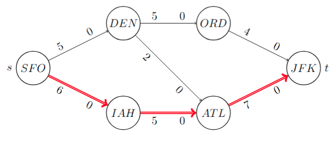

---

# Primer (2)

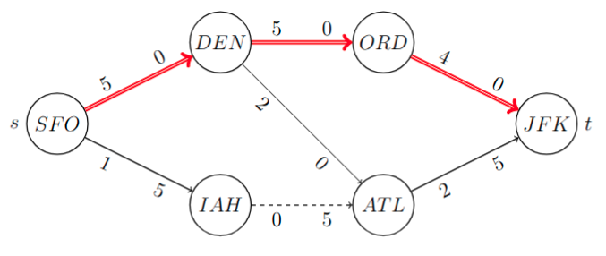

---

# Primer (3)

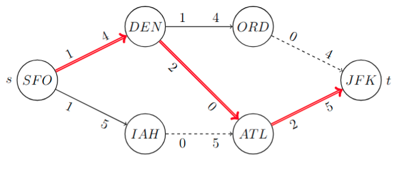

---

# Primer (4)

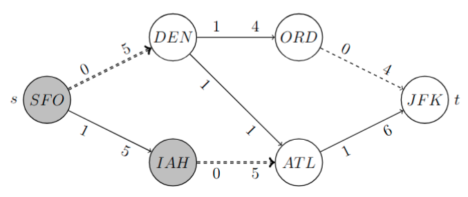

* Prostornina pretoka: $F = 5 + 5 = 6 + 4 = 10$
* Kapaciteta prereza: $K = 5 + 5 = 10$

---

# Optimalna rešitev

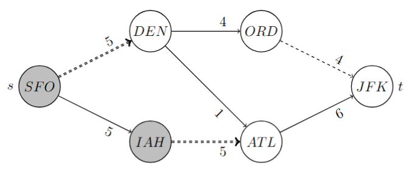

---

# Končnost algoritma

**Opomba.** Ali se Ford-Fulkersonov algoritem vedno ustavi?

* **NE.**
* Obstajajo primeri, kjer lahko (če "nerodno" izbiramo povečujoče poti) v neskončno ponavljamo postopek (če so nekatere pretočnosti iracionalne), pri čemer prostornina pretoka konvergira proti številu, ki je manjše od prostornine maksimalnega pretoka.
* Da zagotovimo, da se algoritem ustavi, v vsakem koraku izberemo najkrajšo povečujočo pot (Edmonds-Karpov algoritem).

---

# Disjunktne poti

**Opomba.** Disjunktne povečujoče poti (po povezavah) lahko obravnavamo hkrati, npr.

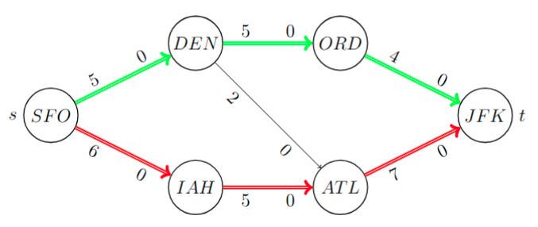

