# Prirejanja in pokritja

* Naj bo $G = (V, E)$ neusmerjen graf.
* Množici $M \subseteq E$ pravimo _prirejanje_ (angl. _matching_), če nobeni dve povezavi iz $M$ nimata skupnega krajišča (tj., $\forall e, f \in M: (e \ne f \Rightarrow e \cap f = \emptyset)$).
  * Prirejanje $M$ je _popolno prirejanje_, če je vsako vozlišče grafa $G$ krajišče povezave iz $M$ (tj., $\forall v \in V \ \exists e \in M: v \in e$).
* Množici $C \subseteq V$ pravimo _pokritje_ (angl. _vertex cover_), če ima vsaka povezava iz $E$ krajišče v $C$ (tj., $\forall e \in E: e \cap C \ne \emptyset$).

---

# Primeri prirejanj

* Prirejanje:
  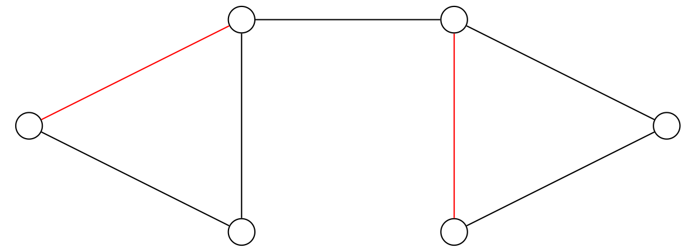

* Ni prirejanje:
  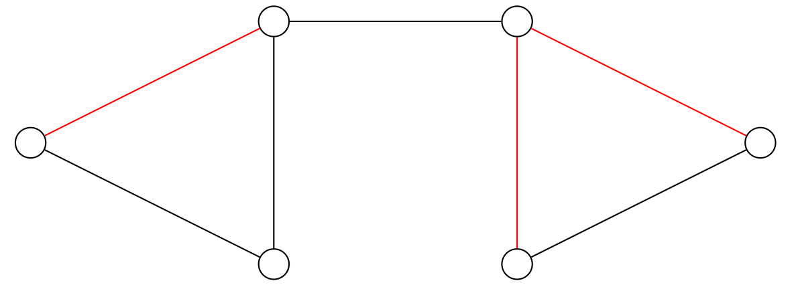

* Popolno prirejanje:
  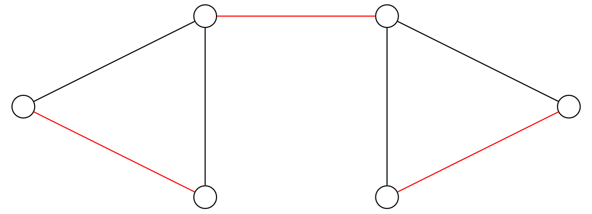

* **_Trditev._** Če ima $G = (V, E)$ popolno prirejanje, je $\vert V \vert$ soda.

---

# Primeri pokritij

* Pokritje:
  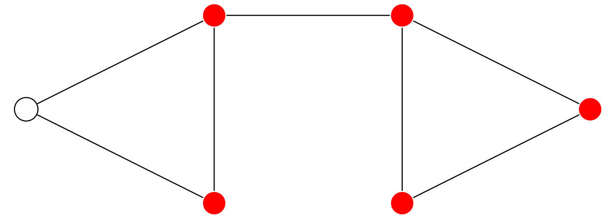

* Ni pokritje:
  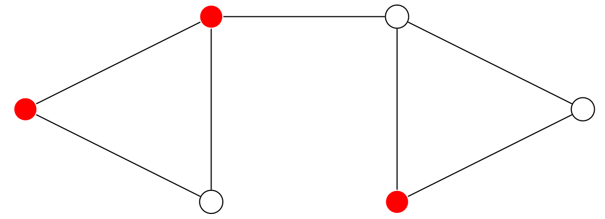

* (Najmanjše) pokritje:
  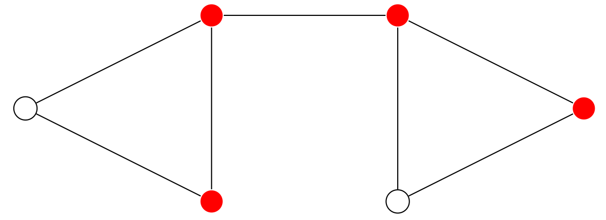

* Iščemo **čim večje prirejanje** in **čim manjše pokritje**.

  - $\mu(G)$ ... velikost največjega prirejanja v $G$
  - $\tau(G)$ ... velikost najmanjšega pokritja v $G$

---

# Primera

* $G_1 = (V_1, E_1)$, $\vert V_1 \vert = 6$:

  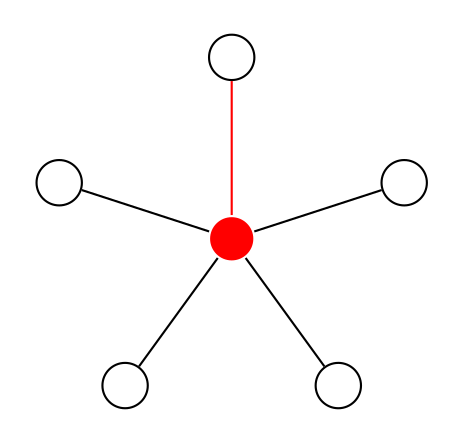

  - $\mu(G_1) = 1$
  - $\tau(G_1) = 1$

* $G_2$:

  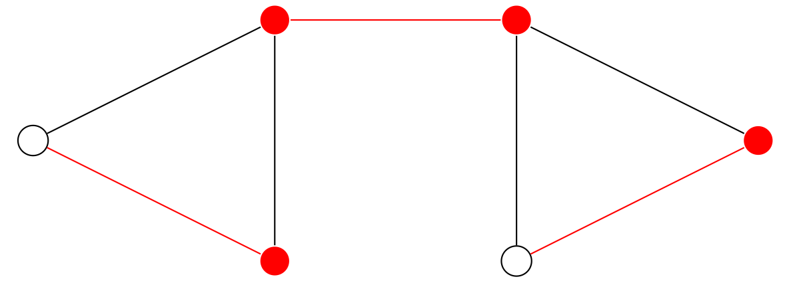

  - $\mu(G_2) = 3$
  - $\tau(G_2) = 4$

---

# Velikosti prirejanj in pokritij

* **_Trditev._** Naj bo $M$ prirejanje in $C$ pokritje v grafu $G$. Potem velja $\vert M \vert \le \vert C \vert$.

* **_Posledica._** Če velja $\vert M \vert = \vert C \vert$, potem je $M$ največje prirejanje in $C$ najmanjše pokritje v $G$.

* **_Posledica._** Za vsak graf $G$ velja $\mu(G) \le \tau(G)$.

* **Opomba.** Lahko se zgodi, da velja $\mu(G) < \tau(G)$. Za dvodelne grafe velja $\mu(G) = \tau(G)$ (dokaz kasneje).

* _Dokaz._ Ker ima vsaka povezava iz $M$ vsaj eno krajišče v $C$, obstaja preslikava $f : M \to C$, za katero velja $\forall e \in M: f(e) \in e \cap C$. Ker je vsako vozlišče iz $C$ krajišče največ ene povezave iz $M$, je preslikava $f$ injektivna, od koder sledi $\vert M \vert \le \vert C \vert$.

---

# Terminologija

**_Definicija._** Naj bo $M$ prirejanje v grafu $G = (V, E)$. Rečemo, da je

* vozlišče $v \in V$
  - _prosto_, če $\lnot \exists e \in M: v \in e$, in
  - _vezano_, če $\exists e \in M: v \in e$;
* povezava $e \in E$
  - _prosta_, če $e \not\in M$, in
  - _vezana_, če $e \in M$; ter
* pot v $G$
  - _izmenična_ (_alternirajoča_), če se v njej izmenjujejo proste in vezane povezave, in
  - _povečujoča_, če je izmenična ter se začne in konča s prostim vozliščem.

---

# Povečujoče poti

Če na povečujoči poti zamenjamo proste in vezane povezave, se prirejanje poveča:

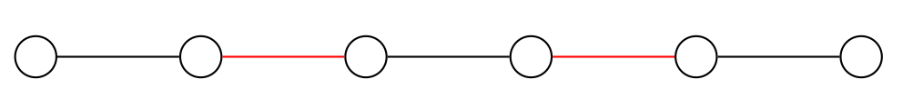

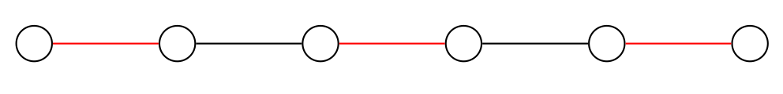

---

# Bergeev izrek

* **_Definicija._** _Simetrična vsota_ množic $A$ in $B$ je

  $$
  A \oplus B := (A \cup B) \setminus (A \cap B) = (A \setminus B) \cup (B \setminus A) .
  $$

* **_Trditev._** Če je $M$ prirejanje v $G$ in $P$ povečujoča pot z množico povezav $E(P)$, je $M' = M \oplus E(P)$ prirejanje v $G$ in $\vert M' \vert = \vert M \vert + 1$.

* **_Trditev (Berge)._** Naj bo $M$ prirejanje v grafu $G$. Potem je $M$ največje prirejanje v $G$ natanko tedaj, ko zanj ne obstaja povečujoča pot.

---

# Dokaz

Dokazujemo enakovredno izjavo: $M$ ni največje prirejanje v $G = (V, E)$ natanko tedaj, ko zanj obstaja povečujoča pot.

* $(\Longleftarrow)$ Sledi iz prejšnje trditve.
* $(\Longrightarrow)$ Denimo, da $M$ ni največje prirejanje v $G$.
  * Potem obstaja prirejanje $M'$ v $G$, za katerega velja $\vert M' \vert > \vert M \vert$.
  * Potem je $H = (V, M \oplus M')$ graf z maksimalno stopnjo $\Delta_H \le 2$ - njegove povezane komponente so poti in sodi cikli.

* 
  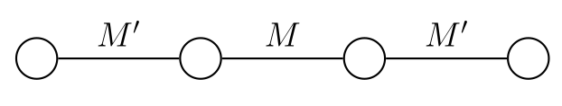
  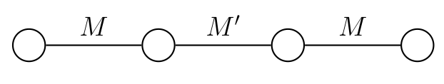
  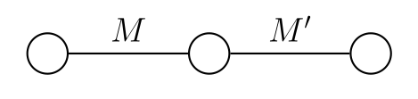
  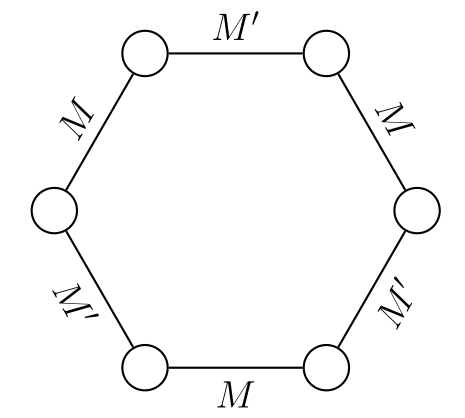

---

# Dokaz (2)

* Ker je $\vert M' \vert > \vert M \vert$, obstaja v $H$ pot $P$, katere prva in zadnja povezava sta v $M'$.
* Trdimo, da je $P$ povečujoča pot za $M$:
  * je alternirajoča, saj $E(P) \cap M' \subseteq M \oplus M'$ in zato $E(P) \cap M' \cap M = \emptyset$;
  * začne in konča se s prostim vozliščem:
    - denimo, da je $u$ krajišče poti $P$ in ni prosto za $M$;
    - potem obstaja povezava $uv \in M \setminus (M \oplus M') = M \cap M'$, kar je v protislovju s predpostavko, da je $M'$ prirejanje.

---

# Madžarska metoda

* Iskanje največjega prirejanja se torej prevede na iskanje povečujočih poti.
* Če je graf $G = (V, E)$ dvodelen ($V = X + Y$, $X \cap Y = \emptyset$, $\forall e \in E: (e \cap X \ne \emptyset \land e \cap Y \ne \emptyset)$; ekvivalentno, v $G$ ni lihih ciklov), povečujočo pot poiščemo z **madžarsko metodo**.

  * Naj bo $G = (X + Y, E)$ dvodelen graf in $M$ prirejanje v $G$. Postavimo množico prostih vozlišč v $X$ kot množico $S$ in $T := \emptyset$.
  * Ponavljamo:
    - $T := T \cup \lbrace v \in Y \mid u \in S, uv \not\in M \rbrace$
    - $S := S \cup \lbrace u \in X \mid v \in T, uv \in M \rbrace$
  * Če je v $T$ v nekem trenutku prosto vozlišče, smo našli povečujočo pot.
    - Postopek ustavimo in povečamo prirejanje (in začnemo od začetka).
  * Sicer sta v nekem trenutku nova $S$ in $T$ enaka starima.

---

# Največje prirejanje in najmanjše pokritje

* **_Izrek._** Če sta nova $S$ in $T$ enaka starima, potem je $M$ največje prirejanje, $C := (X \setminus S) + T$ je najmanjše pokritje, in $\vert M \vert = \vert C \vert = \mu(G) = \tau(G)$.

* _Dokaz._ Trdimo:

  

  

  * med $S$ in $Y \setminus T$ ni prostih povezav (sicer bi lahko povečali $T$)
  * med $S$ in $Y \setminus T$ ni vezanih povezav (do $S$ vodijo vezane povezave samo iz $T$)
  * med $X \setminus S$ in $T$ ni vezanih povezav (sicer bi lahko povečali $S$)

  

  

  * 
    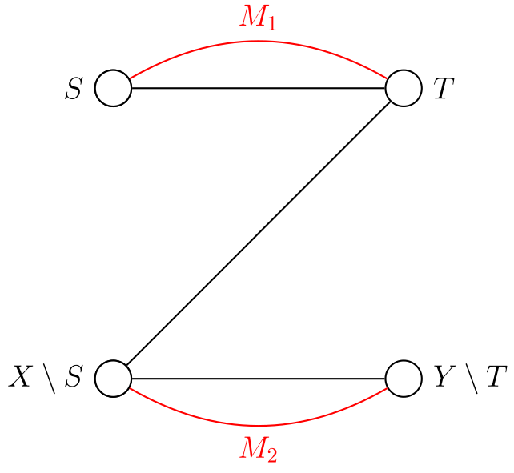

  

  

---

# Nadaljevanje dokaza

* Množica $C := (X \setminus S) + T$ je torej pokritje.
* Definirajmo še množico $M_1$ vezanih povezav med $S$ in $T$ ter množico $M_2$ vezanih povezav med $X \setminus S$ in $Y \setminus T$.
* Potem je $M = M_1 + M_2$ ter velja $\vert M_1 \vert = \vert T \vert$ (sicer je v $T$ prosto vozlišče) in $\vert M_2 \vert = \vert X \setminus S \vert$ (vsa prosta vozlišča iz $X$ so v $S$).
* Velja torej

  $$
  \vert M \vert = \vert M_1 \vert + \vert M_2 \vert = \vert T \vert + \vert X \setminus S \vert = \vert C \vert.
  $$

* $M$ je torej največje prirejanje, $C$ pa najmanjše pokritje.

---

# Primer

* 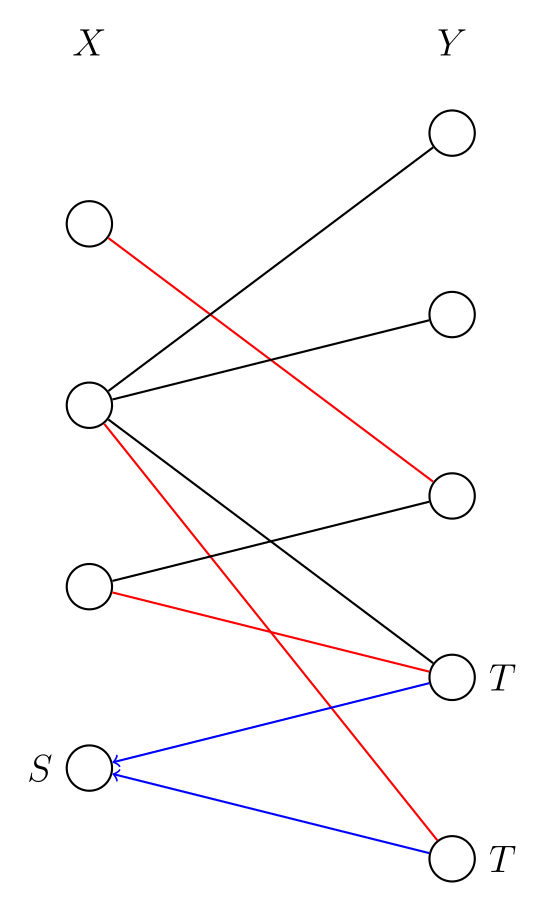

* 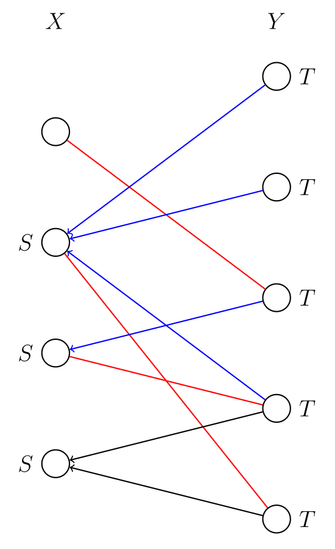
  Imamo prosto vozlišče v $T$, torej smo našli povečujočo pot.

* 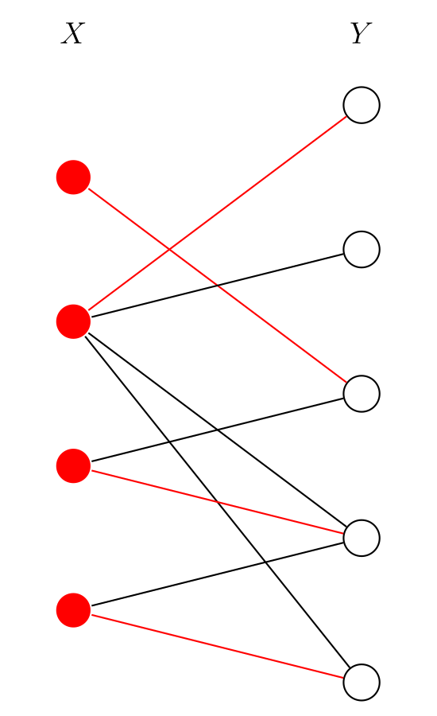
  Ni več prostih vozlišč v $X$, torej imamo največje prirejanje in najmanjše pokritje $C = X$.

---

# Kőnig-Egerváryjev izrek

* V posebnem (za dvodelne grafe) velja torej **_Kőnig-Egerváryjev izrek._**
  - Za dvodelen graf $G$ velja $\mu(G) = \tau(G)$.

* **Opomba.** Obstaja tudi algoritem za iskanje povečujoče poti v splošnem grafu: Edmondsov algoritem (angl. tudi _blossom algorithm_).
  - Ta algoritem je "učinkovit", torej polinomski.

  |                     | dvodelni grafi | splošni grafi   |
  | ------------------- | -------------- | --------------- |
  | največje prirejanje | lahek (MM)     | lahek (Edmonds) |
  | najmanjše pokritje  | lahek (MM)     | težek           |

---

# Hallov izrek

* Naj bo $G = (X+Y, E)$ dvodelen graf.
* Potem obstaja _popolno prirejanje iz $X$ v $Y$_ (tj., prirejanje, ki pokrije $X$) natanko tedaj, ko velja $\forall A \subseteq X: \vert A \vert \le \vert N(A) \vert$, kjer je $N(A) = \lbrace v \in Y \mid \exists u \in A: uv \in E \rbrace$ _soseščina_ (angl. _neighbourhood_) množice $A$.

---

# Dokaz

* ($\Longrightarrow$) Naj bo $M$ popolno prirejanje iz $X$ v $Y$.
* Obstaja injektivna preslikava $f : A \to N(A)$, $f(u) = v \Leftrightarrow uv \in M$.

* 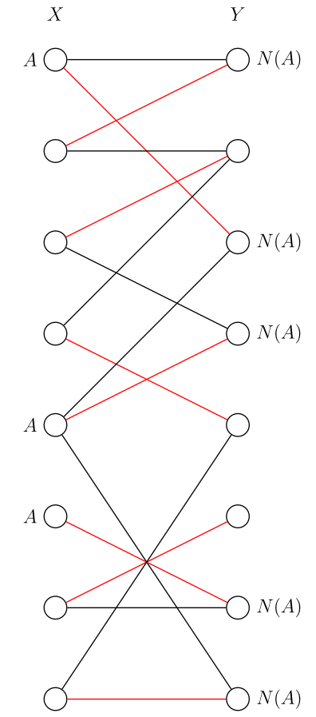

---

# Dokaz (2)

* ($\Longleftarrow$) Uporabimo madžarsko metodo, da dobimo največje prirejanje $M$ in najmanjše pokritje $C$.
* Velja $N(S) \subseteq T$, torej $\vert S \vert \le \vert N(S) \vert \le \vert T \vert$.

* 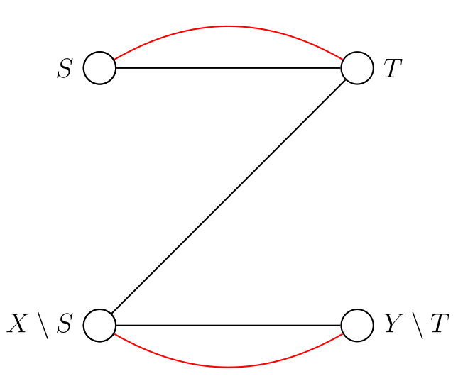

* Nadalje velja

  $$
  \vert M \vert = \vert C \vert = \vert T \vert + \vert X \setminus S \vert \ge \vert S \vert + \vert X \setminus S \vert = \vert X \vert.
  $$

* Ker velja $\vert M \vert \le \vert X \vert$, sledi $\vert M \vert = \vert X \vert$, torej smo našli popolno prirejanje iz $X$ v $Y$.

---

# Opomba

* Hallov izrek je oblike $\exists \ldots \Leftrightarrow \forall \ldots$.

  * Če želimo dokazati, da obstaja popolno prirejanje iz $X$ v $Y$, ga poiščemo.
  * Če želimo dokazati, da ne obstaja popolno prirejanje iz $X$ v $Y$, poiščemo $A \subseteq X$, da velja $\vert A \vert > \vert N(A) \vert$.

* Taka karakterizacija recimo ni znana za hamiltonskost grafa (obstoj Hamiltonovega cikla).

---

# Minimalna in maksimalna popolna prirejanja

* Imamo poln dvodelen graf $K_{n, n} = (X + Y, E)$, kjer je $X = \lbrace u_1, u_2, \dots, u_n \rbrace$, $Y = \lbrace v_1, v_2, \dots, v_n \rbrace$ in $E = \lbrace u_i v_j \mid 1 \le i, j \le n \rbrace$, ter uteži $c_{ij}$ (cene) na povezavah $u_i v_j$ ($1 \le i, j \le n$), ki jih zapišemo v matriko $A = (c_{ij})_{i,j=1}^n$.

* Tak graf ima $n!$ popolnih prirejanj.
  - Iščemo popolno prirejanje z minimalno (maksimalno) ceno, kjer je cena prirejanja $M$ enaka $\sum_{u_i v_j \in M} c_{ij}$.

* **_Primeri._**
  - Problem štafete;
  - druge razporeditve opravil ($n$ ljudi, $n$ opravil, vsak dobi natanko eno opravilo).

---

# Opazka

* Če v matriki $A$ odštejemo konstanto $\epsilon$ od vseh elementov v eni vrstici ali enem stolpcu, se optimalna rešitev ne spremeni, saj ima vsako popolno prirejanje natanko eno povezavo s krajiščem v vozlišču, ki ustreza izbrani vrstici ali stolpcu.
* Cena vsakega popolnega prirejanja se tedaj zmanjša za $\epsilon$.

* **_Primer._** Zmanjšajmo za najmanjšo vrednost v vsaki vrstici, nato pa še v vsakem stolpcu:

  $$
  \begin{bmatrix} 3 & 1 \\ 4 & 2 \end{bmatrix} \to
  \begin{bmatrix} 2 & 0 \\ 2 & 0 \end{bmatrix} \to
  \begin{bmatrix} 0 & 0 \\ 0 & 0 \end{bmatrix}
  $$

---

# Madžarska metoda z utežmi (MMU)

Iščemo minimalno popolno prirejanje.

* 1\. Od vsake vrstice odštejemo njen minimum. Od vsakega stolpca odštejemo njegov minimum. Dobimo nenegativno matriko z vsaj eno ničlo v vsaki vrstici in vsakem stolpcu.
* 2\. Poiščemo $n$ ničel, v vsaki vrstici in vsakem stolpcu eno. Če jih najdemo, nam dajo minimalno popolno prirejanje.
* 3\. Sicer lahko vse ničle v matriki pokrijemo z manj kot $n$ vrsticami in stolpci. Naj bo $\epsilon$ minimum nepokritih števil. Od nepokritih števil odštejemo $\epsilon$, dvakrat pokritim številom pa prištejemo $\epsilon$. Vrnemo se na 2. korak.

---

# Primer - štafeta

|   | prsno | hrbtno | delfin | prosto | počiva | počiva |
| - | ----- | ------ | ------ | ------ | ------ | ------ |
| 1 | 65    | 73     | 63     | 57     | 0      | 0      |
| 2 | 67    | 76     | 65     | 58     | 0      | 0      |
| 3 | 68    | 72     | 69     | 55     | 0      | 0      |
| 4 | 67    | 75     | 70     | 59     | 0      | 0      |
| 5 | 71    | 69     | 75     | 57     | 0      | 0      |
| 6 | 69    | 71     | 66     | 59     | 0      | 0      |

---

# Primer - štafeta (2)

Minimum v vsaki vrstici je $0$ - odštejmo še minimume stolpcev:

|   | prsno | hrbtno | delfin | prosto | počiva | počiva |
| - | ----- | ------ | ------ | ------ | ------ | ------ |
| 1 | **0** | **4**  |  **0** | **2**  | **_0_** | **_0_** |
| 2 | 2     | 7      |  2     | 3      | **0**  | **0**  |
| 3 | **3** | **3**  |  **6** | **0**  | **_0_** | **_0_** |
| 4 | 2     | 6      |  7     | 4      | **0**  | **0**  |
| 5 | **6** | **0**  | **12** | **2**  | **_0_** | **_0_** |
| 6 | 4     | 2      |  3     | 4      | **0**  | **0**  |

---

# Primer - štafeta (3)

* Vse ničle smo pokrili s tremi vrsticami in dvema stolpcema (skupaj manj kot $n = 6$).
* Najmanjša nepokrita vrednost je $\epsilon = 2$ - zmanjšamo nepokrita in povečamo dvakrat pokrita števila za $\epsilon$:

  |   | prsno | hrbtno | delfin | prosto | počiva | počiva |
  | - | ----- | ------ | ------ | ------ | ------ | ------ |
  | 1 | **0** | 4      |  0     | 2      | 2      | 2      |
  | 2 | 0     | 5      |  **0** | 1      | 0      | 0      |
  | 3 | 3     | 3      |  6     | **0**  | 2      | 2      |
  | 4 | 0     | 4      |  5     | 2      | **0**  | 0      |
  | 5 | 6     | **0**  | 12     | 2      | 2      | 2      |
  | 6 | 2     | 0      |  1     | 2      | 0      | **0**  |

---

# Primer - štafeta (4)

Dobimo optimalno rešitev:

|   | prsno | hrbtno | delfin | prosto | počiva | počiva |
| - | ----- | ------ | ------ | ------ | ------ | ------ |
| 1 | **65**| 73     | 63     | 57     | 0      | 0      |
| 2 | 67    | 76     | **65** | 58     | 0      | 0      |
| 3 | 68    | 72     | 69     | **55** | 0      | 0      |
| 4 | 67    | 75     | 70     | 59     | **0**  | 0      |
| 5 | 71    | **69** | 75     | 57     | 0      | 0      |
| 6 | 69    | 71     | 66     | 59     | 0      | **0**  |

* Cena optimalne rešitve: 65 + 69 + 65 + 55 + 0 + 0 = 254.

---

# Ničelni graf

* Kaj pravzaprav naredimo v 2. in 3. koraku?
* Naj bo $H = (X+Y, E')$ dvodelen graf, kjer je $E' = \lbrace u_i v_j \mid c_{ij} = 0 \rbrace$ (_ničelni graf_).
  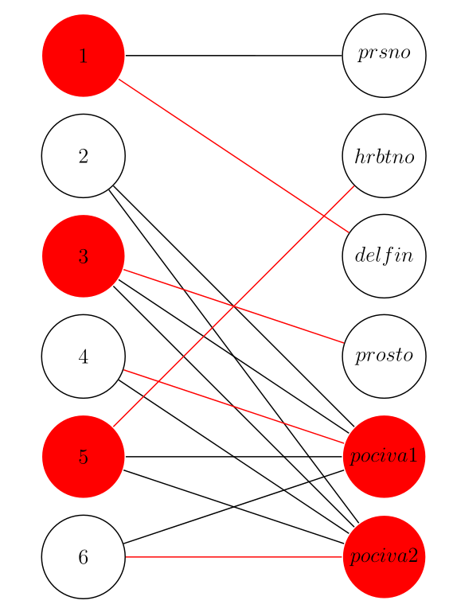

* Na $H$ poiščemo največje prirejanje $M$ in najmanjše pokritje $C = (X \setminus S) + T$ z madžarsko metodo.

* Če je $M$ popolno prirejanje ($\vert M \vert = n$), nam to da $n$ ničel, eno v vsaki vrstici in stolpcu.
* Če je $\vert M \vert = \vert C \vert < n$, nam vozlišča iz $C$ dajo manj kot $n$ vrstic in stolpcev, ki pokrijejo vse ničle.
  - Vrsticam v $C$ (torej v $X \setminus S$) prištejemo $\epsilon$, stolpcem izven $C$ (torej v $X \setminus T$) odštejemo $\epsilon$.
  - Res torej od nepokritih števil odštejemo $\epsilon$, dvakrat pokritim pa prištejemo $\epsilon$.

---

# Končnost MMU

* Zakaj se madžarska metoda z utežmi vedno ustavi?

  

  

  

  

  

  →

  

  

  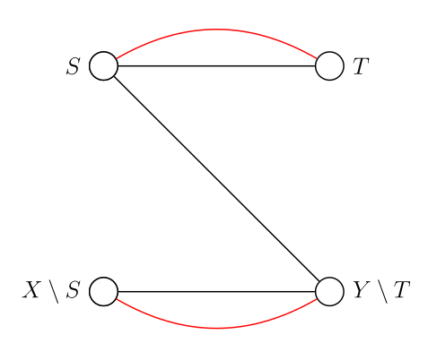

  

  

* V tretjem koraku se znebimo povezav med $X \setminus S$ in $T$ (dvakrat pokrita števila) in pridelamo vsaj eno povezavo med $S$ in $Y \setminus T$ (med nepokritimi števili je bil $\epsilon$, ki smo ga zmanjšali na $0$) - naj bo to povezava $uv$ ($u \in S$, $v \in Y \setminus T$).

---

# Končnost MMU (2)

* Imamo dve možnosti:

  - $v$ je prosto vozlišče: našli smo povečujočo pot, prirejanje se poveča;
  - $v$ je vezano vozlišče: poveča se množica $T$.

* Množica $T$ se lahko poveča največ $n$-krat, preden se poveča prirejanje.
* Prirejanje se poveča največ $n$-krat.
* Madžarska metoda z utežmi ima torej največ $n^2$ korakov.
* Ker pri tem opravi približno $n^2$ operacij za izvedbo madžarske metode, za madžarsko metodo z utežmi potrebujemo $O(n^4)$ operacij.

---

# Opombi

* **Opomba.** Če iščemo maksimalno popolno prirejanje, poiščemo minimalno popolno prirejanje za $-A$.

* **Opomba.** Iščemo $\min \sum_{i=1}^n A_{i \pi(i)}$ po vseh permutacijah $\pi \in S(n)$ ($n!$ permutacij).
  - Če se omejimo samo na ciklične permutacije (tj., oblike $\pi = (i_1 \ i_2 \ \dots \ i_n)$ - $(n-1)!$ permutacij), je to problem potujočega trgovca - zanj ne poznamo učinkovitega algoritma.