# Konveksna optimizacija

* **_Definicija._** Množica $A \subseteq \mathbb{R}^m$ je _konveksna_, če za vsaka $x, y \in A$ in vsak $\lambda \in [0, 1]$ velja $(1 - \lambda) x + \lambda y \in A$.

* Torej: množica $A$ je konveksna, če je vsaka daljica s krajišči v množici $A$ v celoti vsebovana v $A$.

* **_Trditev._** Presek konveksnih množic je konveksen: $A_i$ ($i \in I$) konveksne $\Rightarrow \bigcap_{i \in I} A_i$ konveksna.

* _Dokaz._ Preveriti moramo: za vsaka $x, y \in \bigcap_{i \in I} A_i$ in vsak $\lambda \in [0, 1]$ velja $\forall i \in I: (1-\lambda) x + \lambda y \in A_i$. To je res, ker so množice $A_i$ ($i \in I$) konveksne.

---

# Konveksne kombinacije

* **_Definicija._** Vektor $\lambda_1 x_1 + \lambda_2 x_2 + \dots + \lambda_n x_n$, kjer $\lambda_1, \lambda_2, \dots, \lambda_n \ge 0$, $\lambda_1 + \lambda_2 + \dots + \lambda_n = 1$, je _konveksna kombinacija_ vektorjev $x_1, x_2, \dots, x_n$.

* Za $n = 2$ pišemo $\lambda := \lambda_2$, $\lambda_1 = 1 - \lambda$, torej $\lambda_1 x_1 + \lambda_2 x_2 = (1 - \lambda) x_1 + \lambda x_2$.

* **_Trditev._** Množica $A$ je konveksna natanko tedaj, ko je v $A$ vsaka konveksna kombinacija vektorjev iz $A$.

---

# Dokaz

* ($\Longleftarrow$) Očitno.
* ($\Longrightarrow$) Naj bo $x = \lambda_1 x_1 + \lambda_2 x_2 + \dots + \lambda_n x_n$ konveksna kombinacija vektorjev $x_1, x_2, \dots, x_n \in A$. Naredimo indukcijo na $n$.
  * $n = 1$: $x = 1 \cdot x_1 = x_1 \in A$.
  * $n = 2$: po definiciji.
  * $n > 2$: če $\lambda_n = 1$, potem $\lambda_1 = \lambda_2 = \dots = \lambda_{n-1} = 0$ in $x = 1 \cdot x_n = x_n \in A$. Sicer $\lambda_n < 1$ - tedaj naj bo

    $$
    y := {\lambda_1 x_1 + \lambda_2 x_2 + \dots + \lambda_{n-1} x_{n-1} \over 1 - \lambda_n} .
    $$

    * Ker je ${\lambda_1 \over 1 - \lambda_n}, {\lambda_2 \over 1 - \lambda_n}, \dots, {\lambda_{n-1} \over 1 - \lambda_n} \ge 0$ in ${\lambda_1 \over 1 - \lambda_n} + {\lambda_2 \over 1 - \lambda_n} + \dots + {\lambda_{n-1} \over 1 - \lambda_n} = 1$, je $y$ konveksna kombinacija vektorjev $x_1, x_2, \dots, x_{n-1} \in A$.
    * Po indukcijski predpostavki je $y \in A$, torej je tudi $x = (1 - \lambda_n) y + \lambda_n x_n \in A$.

---

# Konveksna ogrinjača

* **_Definicija._** Množica $\operatorname{conv}(A) := \bigcap_{\substack{K \supseteq A \\ K \text{ konveksna}}} K$ je _konveksna ogrinjača_ (ali _konveksna ovojnica_) množice $A \subseteq \mathbb{R}^m$.

* **Opomba.** Primerjaj z linearno ogrinjačo $\operatorname{Lin}(A) = \bigcap_{\substack{V \supseteq A \\ V \text{ podprostor}}} V$.

---

# Lastnosti konveksne ogrinjače

**_Trditev._** Naj bosta $A, B \subseteq \mathbb{R}^m$ množici, pri čemer je množica $B$ konveksna. Potem velja sledeče.

* 1\. $A \subseteq \operatorname{conv}(A)$.
* 2\. $\operatorname{conv}(A)$ je konveksna množica.
* 3\. $A \subseteq B \Rightarrow \operatorname{conv}(A) \subseteq B$.
* 4\. Če je $A$ konveksna množica, potem $\operatorname{conv}(A) = A$.
* 5\.

  $$
  \begin{multlined}
  \operatorname{conv}(A) = \lbrace \lambda_1 x_1 + \lambda_2 x_2 + \dots + \lambda_n x_n \mid \\
  n \in \mathbb{N}, x_1, x_2, \dots, x_n \in A, \lambda_1, \lambda_2, \dots, \lambda_n \ge 0, \lambda_1 + \lambda_2 + \dots + \lambda_n = 1 \rbrace
  \end{multlined}
  $$

  \- tj., množica konveksnih kombinacij vektorjev iz $A$.

---

# Dokaz

* 1\. $\operatorname{conv}(A) = \bigcap_{\substack{K \supseteq A \\ K \text{ konveksna}}} K \supseteq A$
* 2\. Presek konveksnih množic je konveksen.
* 3\. Ker je $B$ konveksna, sledi iz definicije konveksne ogrinjače.
* 4\. Po 3. je $\operatorname{conv}(A) \subseteq A \subseteq \operatorname{conv}(A)$.

---

# Dokaz (2)

5\. Naj bo $C$ množica konveksnih kombinacij vektorjev iz $A$. Dokažimo $\operatorname{conv}(A) = C$.
* ($\subseteq$) Po 3. velja $\operatorname{conv}(A) \subseteq C$, saj:
  * $A = \lbrace 1 \cdot x \mid x \in A \rbrace \subseteq C$;
  * $C$ je konveksna, ker je vsaka konveksna kombinacija vektorjev $x, y \in C$

    $$
    \begin{aligned}
    z &= (1 - \lambda) x + \lambda y \\
      &= (1 - \lambda)(\mu_1 x_1 + \dots + \mu_k x_k) + \lambda (\nu_1 y_1 + \dots + \nu_\ell y_\ell) \\
      &= (1 - \lambda) \mu_1 x_1 + \dots + (1 - \lambda) \mu_k x_k + \lambda \nu_1 y_1 + \dots + \lambda \nu_\ell y_\ell
    \end{aligned}
    $$

    tudi konveksna kombinacija vektorjev $x_1, \dots, x_k, y_1, \dots, y_\ell \in A$, saj $(1-\lambda) \mu_i, \lambda \nu_j \ge 0$ ($1 \le i \le k$, $1 \le j \le \ell$) in $\sum_{i=1}^k (1 - \lambda) \mu_i + \sum_{j=1}^\ell \lambda \nu_j = (1 - \lambda) + \lambda = 1$, torej $z \in C$.
* ($\supseteq$) Ker je vsak $x \in C$ konveksna kombinacija vektorjev $x_1, x_2, \dots, x_n \in A$, za vsako konveksno množico $K \supseteq A$ velja $x_1, x_2, \dots, x_n \in K$, torej $x \in K$ in zato $x \in \operatorname{conv}(A)$. Sledi $\operatorname{conv}(A) \supseteq C$.

---

# Ekstremne točke

* **_Definicija._** Naj bo $A$ konveksna množica. Točka $a \in A$ je _ekstremna točka_, če velja $\forall x, y \in A \ \forall \lambda \in (0, 1): (a = (1 - \lambda) x + \lambda y \Rightarrow x = y = a)$ (tj., $a$ ne leži v notranjosti nobene daljice med različnima točkama iz $A$).

* **_Primer._** Ekstremne točke so prikazane z rdečo barvo.

* 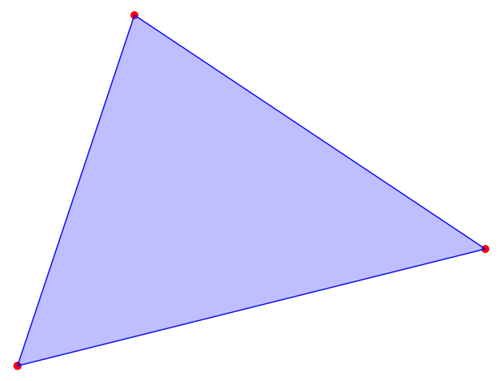

* 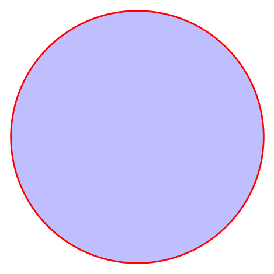

* 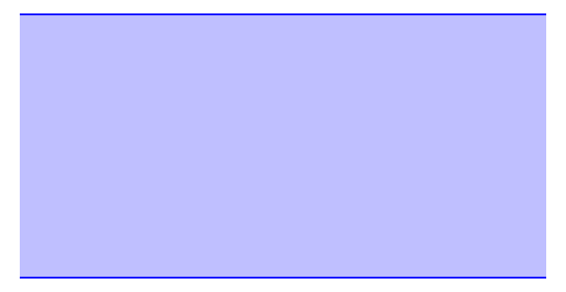

  Ni ekstremnih točk!

---

# Afine množice in kombinacije

* **_Definicija._** Množica $A \ne \emptyset$ je _afina_, če velja $\forall x, y \in A \ \forall \lambda \in \mathbb{R}: (1 - \lambda) x + \lambda y \in A$ (tj., vsaka premica skozi različni točki iz $A$ je vsebovana v $A$).

* **_Definicija._** Vektor $\lambda_1 x_1 + \lambda_2 x_2 + \dots + \lambda_n x_n$, kjer je $\lambda_1 + \lambda_2 + \dots + \lambda_n = 1$, je _afina kombinacija_ vektorjev $x_1, x_2, \dots, x_n$.

---

# Lastnosti afinih množic

* **_Trditev._** Naj bo $A \subseteq \mathbb{R}^m$ neprazna množica. Sledeče trditve so ekvivalentne.

  

  * 1\. Množica $A$ je afina.
  * 2\. Vsaka afina kombinacija točk iz $A$ je v $A$.
  * 3\. $\exists v \in \mathbb{R}^m$, $\exists V \le \mathbb{R}^m$ linearen podprostor: $A = v + V = \lbrace v + x \mid x \in V \rbrace$.

  

* **Opomba.** Primeri afinih množic so premica v $\mathbb{R}^m$, ravnina v $\mathbb{R}^m$, ... - rečemo jim tudi _afini podprostori_. Definiramo lahko tudi dimenzijo afinega podprostora.

---

# Dokaz (1. $\Rightarrow$ 2.)

Naj bo $x = \lambda_1 x_1 + \lambda_2 x_2 + \dots + \lambda_n x_n$ afina kombinacija vektorjev $x_1, x_2, \dots, x_n \in A$. Naredimo indukcijo na $n$.
  * $n = 1$: $x = 1 \cdot x_1 = x_1 \in A$.
  * $n = 2$: po definiciji.
  * $n > 2$: brez škode za splošnost vzamemo $\lambda_n \ne 1$ - tedaj naj bo

    $$
    y := {\lambda_1 x_1 + \lambda_2 x_2 + \dots + \lambda_{n-1} x_{n-1} \over 1 - \lambda_n} .
    $$

    * Ker je ${\lambda_1 \over 1 - \lambda_n} + {\lambda_2 \over 1 - \lambda_n} + \dots + {\lambda_{n-1} \over 1 - \lambda_n} = 1$, je $y$ afina kombinacija vektorjev $x_1, x_2, \dots, x_{n-1} \in A$.
    * Po indukcijski predpostavki je $y \in A$, torej je tudi $x = (1 - \lambda_n) y + \lambda_n x_n \in A$.

---

# Dokaz (2. $\Rightarrow$ 3. $\Rightarrow$ 1.)

* (2. $\Rightarrow$ 3.) Naj bo $v \in A$ poljuben vektor. Potem je $V := A - v$ linearen podprostor, saj za vsake $x, y \in A$ ter $\mu, \nu \in \mathbb{R}$ velja
  
  $$
  \begin{aligned}
  \mu (x - v) + \nu (y - v) &= \mu x + \nu y - \mu v - \nu v \\
  &= \mu x + \nu y + (1 - \mu - \nu) v - v \in V,
  \end{aligned}
  $$

  saj $x, y, v \in A$ ter $\mu + \nu + (1 - \mu - \nu) = 1$. Velja torej $A = V + v$.

* (3. $\Rightarrow$ 1.) Poljubna vektorja iz $A$ lahko zapišemo kot $x+v$ in $y+v$, kjer $x, y \in V$. Za poljuben $\lambda \in \mathbb{R}$ velja

  $$
  (1 - \lambda) (x + v) + \lambda (y + v) = (1 - \lambda) x + \lambda y + v \in A.
  $$

---

# Konveksni stožci in Farkaseva lema

* **_Definicija._** Množica $A \subseteq \mathbb{R}^m$ je _konveksen stožec_, če velja $\forall x, y \in A \ \forall \lambda, \mu \ge 0: \lambda x + \mu y \in A$.

* **Opomba.** Če za vsaka $x, y \in A$ velja

  - $\forall \lambda, \mu: \lambda x + \mu y \in A$, potem je $A$ linearen podprostor;
  - $\forall \lambda, \mu \ge 0: \lambda x + \mu y \in A$, potem je $A$ konveksen stožec;
  - $\forall \lambda, \mu: (\lambda + \mu = 1 \Rightarrow \lambda x + \mu y \in A)$, potem je množica $A$ afina; in
  - $\forall \lambda, \mu \ge 0: (\lambda + \mu = 1 \Rightarrow \lambda x + \mu y \in A)$, potem je množica $A$ konveksna.

  Vsak konveksen stožec je konveksna množica; obratno ne velja.

---

# Konveksen stožec, napet na vektorjih

* **_Definicija._** Množica

  $$
  S(a_1, a_2, \dots, a_n) := \lbrace \lambda_1 a_1 + \lambda_2 a_2 + \dots \lambda_n a_n \mid \lambda_1, \lambda_2, \dots, \lambda_n \ge 0 \rbrace
  $$

  je _konveksen stožec, napet na vektorjih_ $a_1, a_2, \dots, a_n$.

* **_Trditev._** Množica $S(a_1, a_2, \dots, a_n)$ je konveksen stožec.

* _Dokaz._ Naj bodo $\lambda, \lambda_1, \dots, \lambda_n, \mu, \mu_1, \dots, \mu_n \ge 0$. Potem velja

  $$
  \begin{multlined}
  \lambda (\lambda_1 a_1 + \dots + \lambda_n a_n) + \mu (\mu_1 a_1 + \dots + \mu_n a_n) = \\
  (\lambda \lambda_1 + \mu \mu_1) a_1 + \dots + (\lambda \lambda_n + \mu \mu_n) a_n \in S(a_1, \dots, a_n),
  \end{multlined}
  $$

  saj $\lambda \lambda_i + \mu \mu_i \ge 0$ ($1 \le i \le n$).

---

# Primeri

* $S(a_1)$:
  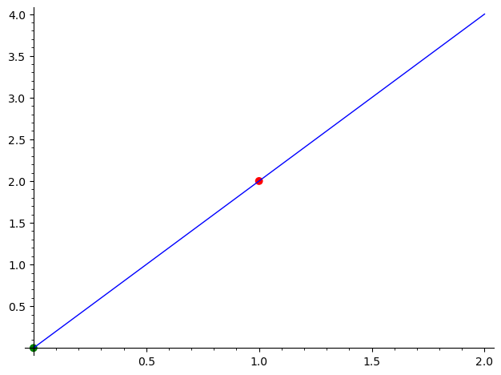

* $S(a_1, a_2)$:
  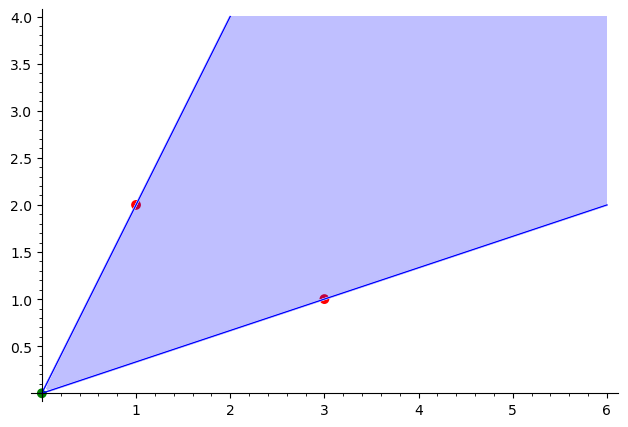

---

# Primeri (2)

$S(a_1, a_2, a_3)$:

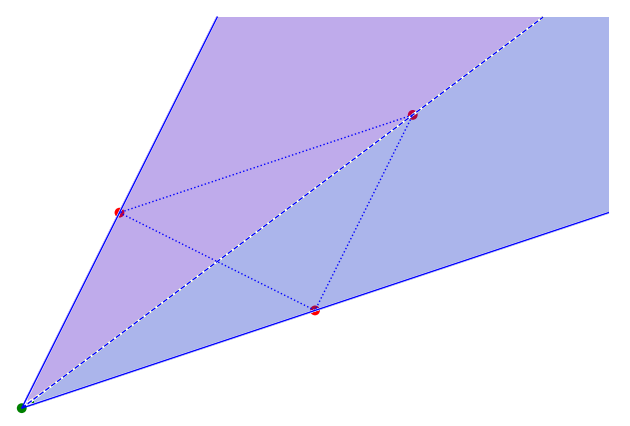

---

# Dualni stožec

* **_Definicija._** Naj bo $A \subseteq \mathbb{R}^m$. Množici

  $$
  A^\ast := \lbrace x \in \mathbb{R}^m \mid \forall a \in A: a^\top x \ge 0 \rbrace
  $$

  (tj., množici vektorjev, ki tvorijo ostri kot z vsemi vektorji iz $A$) pravimo _dualni stožec_ množice $A$.

* 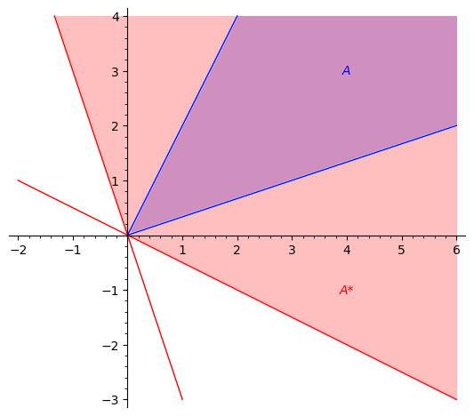

---

# Lastnosti dualnega stožca

* **_Trditev._** Dualni stožec $A^\ast$ množice $A$ je konveksen stožec.

* _Dokaz._ Vzemimo poljubne $x, y \in A^\ast$ in $\lambda, \mu \ge 0$. Potem za vsak $a \in A$ velja

  $$
  a^\top (\lambda x + \mu y) = \lambda \, a^\top x + \mu \, a^\top y \ge 0,
  $$

  torej $\lambda x + \mu y \in A^\ast$.

* **_Trditev._** $A \subseteq A^{\ast\ast}$.

* **Opomba.** V splošnem ne velja $A = A^{\ast\ast}$ (npr. če $A$ ni konveksen stožec).

* _Dokaz._ Vzemimo poljuben $x \in A$. Potem za vsak $y \in A^\ast$ velja $x^\top y \ge 0$, torej velja tudi $x \in A^{\ast\ast}$.

---

# Farkaseva lema

* **_Izrek (Farkaseva lema - geometrijska oblika)._** $S^{\ast\ast}(a_1, a_2, \dots, a_n) = S(a_1, a_2, \dots, a_n)$.

* _Dokaz._

  * ($\supseteq$) Po prejšnji trditvi.
  * ($\subseteq$) Naj bo $A = [a_1 \, a_2 \, \dots \, a_n]$ matrika s stolpci $a_1, a_2, \dots, a_n$ in $b \in S^{\ast\ast}(a_1, a_2, \dots, a_n)$. Definirajmo linearni program $\Pi$ in njegov dual $\Pi'$:

    

    

    $$
    \begin{aligned}
    \Pi: \quad \max \ 0^\top x \\[1ex]
    \text{p.p.} \quad A x &= b \\
    x &\ge 0
    \end{aligned}
    $$

    

    

    $$
    \begin{aligned}
    \Pi': \quad \min \ b^\top y \\[1ex]
    \text{p.p.} \quad A^\top y &\ge 0 \\
    \phantom{}
    \end{aligned}
    $$

    

    

---

# Dokaz (2)

* Ker je $y = 0$ dopustna rešitev $\Pi'$, je ta dopusten; pokazali bomo, da je tudi omejen.
* Naj bo $y$ dopustna rešitev za $\Pi'$, torej velja $A^\top y \ge 0$ oziroma

  $$
  \forall i \in \lbrace 1, 2, \dots, n \rbrace: \ a_i^\top y \ge 0.
  $$

* Potem za poljubne $\lambda_1, \lambda_2, \dots, \lambda_n \ge 0$ velja

  $$
  (\lambda_1 a_1 + \lambda_2 a_2 + \dots + \lambda_n a_n)^\top y = \lambda_1 \, a_1^\top y + \lambda_2 \, a_2^\top y + \dots + \lambda_n \, a_n^\top y \ge 0
  $$

* Vektor $y$ torej tvori ostri kot z vsemi vektorji iz $S(a_1, a_2, \dots, a_n)$ in zato $y \in S^\ast(a_1, a_2, \dots, a_n)$.

---

# Dokaz (3)

* Ker velja $b \in S^{\ast\ast}(a_1, a_2, \dots, a_n)$, sledi $b^\top y \ge 0$, torej je $\Pi'$ omejen in zato optimalen.
* Po krepkem izreku o dualnosti je tudi $\Pi$ optimalen, torej $\exists x \ge 0: Ax = b$ oziroma

  $$
  \exists x_1, x_2, \dots, x_n \ge 0: \ x_1 a_1 + x_2 a_2 + \dots + x_n a_n = b,
  $$

  iz česar sledi $b \in S(a_1, a_2, \dots, a_n)$.

* **Opomba.** Farkasevo lemo se da dokazati tudi neposredno, krepki izrek o dualnosti sledi iz nje. Imamo torej ekvivalenco Farkas $\Leftrightarrow$ KID.

---

# Farkaseva lema - algebraična oblika

1. $\exists x \ge 0: \ Ax = b \ \Longleftrightarrow \ \forall y: \ (A^\top y \ge 0 \Rightarrow b^\top y \ge 0)$
2. $\exists x \ge 0: \ Ax \le b \ \Longleftrightarrow \ \forall y \ge 0: \ (A^\top y \ge 0 \Rightarrow b^\top y \ge 0)$
3. $\exists x: \ Ax = b \ \Longleftrightarrow \ \forall y: \ (A^\top y = 0 \Rightarrow b^\top y \ge 0)$
4. $\exists x: \ Ax \le b \ \Longleftrightarrow \ \forall y \ge 0: \ (A^\top y = 0 \Rightarrow b^\top y \ge 0)$

* _Dokaz._

  

  1\. Naj bodo $a_1, a_2, \dots, a_n$ stolpci matrike $A$. Potem je izjava ekvivalentna izjavi $b \in S(a_1, a_2, \dots, a_n) \Longleftrightarrow b \in S^{\ast\ast}(a_1, a_2, \dots, a_n)$, ki sledi iz geometrijske oblike Farkaseve leme.

  

---

# Dokaz (nadaljevanje)

Obravnavamo linearna programa:

* 2\.

  

  

  $$
  \begin{aligned}
  \Pi: \quad \max \ 0^\top x \\[1ex]
  \text{p.p.} \quad A x &\le b \\
  x &\ge 0
  \end{aligned}
  $$

  

  

  $$
  \begin{aligned}
  \Pi': \quad \min \ b^\top y \\[1ex]
  \text{p.p.} \quad A^\top y &\ge 0 \\
  y &\ge 0
  \end{aligned}
  $$

  

  

* 3\.

  

  

  $$
  \begin{aligned}
  \Pi: \quad \max \ 0^\top x \\[1ex]
  \text{p.p.} \quad A x &= b
  \end{aligned}
  $$

  

  

  $$
  \begin{aligned}
  \Pi': \quad \min \ b^\top y \\[1ex]
  \text{p.p.} \quad A^\top y &= 0
  \end{aligned}
  $$

  

  

* 4\.

  

  

  $$
  \begin{aligned}
  \Pi: \quad \max \ 0^\top x \\[1ex]
  \text{p.p.} \quad A x &\le b \\
  \phantom{}
  \end{aligned}
  $$

  

  

  $$
  \begin{aligned}
  \Pi': \quad \min \ b^\top y \\[1ex]
  \text{p.p.} \quad A^\top y &= 0 \\
  y &\ge 0
  \end{aligned}
  $$

  

  

* V vseh primerih ekvivalenco dokažemo tako:

  * ($\Longrightarrow$) Sledi iz šibkega izreka o dualnosti.
  * ($\Longleftarrow$) Dualni linearni program $\Pi'$ ima dopustno rešitev $y = 0$, po predpostavki pa je to tudi optimalna rešitev. Po krepkem izreku o dualnosti je tudi $\Pi$ optimalen, torej ima dopustno rešitev.

---

# Primeri

1\. Ali obstaja nenegativna rešitev sistema linearnih enačb $Ax = b$?
* Če obstaja, jo zapišemo. Če ne obstaja, poiščemo $y$, da velja $A^\top y \ge 0$, $b^\top y < 0$.

  $$
  \begin{aligned}
  x_1 - x_2 + 2 x_3 &= 1 & / \cdot 1 \\
  -x_1 - x_2 + x_3 &= 2 & / \cdot (-1) \\ \hline
  2 x_1 + x_3 &= -1
  \end{aligned}
  $$

* Dokažimo, da zgornji sistem nima nenegativnih rešitev.

  $$
  \begin{aligned}
  A &= \begin{bmatrix}
  1 & -1 & 2 \\ -1 & -1 & 1
  \end{bmatrix}, \quad
  b = \begin{bmatrix} 1 \\ 2 \end{bmatrix}, \quad
  y = \begin{bmatrix} 1 \\ -1 \end{bmatrix} \\
  A^\top y &= \begin{bmatrix}
  1 & -1 \\ -1 & -1 \\ 2 & 1
  \end{bmatrix}
  \begin{bmatrix} 1 \\ -1 \end{bmatrix}
  = \begin{bmatrix} 2 \\ 0 \\ 1 \end{bmatrix} \ge 0, \quad
  b^\top y = -1 < 0
  \end{aligned}
  $$
   
* Ustrezen $x$ oziroma $y$ lahko poiščemo s simpleksno metodo.

---

# Primeri (2)

2\. Pokažimo, da linearni program nima dopustne rešitve.

* 
  $$
  \begin{aligned}
  x_1 - x_2 &\le -1 & / \cdot 1 \\
  -x_1 - x_2 &\le -3 & / \cdot 3 \\
  2 x_1 + x_2 &\le 2 & / \cdot 4 \\
  x_1, x_2 &\ge 0 \\ \hline
  6 x_1 &\le -2
  \end{aligned}
  $$

* 
  $$
  \begin{aligned}
  A &= \begin{bmatrix}
  1 & -1 \\ -1 & -1 \\ 2 & 1
  \end{bmatrix}, \quad
  b = \begin{bmatrix} -1 \\ -3 \\ 2 \end{bmatrix},  \quad
  y = \begin{bmatrix} 1 \\ 3 \\ 4 \end{bmatrix} \ge 0 \\
  A^\top y &= \begin{bmatrix} 6 \\ 0 \end{bmatrix} \ge 0, \quad
  b^\top y = -2 < 0
  \end{aligned}
  $$

---

# Primeri (3)

3\. Enakovredna izjava: $\exists x: \ Ax = b \ \Longleftrightarrow \ \forall y: \ (A^\top y = 0 \Rightarrow b^\top y = 0)$.

* Pri linearni algebri $\lnot \exists x: \ Ax = b$ dokazujemo z Gaussovo eliminacijo.

* 
  $$
  \begin{aligned}
  x_1 - 2 x_2 &= 3 & / \cdot 1 \\
  -x_1 + 2 x_2 &= 1 & / \cdot 1 \\ \hline
  0 &= 4
  \end{aligned}
  $$

* 
  $$
  \begin{aligned}
  A &= \begin{bmatrix}
  1 & -2 \\ -1 & 2
  \end{bmatrix}, \quad
  b = \begin{bmatrix} 3 \\ 1 \end{bmatrix}, \quad
  y = \begin{bmatrix} 1 \\ 1 \end{bmatrix} \\
  A^\top y &= \begin{bmatrix} 0 \\ 0 \end{bmatrix}, \quad
  b^\top y = 4
  \end{aligned}
  $$

---

# Opomba

* Ekvivalentna trditev Farkasevi lemi:

  $$
  b \not\in S(a_1, a_2, \dots, a_n) \Longleftrightarrow b \not\in S^{\ast\ast}(a_1, a_2, \dots, a_n).
  $$

* Torej ($\Longrightarrow$): če $b$ ni v konveksnem stožcu, napetem na $a_1, a_2, \dots, a_n$, potem $b$ ne tvori ostrega kota z $y \in S^\ast(a_1, a_2, \dots, a_n)$ - med $b$ in $S(a_1, a_2, \dots, a_n)$ je tako neka hiperravnina.

* 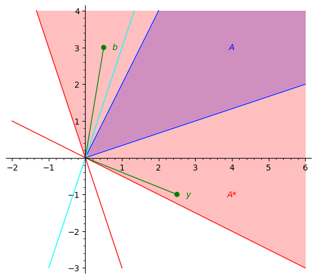

---

# Konveksne funkcije

Konveksne funkcije so "obrnjene navzgor", npr $f(x) = x^2$.

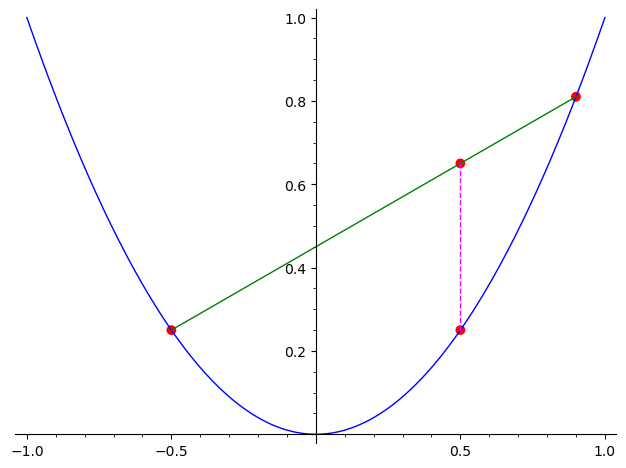

---

# Definicija

* Naj bo $K \subseteq \mathbb{R}^n$ konveksna množica.
* Funkcija $f : K \to \mathbb{R}$ je _konveksna_, če velja

  $$
  \forall x, y \in K \ \forall \lambda \in [0, 1]: f((1 - \lambda) x + \lambda y) \le (1 - \lambda) f(x) + \lambda f(y)
  $$

  Torej: graf funkcije leži pod zveznicami točk na grafu.

* Funkcija $f : K \to \mathbb{R}$ je _konkavna_, če velja

  $$
  \forall x, y \in K \ \forall \lambda \in [0, 1]: f((1 - \lambda) x + \lambda y) \ge (1 - \lambda) f(x) + \lambda f(y)
  $$

  Torej: $f$ je konkavna $\Longleftrightarrow$ $-f$ je konveksna.

* Funkcija $f : K \to \mathbb{R}$ je _strogo konveksna_, če velja

  $$
  \forall x, y \in K \ \forall \lambda \in (0, 1): (x \ne y \Rightarrow f((1 - \lambda) x + \lambda y) < (1 - \lambda) f(x) + \lambda f(y))
  $$

* Funkcija $f : K \to \mathbb{R}$ je _strogo konkavna_, če velja

  $$
  \forall x, y \in K \ \forall \lambda \in (0, 1): (x \ne y \Rightarrow f((1 - \lambda) x + \lambda y) > (1 - \lambda) f(x) + \lambda f(y))
  $$

---

# Primeri

* Množica $K \subseteq \mathbb{R}$ je konveksna natanko tedaj, ko je množica $K$ interval.
* Trdimo: $f(x) = x^2$ je konveksna funkcija (za vsak interval $K$).

  $$
  \begin{aligned}
  & f((1 - \lambda) x + \lambda y) \stackrel{?}{\le} (1 - \lambda) f(x) + \lambda f(y) \\[2ex]
  & ((1 - \lambda) x + \lambda y)^2 - ((1 - \lambda) x^2 + \lambda y^2) \\
  &= (1 - \lambda)^2 x^2 + 2(1 - \lambda) \lambda xy + \lambda^2 y^2 - (1 - \lambda) x^2 - \lambda y^2 \\
  &= (1 - \lambda)(1 - \lambda - 1) x^2 + 2(1 - \lambda) \lambda xy + \lambda (\lambda - 1) y^2 \\
  &= -\lambda(1 - \lambda) (x^2 - 2xy + y^2) = -\lambda(1 - \lambda) (x - y)^2 \le 0
  \end{aligned}
  $$

---

# Primeri (2)

* _Afina funkcija_ $f(x_1, x_2, \dots, x_n) = a_1 x_1 + a_2 x_2 + \dots + a_n x_n + b$ (ali $f(x) = a^\top x + b$) je konveksna:

  $$
  \begin{aligned}
  f((1 - \lambda) x + \lambda y)
  &= a^\top ((1 - \lambda) x + \lambda y) + b \\
  &= (1 - \lambda) a^\top x + \lambda a^\top y + (1 - \lambda) b + \lambda b \\
  &= (1 - \lambda) f(x) + \lambda f(y)
  \end{aligned}
  $$

* Funkcija $f$ je tudi konkavna.
* Da se dokazati, da je funkcija konveksna in konkavna natanko tedaj, ko je afina.

---

# Primeri (3)

* _Norma_ $\Vert \cdot \Vert : \mathbb{R}^n \to \mathbb{R}$ je funkcija s sledečimi lastnostmi:
   - $\Vert x \Vert \ge 0$, $\Vert x \Vert = 0 \Rightarrow x = 0$
   - $\Vert \lambda x \Vert = \vert \lambda \vert \Vert x \Vert$
   - $\Vert x + y \Vert \le \Vert x \Vert + \Vert y \Vert$ (_trikotniška neenakost_)

* Primer: dolžina vektorja $\Vert x \Vert = \sqrt{x^\top x} = \sqrt{x_1^2 + x_2^2 + \dots + x_n^2}$

* Norma je konveksna:

  $$
  \Vert (1 - \lambda) x + \lambda y \Vert \le \Vert (1 - \lambda) x \Vert + \Vert \lambda y \Vert = (1 - \lambda) \Vert x \Vert + \lambda \Vert y \Vert
  $$

---

# Lastnosti konveksnih funkcij

* **_Trditev._** Naj bo $K \subseteq \mathbb{R}^n$ konveksna množica ter $f, g: K \to \mathbb{R}$ konveksni funkciji. Potem velja sledeče.

  1. Če $c \ge 0$, potem je $c \cdot f$ konveksna funkcija.
  2. Funkcija $f + g$ je konveksna.
  3. Če je funkcija $f$ afina, je slika $f(K)$ konveksna množica.

* **_Trditev._** Naj bo $K \subseteq \mathbb{R}^n$ konveksna množica ter $f: K \to \mathbb{R}$ in $g: \operatorname{conv}(f(K)) \to \mathbb{R}$ konveksni funkciji. Denimo, da velja vsaj eno od sledečega.

  - Funkcija $f$ je afina, ali
  - funkcija $g$ je naraščajoča.

  Potem je kompozitum $g \circ f$ konveksna funkcija.

---

# Dokaz

* 1\.

  $$
  (c \cdot f)((1 - \lambda) x + \lambda y) \le c ((1 - \lambda) f(x) + \lambda f(y)) = ((1 - \lambda) (c \cdot f)(x) + \lambda (c \cdot f)(y))
  $$

* 2\.

  $$
  \begin{aligned}
  (f + g)((1 - \lambda) x + \lambda y)
  &= f((1 - \lambda) x + \lambda y) + g((1 - \lambda) x + \lambda y) \\
  &\le (1 - \lambda) f(x) + \lambda f(y) + (1 - \lambda) g(x) + \lambda g(y) \\
  &= (1 - \lambda) (f + g)(x) + \lambda (f + g)(y)
  \end{aligned}
  $$

* 3\. Funkcija $f(x) = a^\top x + b$ je konveksna in konkavna, za $x, y \in K$ velja $f(x), f(y) \in f(K)$. Ker je $(1 - \lambda) x + \lambda y \in K$, velja

  $$
  (1 - \lambda) f(x) + \lambda f(y) = f((1 - \lambda) x + \lambda y) \in f(K).
  $$

---

# Dokaz (2)

* Trdimo, da velja

  $$
  \begin{aligned}
  f((1 - \lambda) x + \lambda y) &\le (1 - \lambda) f(x) + \lambda f(y) \\
  g(f((1 - \lambda) x + \lambda y)) &\le g((1 - \lambda) f(x) + \lambda f(y)) \\
  &\le (1 - \lambda) (g \circ f)(x) + \lambda (g \circ f)(y)
  \end{aligned}
  $$

* Prva neenakost velja zaradi konveksnosti funkcije $f$.
* Če je funkcija $g$ naraščajoča, potem velja tudi druga neenakost.
* Če pa je funkcija $f$ afina, velja enakost v prvi in posledično tudi v drugi neenakosti.
* V obeh primerih zadnja neenakost sledi zaradi konveksnosti funkcije $g$.

---

# Neprimeri

* Produkt konveksnih funkcij ni nujno konveksna funkcija: $f(x) = x$, $g(x) = -x$, $(f \cdot g)(x) = -x^2$.
* Kompozitum konveksnih funkcij ni nujno konveksna funkcija: $f(x) = x^2$, $g(x) = -x$, $(g \circ f)(x) = -x^2$.
* Slika konveksne množice s konveksno funkcijo ni nujno konveksna množica:

  $$
  \begin{aligned}
  f:&\ [0, 1] \to \mathbb{R} \\
  f(x) &= \begin{cases}
  0 & \text{če } 0 \le x < 1 \\
  1 & \text{če } x = 1
  \end{cases} \\
  f([0, 1]) &= \lbrace 0, 1 \rbrace
  \end{aligned}
  $$

---

# Konveksne funkcije in optimizacija

* **_Definicija._** Naj bo $A \subseteq \mathbb{R}^n$ in $f: A \to \mathbb{R}$. Funkcija $f$ ima v točki $x^\ast \in A$:

  * _globalni maksimum_, če $\forall x \in A: f(x) \le f(x^\ast)$;
  * _globalni minimum_, če $\forall x \in A: f(x) \ge f(x^\ast)$;
  * _lokalni maksimum_, če $\exists \epsilon > 0 \ \forall x \in A: (\Vert x - x^\ast \Vert < \epsilon \Rightarrow f(x) \le f(x^\ast))$; in
  * _lokalni minimum_, če $\exists \epsilon > 0 \ \forall x \in A: (\Vert x - x^\ast \Vert < \epsilon \Rightarrow f(x) \ge f(x^\ast))$.

* **_Trditev._** Naj bo $K \subseteq \mathbb{R}^n$ konveksna množica ter $f: K \to \mathbb{R}$ konveksna funkcija. Če ima $f$ v $x^\ast \in K$ lokalni minimum, ima v $x^\ast$ tudi globalni minimum.

---

# Dokaz

* Naj bo $\epsilon > 0$ tak, da velja $\forall x \in K: (\Vert x - x^\ast \Vert < \epsilon \Rightarrow f(x) \ge f(x^\ast))$.
* Če $x^\ast$ ni globalni minimum, potem obstaja tak $y \in K$, da velja $f(y) < f(x^\ast)$.
* Tedaj za vsak $\lambda \in (0, 1]$ velja

  $$
  f((1 - \lambda) x^\ast + \lambda y) \le (1 - \lambda) f(x^\ast) + \lambda f(y) < (1 - \lambda) f(x^\ast) + \lambda f(x^\ast) = f(x^\ast) .
  $$

* Za dovolj majhen $\lambda$ je $(1 - \lambda) x^\ast + \lambda y$ poljubno blizu $x^\ast$:

  $$
  \Vert (1 - \lambda) x^\ast + \lambda y - x^\ast \Vert = \Vert \lambda (y - x^\ast) \Vert = \lambda \Vert y - x^\ast \Vert < \epsilon, \text{ če } \lambda < {\epsilon \over \Vert y - x^\ast \Vert}
  $$

* Torej: če je $\lambda \in \left(0, {\epsilon \over \Vert y - x^\ast \Vert}\right)$, je $\Vert (1 - \lambda) x^\ast + \lambda y - x^\ast \Vert < \epsilon$ in tedaj $f((1 - \lambda) x^\ast + \lambda y) < f(x^\ast)$, protislovje.

---

# Odvodi

* Preverjanje konveksnosti po definiciji je v splošnem težko. Večinoma je lažje preverjati konveksnost z odvodi.

* Naj bo $f: (a, b) \to \mathbb{R}$ konveksna funkcija. Njen graf potem leži nad vsako tangento (**kriterij 1. odvoda**), torej
$f(y) \ge f(x) + (y-x) f'(x)$ za vsaka $x, y \in (a, b)$.

* **_Primer._** Naj bo $f(x) = x^2$. Preverimo, ali za vsaka $x, y \in \mathbb{R}$ velja

  $$
  y^2 \stackrel{?}{\ge} x^2 + (y-x) \cdot 2x .
  $$

  * Res:

    $$
    y^2 - x^2 - 2xy + 2x^2 = y^2 - 2xy + x^2 = (x-y)^2 \ge 0.
    $$

---

# Odvodi (2)

* Smerni koeficienti tangent na graf konveksne funkcije $f$ naraščajo - njen odvod $f'$ je torej naraščajoča funkcija, torej $f''(x) \ge 0$ za vsak $x \in (a, b)$ (**kriterij 2. odvoda**).

* **_Primer._** Naj bo $f(x) = x^2$. Potem je $f''(x) = 2 \ge 0$.

---

# Kriterij 1. odvoda

* Naj bo $K \subseteq \mathbb{R}^n$ odprta konveksna množica, ter $f: K \to \mathbb{R}$ funkcija, ki ima vse parcialne odvode ${\partial f \over \partial x_i}$ ($1 \le i \le n$).
  - Parcialne odvode zapišemo v _gradient_ $\nabla f(x) = \left({\partial f \over \partial x_i}(x)\right)_{i=1}^n$.
* Potem je funkcija $f$ konveksna natanko tedaj, ko za vsaka $x, y \in K$ velja $f(y) \ge f(x) + (\nabla f(x))^\top (y - x)$.

---

# Dokaz ($\Longleftarrow$)

* Naj bodo $x, y \in K$ in $\lambda \in [0, 1]$ poljubni ter pišimo $z := (1 - \lambda) x + \lambda y$.
* Potem velja:

  $$
  \begin{aligned}
  f(x) &\ge f(z) + (\nabla f(z))^\top (x - z) &&/ \cdot (1 - \lambda) \\
  f(y) &\ge f(z) + (\nabla f(z))^\top (y - z) &&/ \cdot \lambda \\
  \hline
  (1 - \lambda) f(x) + \lambda f(y) &\ge f(z) + (\nabla f(z))^\top ((1 - \lambda) x + \lambda y - z) \\
  &= f((1 - \lambda) x + \lambda y)
  \end{aligned}
  $$

* Funkcija $f$ je torej konveksna.

---

# Dokaz ($\Longrightarrow$)

* Za fiksna $x, y \in K$ je $g_{x, y}(\lambda) = f((1 - \lambda) x + \lambda y)$ funkcija v $\lambda$ - zanima nas njen odvod pri $\lambda = 0$.
*  Funkcija $g_{x, y}$ je definirana na $(-\epsilon, 1]$ za nek $\epsilon > 0$.
*  Naj bo $\delta > 0$ tak, da je množica $K(x, \delta) = \lbrace y \in \mathbb{R}^n \mid \Vert x - y \Vert \le \delta \rbrace$ (tj., krogla s središčem v $x$ in polmerom $\delta$) vsebovana v $K$.
* Zadostuje, da za vse $\lambda \in (-\epsilon, 0]$ velja

  $$
  \Vert (1 - \lambda) x + \lambda y - x \Vert = \Vert \lambda y - \lambda x \Vert = \vert \lambda \vert \Vert y - x \Vert < \delta.
  $$

* Vzamemo lahko torej $\epsilon := {\delta \over \Vert y - x \Vert}$.

---

# Dokaz ($\Longrightarrow$, 2)

* Izračunajmo $g'_{x, y}(\lambda)$.

  $$
  \begin{aligned}
  g'_{x, y}(\lambda)
  &= {d \over d \lambda} f((1 - \lambda) x + \lambda y) \\
  &= {d \over d \lambda} f((1 - \lambda) x_1 + \lambda y_1, \dots, (1 - \lambda) x_n + \lambda y_n) \\
  &= {\partial f \over \partial x_1}((1 - \lambda) x + \lambda y) \cdot (y_1 - x_1) + \dots + {\partial f \over \partial x_n}((1 - \lambda) x + \lambda y) \cdot (y_n - x_n) \\
  &= (\nabla f((1 - \lambda) x + \lambda y))^\top (y - x)
  \end{aligned}
  $$

* Velja torej $g'_{x, y}(0) = (\nabla f(x))^\top (y - x)$.

---

# Dokaz ($\Longrightarrow$, 3)

* Po definiciji odvoda nadalje velja

  $$
  \begin{aligned}
  g'_{x, y}(0)
  &= \lim_{\lambda \to 0} {g_{x, y}(\lambda) - g_{x, y}(0) \over \lambda} \\
  &= \lim_{\lambda \to 0} {f((1 - \lambda) x + \lambda y) - f(x) \over \lambda} \\
  &= \lim_{\lambda \searrow 0} {f((1 - \lambda) x + \lambda y) - f(x) \over \lambda} \\ 
  &\le \lim_{\lambda \searrow 0} {(1 - \lambda) f(x) + \lambda f(y) - f(x) \over \lambda} & \text{(ker $\lambda > 0$)} \\
  &= f(y) - f(x).
  \end{aligned}
  $$

* Velja torej $f(y) \ge f(x) + (\nabla f(x))^\top (y - x)$.

---

# Kriterij 2. odvoda za funkcije ene spremenljivke

* Naj bo $f: (a, b) \to \mathbb{R}$ dvakrat odvedljiva funkcija.
* Potem je funkcija $f$ konveksna natanko tedaj, ko za vsak $x \in (a, b)$ velja $f''(x) \ge 0$.

* _Dokaz ($\Longrightarrow$)._ Naj bo $x \in (a, b)$ in $h > 0$ tak, da $x \pm h \in (a, b)$.
  * Zaradi konveksnosti funkcije $f$ potem velja:

    $$
    f(x) = f\left({1 \over 2} (x + h) + {1 \over 2} (x - h)\right) \le {1 \over 2} f(x + h) + {1 \over 2} f(x - h)
    $$

  * Z dvakratno uporabo L'Hôpitalovega pravila potem izpeljemo

    $$
    \begin{aligned}
    0 \le \lim_{h \to 0} {f(x + h) + f(x - h) - 2f(x) \over h^2} &= \lim_{h \to 0} {f'(x + h) - f'(x - h) \over 2h} \\
    &= \lim_{h \to 0} {f''(x + h) + f''(x - h) \over 2} = f''(x).
    \end{aligned}
    $$

---

# Dokaz ($\Longleftarrow$)

* Naj bosta $x, y \in (a, b)$ (brez škode za splošnost privzamemo $x < y$) ter $\lambda \in (0, 1)$. Postavimo $z = (1 - \lambda) x + \lambda y \in (x, y)$.
* Po Lagrangeevem izreku velja

  $$
  \begin{aligned}
  \exists \xi_1 &\in (x, z): & {f(z) - f(x) \over z - x} &= f'(\xi_1) \\
  \exists \xi_2 &\in (z, y): & {f(y) - f(z) \over y - z} &= f'(\xi_2) \\
  \exists \xi_3 &\in (\xi_1, \xi_2): & {f'(\xi_2) - f'(\xi_1) \over \xi_2 - \xi_1} &= f''(\xi_3)
  \end{aligned}
  $$

---

# Dokaz ($\Longleftarrow$, 2)

* Ker velja $f''(\xi_3) \ge 0$ in $\xi_1 < \xi_2$, sledi $f'(\xi_1) \le f'(\xi_2)$ (tj., funkcija $f'$ narašča, ker je njen odvod nenegativen).
* Velja torej:

  $$
  \begin{aligned}
  {f(z) - f(x) \over z - x} &\le {f(y) - f(z) \over y - z} & / \cdot (z - x)(y - z) \\
  (y - z)(f(z) - f(x)) &\le (z - x)(f(y) - f(z)) \\
  (y - z + z - x) f(z) &\le (y - z) f(x) + (z - x) f(y) \\
  (y - x) f(z) &\le (1 - \lambda)(y - x) f(x) + \lambda (y - x) f(y) \\
  f((1 - \lambda) x + \lambda y) &\le (1 - \lambda) f(x) + \lambda f(y)
  \end{aligned}
  $$

---

# Lastni vektorji in vrednosti

* Pri Algebri 1 se naučite: $x \in \mathbb{C}^n \setminus \lbrace 0 \rbrace$ je _lastni vektor_ matrike $A \in \mathbb{R}^{n \times n}$, če obstaja _lastna vrednost_ $\lambda \in \mathbb{C}$, da velja $Ax = \lambda x$.
* Matrika $A$ je _diagonalizabilna_, če obstaja $n$ linearno neodvisnih lastnih vektorjev.

* **_Primer._** Matrika $A = \begin{bmatrix} 0 & 1 \\ 0 & 0 \end{bmatrix}$ ni diagonalizabilna:

  $$
  \begin{gathered}
  \begin{bmatrix} 0 & 1 \\ 0 & 0 \end{bmatrix}
  \begin{bmatrix} x \\ y \end{bmatrix} =
  \begin{bmatrix} y \\ 0 \end{bmatrix} =
  \lambda \begin{bmatrix} x \\ y \end{bmatrix} \\
  \begin{aligned}
  \lambda &= 0: & y &= 0, & x &\ne 0 \\
  \lambda &\ne 0: & y &= 0, & x &= 0 & \text{ni lastni vektor}
  \end{aligned}
  \end{gathered}
  $$

  - Imamo torej samo en linearno neodvisen lastni vektor.

---

# Diagonalizacija

* Lastne vrednosti poiščemo kot ničle karakterističnega polinoma $\det(A - \lambda I)$. Lastni vektorji so neničelne rešitve enačbe $(A - \lambda I) x = 0$ za lastne vrednosti $\lambda$.

* Realna matrika ima lahko kompleksne lastne vrednosti in lastne vektorje:

  $$
  A = \begin{bmatrix} 0 & 1 \\ -1 & 0 \end{bmatrix} \qquad
  \begin{vmatrix} -\lambda & 1 \\ -1 & -\lambda \end{vmatrix} = \lambda^2 + 1, \quad
  \lambda = \pm i
  $$

* Če je $A$ diagonalizabilna matrika, jo lahko zapišemo kot $A = PDP^{-1}$, kjer je $P$ obrnljiva matrika, katere stolpci so linearno neodvisni lastni vektorji, $D$ pa diagonalna matrika z ustreznimi lastnimi vrednostmi na diagonali.

---

# Simetrične matrike

* **_Definicija._** Matrika $A \in \mathbb{R}^{n \times n}$ je _simetrična_, če velja $A^\top = A$.

* **_Izrek._** Simetrična matrika $A \in \mathbb{R}^{n \times n}$ ima realne lastne vrednosti in je diagonalizabilna v ortonormirani bazi (tj., lastni vektorji imajo normo $1$ in so drug na drugega pravokotni).
  - Tedaj lahko pišemo $A = UDU^\top$, kjer je $U$ ortogonalna matrika (tj., $U^\top U = I$ oziroma $U^{-1} = U^\top$) z lastnimi vektorji v stolpcih.

---

# Definitnost

**_Definicija._** Naj bo $A \in \mathbb{R}^{n \times n}$ simetrična matrika.

* $A$ je _pozitivno semidefinitna_ ($A \ge 0$), če ima same nenegativne lastne vrednosti.
* $A$ je _pozitivno definitna_ ($A > 0$), če ima same pozitivne lastne vrednosti.
* $A$ je _negativno semidefinitna_ ($A \le 0$), če ima same nepozitivne lastne vrednosti.
* $A$ je _negativno definitna_ ($A < 0$), če ima same negativne lastne vrednosti.
* $A$ je _nedefinitna_, če ima tako pozitivne kot negativne lastne vrednosti.

---

# Kvadratne forme

* **_Definicija._** Naj bo <i>$A = (a_{ij})_{i,j=1}^n \in \mathbb{R}^{n \times n}$</i> simetrična matrika. _Kvadratna forma_, ki pripada $A$, je

  $$
  f(x) = x^\top A x = [x_1 \ x_2 \ \dots \ x_n] \begin{bmatrix}
  a_{11} x_1 + a_{12} x_2 + \dots a_{1n} x_n \\
  a_{21} x_1 + a_{22} x_2 + \dots a_{2n} x_n \\
  \vdots \\
  a_{n1} x_1 + a_{n2} x_2 + \dots a_{nn} x_n
  \end{bmatrix} = \sum_{i=1}^n \sum_{j=1}^n a_{ij} x_i x_j
  $$

* **_Primera._**

  * Kvadratna forma za matriko $A = \begin{bmatrix} 3 & 1 \\ 1 & -2 \end{bmatrix}$ je $f(x_1, x_2) = 3 x_1^2 + 2 x_1 x_2 - 2 x_2^2$.
  * Kvadratna forma $f(x_1, x_2, x_3) = 4 x_1^2 - 2 x_1 x_2 + 3 x_1 x_3 - x_2^2 + x_3^2$ ustreza matriki
    $$
    A = \begin{bmatrix} 4 & -1 & {3 \over 2} \\ -1 & -1 & 0 \\ {3 \over 2} & 0 & 1 \end{bmatrix}.
    $$

---

# Definitnost in kvadratne forme

**_Trditev._**

- $A \ge 0 \Longleftrightarrow \forall x \in \mathbb{R}^n: \ x^\top A x \ge 0$,
- $A > 0 \Longleftrightarrow \forall x \in \mathbb{R}^n \setminus \lbrace 0 \rbrace: \ x^\top A x > 0$,
- $A \le 0 \Longleftrightarrow \forall x \in \mathbb{R}^n: \ x^\top A x \le 0$,
- $A < 0 \Longleftrightarrow \forall x \in \mathbb{R}^n \setminus \lbrace 0 \rbrace: \ x^\top A x < 0$,
- $A$ je nedefinitna natanko tedaj, ko $x^\top A x$ doseže tako pozitivne kot negativne vrednosti.

---

# Dokaz

* Vzemimo $x \in \mathbb{R}^n$ in diagonalizirajmo $A = UDU^\top$.
* Če je $x = 0$, potem je $x^\top A x = 0$. Sicer pišimo $\tilde{x} = U^\top x$, posledično velja tudi $x = U \tilde{x}$.
* Potem velja

  $$
  x^\top A x = x^\top UDU^\top x = \tilde{x}^\top D \tilde{x} = \sum_{i=1}^n \lambda_i \tilde{x}_i^2.
  $$

* Matrika $A$ ima tako vse lastne vrednosti nenegativne/pozitivne/nepozitivne/negativne natanko tedaj, ko je za vsak $x \in \mathbb{R}^n \setminus \lbrace 0 \rbrace$ zgornja vrednost $\ge/>/\le/< 0$.

---

# Primer

* Naj bo $A$ simetrična matrika dimenzij $2 \times 2$: $\quad A = \begin{bmatrix} a & b \\ b & c \end{bmatrix}$

* Potem velja:

  $$
  \begin{alignedat}{8}
  A \ge 0 \quad &\Leftrightarrow &\quad \lambda_1, \lambda_2 &\ge 0 \quad \Leftrightarrow &\quad \lambda_1 + \lambda_2 &\ge 0 &\quad &\Leftrightarrow &\quad \operatorname{tr} A &=&\ a + c &\ge 0 \\
  &&&& \lambda_1 \lambda_2 &\ge 0 &&& \det A &=&\ ac - b^2 &\ge 0 \\[1ex]
  A > 0 \quad &\Leftrightarrow &\quad \lambda_1, \lambda_2 &> 0 \quad \Leftrightarrow &\quad \lambda_1 + \lambda_2 &> 0 &\quad &\Leftrightarrow &&&\ a + c &> 0 &\quad &\Leftrightarrow & a &> 0 \\
  &&&& \lambda_1 \lambda_2 &> 0 &&&&& ac - b^2 &> 0 &&& ac - b^2 &> 0 \\[1ex]
  A \le 0 \quad &\Leftrightarrow &\quad \lambda_1, \lambda_2 &\le 0 \quad \Leftrightarrow &\quad \lambda_1 + \lambda_2 &\le 0 &\quad &\Leftrightarrow &&&\ a + c &\le 0 \\
  &&&& \lambda_1 \lambda_2 &\ge 0 &&&&& ac - b^2 &\ge 0 \\[1ex]
  A < 0 \quad &\Leftrightarrow &\quad \lambda_1, \lambda_2 &< 0 \quad \Leftrightarrow &\quad \lambda_1 + \lambda_2 &< 0 &\quad &\Leftrightarrow &&&\ a + c &< 0 &\quad &\Leftrightarrow & a &< 0 \\
  &&&& \lambda_1 \lambda_2 &> 0 &&&&& ac - b^2 &> 0 &&& ac - b^2 &> 0 \\[1ex]
  A \text{ nedefinitna} \quad &\Leftrightarrow &\quad \lambda_1 &> 0 \quad \Leftrightarrow &\quad \lambda_1 \lambda_2 &< 0 &\quad &\Leftrightarrow &&& ac - b^2 &< 0 \\
  && \lambda_2 &< 0
  \end{alignedat}
  $$

---

# Preverjanje definitnosti

* **_Definicija._** _Glavne poddeterminante_ matrike <i>$A = (a_{ij})_{i,j=1}^n \in \mathbb{R}^{n \times n}$</i> so vrednosti <i>$\det (a_{ij})_{i,j=1}^\ell$</i> ($1 \le \ell \le n$).

* **_Trditev._** Naj bo $A \in \mathbb{R}^{n \times n}$ simetrična matrika. Potem velja:

  - $A > 0$ natanko tedaj, ko so vse glavne poddeterminante pozitivne.
  - $A < 0$ natanko tedaj, ko glavne poddeterminante alternirajo med negativnimi in pozitivnimi vrednostmi.

---

# Hessejeva matrika

* **_Definicija._** Naj bo $\Omega \subseteq \mathbb{R}^n$ odprta množica in $f: \Omega \to \mathbb{R}$ funkcija, za katero obstajajo vsi drugi parcialni odvodi ${\partial^2 f \over \partial x_j \partial x_i}$ ($1 \le i, j \le n$).
* _Hessejeva matrika_ funkcije $f$ je $H_f(x) = \left({\partial^2 f \over \partial x_j \partial x_i}(x)\right)_{i,j=1}^n$.
  * Če so vsi drugi parcialni odvodi **zvezni** ($f \in \mathcal{C}^2(\Omega)$), velja $\forall i, j: {\partial^2 f \over \partial x_j \partial x_i} = {\partial^2 f \over \partial x_i \partial x_j}$, torej je $H_f(x)$ simetrična.

---

# Kriterij 2. odvoda

* Naj bo $K \subseteq \mathbb{R}^n$ odprta konveksna množica, ter $f: K \to \mathbb{R}$ funkcija iz $\mathcal{C}^2(K)$.
* Potem je funkcija $f$ konveksna natanko tedaj, ko za vsak $x \in K$ velja $H_f(x) \ge 0$.

* _Dokaz._ Trdimo, da je funkcija $f$ konveksna natanko tedaj, ko za vsaka $x, y \in K$ obstaja tak $\epsilon$, da je funkcija $h_{x,y}: (-\epsilon, 1+\epsilon) \to \mathbb{R}$, $h_{x,y}(t) = f((1 - t) x + ty)$ konveksna in $h_{x,y} \in \mathcal{C}^2(-\epsilon, 1+\epsilon)$.
  - Dokažimo najprej to trditev.

---

# Dokaz ($\Longrightarrow$)

* Ker je množica $K$ odprta, obstaja tak $\epsilon$, da je funkcija z zgornjim predpisom dobro definirana.
* Ker velja $f \in \mathcal{C}^2(K)$, velja tudi $h_{x,y} \in \mathcal{C}^2(-\epsilon, 1+\epsilon)$.
* Dokažimo še, da je $h_{x,y}$ konveksna funkcija.
* Vzemimo torej poljubne $s, t \in (-\epsilon, 1+\epsilon)$ in $\lambda \in [0, 1]$.
* Ker je $f$ konveksna, velja:

  $$
  \begin{aligned}
  f((1 - \lambda)((1 - t) x + ty) + \lambda ((1 - s) x + sy)) &\le (1 - \lambda) f((1 - t) x + ty) + \lambda f((1 - s) x + sy) \\
  f((1 - (1 - \lambda) t - \lambda s) x + ((1 - \lambda) t + \lambda s) y) &\le (1 - \lambda) f((1 - t) x + ty) + \lambda f((1 - s) x + sy) \\
  h_{x,y}((1 - \lambda) t + \lambda s) &\le (1 - \lambda) h_{x,y}(t) + \lambda h_{x,y}(s)
  \end{aligned}
  $$

---

# Dokaz ($\Longleftarrow$)

* Ker je za vsaka $x, y \in K$ funkcija $h_{x,y}$ konveksna, za vsak $\lambda \in [0, 1]$ velja:

  $$
  \begin{aligned}
  h_{x,y}(\lambda) = h_{x,y}((1 - \lambda) \cdot 0 + \lambda \cdot 1) &\le (1 - \lambda) h_{x,y}(0) + \lambda h_{x,y}(1) \\
  f((1 - \lambda) x + \lambda y) &\le (1 - \lambda) f(x) + \lambda f(y)
  \end{aligned}
  $$

* Funkcija $f$ je torej konveksna.

---

# Dokaz (nadaljevanje)

Za poljubna $x, y \in K$ lahko torej zapišemo:

$$
\begin{aligned}
h_{x,y}(t) &= f((1 - t) x + ty) \\
&= f((1 - t) x_1 + ty_1, \dots, (1 - t) x_n + ty_n) \\[2ex]
h'_{x,y}(t) &= {\partial f \over \partial x_1}((1 - t) x + ty) \cdot (y_1 - x_1) + \dots + {\partial f \over \partial x_n}((1 - t) x + ty) \cdot (y_n - x_n) \\
&= (\nabla f((1 - t) x + ty))^\top (y - x) \\[2ex]
h''_{x,y}(t) &= {\partial^2 f \over \partial x_1 \partial x_1}((1 - t) x + ty) \cdot (y_1 - x_1)(y_1 - x_1) + \dots + {\partial^2 f \over \partial x_n \partial x_1}((1 - t) x + ty) \cdot (y_n - x_n)(y_1 - x_1) \\
&+ \dots \\
&+ {\partial^2 f \over \partial x_1 \partial x_n}((1 - t) x + ty) \cdot (y_1 - x_1)(y_n - x_n) + \dots + {\partial^2 f \over \partial x_n \partial x_n}((1 - t) x + ty) \cdot (y_n - x_n)(y_n - x_n) \\
&= \sum_{i=1}^n \sum_{j=1}^n {\partial^2 f \over \partial x_j \partial x_i}((1 - t) x + ty) \cdot (y_j - x_j)(y_i - x_i) \\
&= (y - x)^\top H_f((1 - t) x + ty) (y - x)
\end{aligned}
$$

---

# Dokaz (zaključek)

* Velja torej:

  $$
  \begin{aligned}
  \forall x, y \in K \ \forall t \in (-\epsilon, 1+\epsilon): h''_{x,y}(t) \ge 0 &\iff
  \forall x, y \in K \ \forall t \in (-\epsilon, 1+\epsilon): H_f((1 - t) x + ty) \ge 0 \\
  &\iff \forall x \in K: H_f(x) \ge 0
  \end{aligned}
  $$

* **Opomba.** Taylorjev razvoj funkcije več spremenljivk lahko zapišemo kot

  $$
  f(y) = f(x) + (\nabla f(x))^\top (y - x) + {1 \over 2} (y - x)^\top H_f(x) (y - x) + \text{členi višjega reda}
  $$

  - Če je v $x$ lokalni minimum, potem velja $H_f(x) \ge 0$, $\nabla f(x) = 0$.
  - Če velja $H_f(x) > 0$ in $\nabla f(x) = 0$, potem je v $x$ lokalni minimum.

---

# Stroga konveksnost in ekstremne točke

* Iz dokazov za kriterij 2. odvoda lahko ugotovimo, da če za vsak $x \in K$ velja $H_f(x) > 0$, potem je $f$ strogo konveksna.
  - Obratno ne velja v splošnem (npr. $f(x) = x^4$).

* **_Trditev._** Naj bo $K \subseteq \mathbb{R}^n$ konveksna množica, ter $f: K \to \mathbb{R}$ strogo konveksna funkcija. Če je $x^\ast \in K$ globalni maksimum funkcije $f$, potem je $x^\ast$ ekstremna točka za $K$.

* _Dokaz._ Predpostavimo, da $x^\ast$ ni ekstremna točka, torej obstajajo $x, y \in K, \ x \ne y$ ter $\lambda \in (0, 1)$, da velja $x^\ast = (1 - \lambda) x + \lambda y$. Potem velja

  $$
  f(x^\ast) = f((1 - \lambda) x + \lambda y) < (1 - \lambda) f(x) + \lambda f(y) \le (1 - \lambda) f(x^\ast) + \lambda f(x^\ast) = f(x^\ast),
  $$

  protislovje.

---

# Neprimer

* Naj bo $K = [-1, 1] \times \mathbb{R}$ in $f: K \to \mathbb{R}$, $f(x, y) = x^2$.
* Funkcija $f$ je konveksna, saj velja $H_f(x, y) = \begin{bmatrix} 2 & 0 \newline 0 & 0 \end{bmatrix} \ge 0$ (lastni vrednosti sta $0$ in $2$).
* Funkcija $f$ ni strogo konveksna, saj za vse $\lambda \in (0, 1)$ velja

  $$
  1 = f(1, \lambda) = f((1 - \lambda) (1, 0) + \lambda (1, 1)) = (1 - \lambda) f(1, 0) + \lambda f(1, 1) = 1
  $$

* Globalni maksimumi funkcije $f$ so doseženi v točkah iz $\lbrace -1, 1 \rbrace \times \mathbb{R}$.
* Množica $K$ nima ekstremnih točk.

---

# Konveksne funkcije in vezani ekstremi

* Naj bo $\Omega \subseteq \mathbb{R}^n$ odprta množica.
* Problem **vezanih ekstremov z neenačbami (VEN)** definiramo kot

  $$
  \begin{aligned}
  \max / \min \ f(x) \\[1ex]
  \text{p.p.} \quad
  x &\in \Omega \\
  g_1(x) &\le 0 \\
  g_2(x) &\le 0 \\
  &\vdots \\
  g_m(x) &\le 0
  \end{aligned}
  $$

* Množica dopustnih rešitev je torej

  $$
  D = \lbrace x \in \Omega \mid \forall i \in \lbrace 1, 2, \dots, m \rbrace: g_i(x) \le 0 \rbrace.
  $$

---

# Primer

* Iščemo maksimum in minimum funkcije $f(x, y) = 2x^3 + 4x^2 + y^2 - 2xy$ v območju med $y = 4$ in $y = x^2$.

* 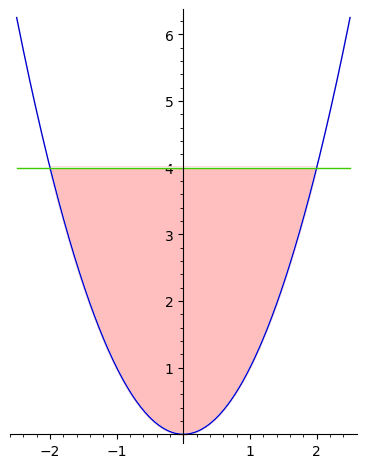

* Imamo torej:

  $$
  \begin{aligned}
  \Omega &= \mathbb{R}^2 \\
  y &\le 4 & y - 4 &\le 0 \\
  y &\ge x^2 & x^2 - y &\le 0
  \end{aligned}
  $$

---

# 1. način

* V notranjosti:

  $$
  \begin{alignedat}{2}
  {\partial f \over \partial x}(x, y) &=&\ 6x^2 + 8x - 2y &= 0 \\
  {\partial f \over \partial y}(x, y) &=&\ 2y - 2x &= 0 \Longrightarrow x = y \\
  && 6x^2 + 6x &= 0 \\
  && x(x+1) &= 0
  \end{alignedat}
  $$

* Dobimo kandidata $x = y = 0$ in $x = y = -1$, ki pa nista v $\mathring{D}$ (relativna notranjost $D$).

---

# 1. način (2)

Na zgornjem robu: $x \in (-2, 2)$, $y = 4$

$$
\begin{gathered}
\begin{aligned}
g(x) &= f(x, 4) = 2x^3 + 4x^2 - 8x + 16 \\
g'(x) &= 6x^2 + 8x - 8 = 2(3x^2 + 4x - 4) = 0 \\
x &= {-4 \pm \sqrt{16 + 48} \over 6} = {-2 \pm 4 \over 3}
\end{aligned} \\
\begin{aligned}
x_1 &= -2 & f(-2, 4) &= 32 \quad \text{(ni v relativni notranjosti roba)} \\
x_2 &= {2 \over 3} & f\left({2 \over 3}, 4\right) &= {352 \over 27} \approx 13.037
\end{aligned}
\end{gathered}
$$

---

# 1. način (3)

* Na spodnjem robu: $x \in (-2, 2)$, $y = x^2$

  $$
  \begin{aligned}
  h(x) &= f(x, x^2) = x^4 + 4x^2 \\
  h'(x) &= 4x^3 + 8x = 4x(x^2 + 2) = 0 \\
  x &= 0 \quad \ \ f(0, 0) = 0
  \end{aligned}
  $$

* Na stičiščih obeh robov: $x = \pm 2$, $y = 4$

  $$
  f(-2, 4) = 32 \qquad f(2, 4) = 32
  $$

* Globalni maksimum je torej v $(\pm 2, 4)$, globalni minimum pa v $(0, 0)$.

---

# 2. način

* V notranjosti: kot prej.
* Na zgornjem robu: $y - 4 = 0$. 
  * Definirajmo _Lagrangeevo funkcijo_

    $$
    L(x, y, \lambda) = 2x^3 + 4x^2 + y^2 - 2xy + \lambda (y - 4),
    $$

    kjer je $\lambda$ _Lagrangeev množitelj (multiplikator)_.

---

# 2. način (zgornji rob)

* Poiščimo parcialne odvode Lagrangeeve funkcije:

  $$
  \begin{gathered}
  \begin{alignedat}{2}
  {\partial L \over \partial x} &= 6x^2 + 8x - 2y &&= 0 \\
  {\partial L \over \partial y} &= 2y - 2x + \lambda &&= 0 \\
  {\partial L \over \partial \lambda} &= y - 4 &&= 0
  \end{alignedat} \\
  y = 4 \qquad x = {-2 \pm 4 \over 3} \qquad \lambda = {-28 \pm 8 \over 3}
  \end{gathered}
  $$

* Sistem enačb ima rešitvi $(x, y, \lambda) = (-2, 4, -12)$ in $(x, y, \lambda) = \left({2 \over 3}, 4, -{20 \over 3}\right)$.

---

# 2. način (spodnji rob)

$$
\begin{gathered}
L(x, y, \mu) = 2x^3 + 4x^2 + y^2 - 2xy + \mu (x^2 - y) \\
\begin{alignedat}{2}
{\partial L \over \partial x} &= 6x^2 + 8x - 2y + 2 \mu x &&= 0 \\
{\partial L \over \partial y} &= 2y - 2x - \mu &&= 0 \\
{\partial L \over \partial \mu} &= x^2 - y &&= 0 \\[2ex]
y &= x^2 \\
\mu &= 2x^2 - 2x \\
0 &= 4x^3 + 8x = 4x (x^2 + 2)
\end{alignedat} \\
x = 0 \qquad y = 0 \qquad \mu = 0
\end{gathered}
$$

* Sistem enačb ima rešitev $(x, y, \mu) = (0, 0, 0)$.

---

# 2. način (stičišči robov)

$$
\begin{gathered}
L(x, y, \lambda, \mu) = 2x^3 + 4x^2 + y^2 - 2xy + \lambda (y - 4) + \mu (x^2 - y) \\
\begin{alignedat}{2}
{\partial L \over \partial x} &= 6x^2 + 8x - 2y + 2 \mu x &&= 0 \\
{\partial L \over \partial y} &= 2y - 2x + \lambda - \mu &&= 0 \\
{\partial L \over \partial \lambda} &= y - 4 &&= 0 \\
{\partial L \over \partial \mu} &= x^2 - y &&= 0 \\[2ex]
\end{alignedat} \\
y = 4 \qquad x = \pm 2 \qquad \mu = \mp 4 - 4 \qquad \lambda = -12
\end{gathered}
$$

* Sistem enačb ima rešitvi $(x, y, \lambda, \mu) = (-2, 4, -12, 0)$ in $(x, y, \lambda, \mu) = (2, 4, -12, -8)$.

---

# 3. način

$$
\begin{alignedat}{2}
f(x, y) &= 2x^3 + 4x^2 + y^2 - 2xy \\
\text{p.p.} \quad y - 4 &\le 0 \\
x^2 - y &\le 0 \\[2ex]
L(x, y, \lambda, \mu) &= 2x^3 + 4x^2 + y^2 - 2xy &&+ \lambda (y - 4) + \mu (x^2 - y) \\
L_x := {\partial L \over \partial x} &= 6x^2 + 8x - 2y + 2 \mu x &&= 0 \\
L_y := {\partial L \over \partial y} &= 2y - 2x + \lambda - \mu &&= 0 \\
\end{alignedat}
$$

* Ločimo primere:
  - $\lambda = 0$, $\mu = 0$: notranjost
  - $y - 4 = 0$, $\mu = 0$: zgornji rob
  - $\lambda = 0$, $x^2 - y = 0$: spodnji rob
  - $y - 4 = 0$, $x^2 - y = 0$: stičišči robov

---

# Lagrangeeva funkcija

* Za problem vezanih ekstremov z neenačbami lahko torej zapišemo Lagrangeevo funkcijo

  $$
  L(x_1, \dots, x_n, \lambda_1, \dots, \lambda_m) = f(x_1, \dots, x_n) + \sum_{i=1}^m \lambda_i g_i(x_1, \dots, x_n)
  $$

* Lokalni ekstremi so doseženi pri

  $$
  \begin{align}
  L_j := {\partial L \over \partial x_j}(x_1, \dots, x_n, \lambda_1, \dots, \lambda_m) &= 0 & (1 \le j \le n) \\
  \lambda_i g_i(x_1, \dots, x_n) &= 0 & (1 \le i \le m) \\
  g_i(x_1, \dots, x_n) &\le 0 & (1 \le i \le m)
  \end{align}
  $$

* Ločimo na $2^m$ primerov glede na $g_i(x_1, \dots, x_n) = 0$ oziroma $g_i(x_1, \dots, x_n) < 0$ in posledično $\lambda_i = 0$ ($1 \le i \le m$).

---

# Karush-Kuhn-Tuckerjevi pogoji

* **_Definicija._** Vrednosti $x_1, \dots, x_n, \lambda_1, \dots, \lambda_m$ ustrezajo _Karush-Kuhn-Tuckerjevim (KKT) pogojem_ za problem vezanega ekstrema z neenačbami, če velja

  $$
  \begin{align}
  L_j := {\partial L \over \partial x_j}(x_1, \dots, x_n, \lambda_1, \dots, \lambda_m) &= 0 & (1 \le j \le n) \\
  \lambda_i g_i(x_1, \dots, x_n) &= 0 & (1 \le i \le m) \\
  g_i(x_1, \dots, x_n) &\le 0 & (1 \le i \le m) \\
  \lambda_i &\ge 0 & (1 \le i \le m)
  \end{align}
  $$

* Ali so Karush-Kuhn-Tuckerjevi pogoji za $(x^\ast, \lambda^\ast)$ zadoščeni natanko tedaj, ko je $x^\ast$ globalni ekstrem?
  * V splošnem **NE**.
  * Bo pa odgovor pritrdilen za **konveksne optimizacijske probleme**.

---

# Primera

$$
\begin{aligned}
\min \ x^2 - y^2 \\[1ex]
\text{p.p.} \quad
x, y &\in \mathbb{R} & (\Omega = \mathbb{R}^2) \\
x, y &\ge 0
\end{aligned}
$$

* Tak problem je neomejen - globalnega minimuma ni!
* Vseeno lahko najdemo točko, ki ustreza Karush-Kuhn-Tuckerjevim pogojem:

  $$
  \begin{alignedat}{5}
  L(x, y, \lambda, \mu) &= x^2 - y^2 &&- \lambda x - \mu y \\
  L_x &= 2x - \lambda &&= 0 & -\lambda x &= 0 &\qquad x &\ge 0 &\qquad \lambda &\ge 0 \\
  L_y &= -2y - \mu &&= 0 & -\mu y &= 0 &\qquad y &\ge 0 &\qquad \mu &\ge 0 \\
  x &= y = \lambda = \mu &&= 0
  \end{alignedat}
  $$

---

# Primera (2)

$$
\begin{aligned}
\min \ x \\[1ex]
\text{p.p.} \quad
x, y &\in \mathbb{R} & (\Omega = \mathbb{R}^2) \\
0 \le y &\le x^3
\end{aligned}
$$

* Globalni minimum je v točki $(x, y) = (0, 0)$.

  $$
  \begin{alignedat}{4}
  L(x, y, \lambda, \mu) &= x - \lambda y +{} &\mu &(y - x^3) \\
  L_x &= 1 - 3 \mu x^2 &&= 0 \\
  L_y &= -\lambda + \mu &&= 0 & \\
  -\lambda y &= 0 & y &\ge 0 &\qquad \lambda &\ge 0 \\
  \mu (y - x^3) &= 0 & y &\le x^3 &\qquad \mu &\ge 0 \\[1ex]
  \lambda &= \mu\ne 0 & y &= x = 0 & 1 &= 0 & \rightarrow\!&\!\leftarrow
  \end{alignedat}
  $$

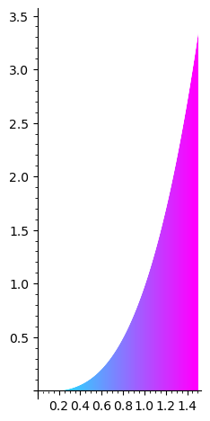

---

# Zadostnost pogojev KKT

* **_Izrek._** Naj bo $\Omega \subseteq \mathbb{R}^n$ odprta konveksna množica ter $f, g_1, g_2, \dots, g_m: \Omega \to \mathbb{R}$ konveksne odvedljive funkcije. Če $(x^\ast, \lambda^\ast) \in \Omega \times \mathbb{R}^m$ zadošča Karush-Kuhn-Tuckerjevim pogojem, potem je $x^\ast$ globalni minimum funkcije $f\vert_D$, kjer je $D = \lbrace x \in \Omega \mid \forall i \in \lbrace 1, 2, \dots, m \rbrace: g_i(x) \le 0 \rbrace$ (tj., $x^\ast$ je optimalna rešitev ustreznega problema vezanih ekstremov z neenačbami).

* **Opomba.** Pri pogojih iz zgornjega izreka so torej Karush-Kuhn-Tuckerjevi pogoji zadostni za optimalnost rešitve.

* _Dokaz._ Vzemimo poljuben $x \in D$. Zaradi konveksnosti (kriterij 1. odvoda) velja:

  $$
  \begin{aligned}
  f(x) &\ge f(x^\ast) + (\nabla f(x^\ast))^\top (x - x^\ast) \\
  \forall i \in \lbrace 1, 2, \dots, m \rbrace: \ g_i(x) &\ge g_i(x^\ast) + (\nabla g_i(x^\ast))^\top (x - x^\ast) \qquad / \cdot \lambda_i^\ast \\ \hline
  f(x) \ge f(x) + \sum_{i=1}^m \lambda_i^\ast g_i(x) &\ge f(x^\ast) + \sum_{i=1}^m \lambda_i^\ast g_i(x^\ast) + \left(\nabla f(x^\ast) + \sum_{i=1}^m \lambda_i^\ast \nabla g_i(x^\ast)\right)^\top (x - x^\ast) \\
  &= f(x^\ast) + (\nabla L(x^\ast, \lambda^\ast))^\top (x - x^\ast) = f(x^\ast) \\
  \end{aligned}
  $$

---

# Potrebnost pogojev KKT

* **_Izrek._** Naj bo $\Omega \subseteq \mathbb{R}^n$ odprta množica ter $f, g_1, g_2, \dots, g_m: \Omega \to \mathbb{R}$ funkcije, pri čemer je funkcija $f$ odvedljiva. Če je $x^\ast$ globalni minimum funkcije $f\vert_D$ za $D = \lbrace x \in \Omega \mid \forall i \in \lbrace 1, 2, \dots, m \rbrace: g_i(x) \le 0 \rbrace$ in velja vsaj eno od sledečega:

  - funkcije $g_1, g_2, \dots, g_m$ so afine; ali
  - množica $\Omega$ je konveksna, $\mathring{D} \ne \emptyset$ ter funkcije $f, g_1, g_2, \dots, g_m$ so konveksne; ali
  - funkcije $g_1, g_2, \dots, g_m$ so odvedljive ter $(\nabla g_i(x^\ast))_{\!\!\!\!\!\substack{i = 1 \\ g_i(x^\ast) = 0}}^m$ je zaporedje linearno neodvisnih vektorjev,

  potem obstaja tak $\lambda^\ast \in \mathbb{R}^m$, da $(x^\ast, \lambda^\ast)$ ustreza Karush-Kuhn-Tuckerjevim pogojem.

* Dokaz izpustimo. V dokazu se uporabi Farkaseva lema.

* **Opomba.** Pri pogojih iz zgornjega izreka so torej Karush-Kuhn-Tuckerjevi pogoji potrebni za optimalnost rešitve.

---

# Konveksni problemi

* **_Posledica._** Naj bo $\Omega \subseteq \mathbb{R}^n$ odprta konveksna množica ter $f, g_1, g_2, \dots, g_m: \Omega \to \mathbb{R}$ konveksne odvedljive funkcije, tako da velja $\mathring{D} \ne \emptyset$. Potem je $x^\ast \in \Omega$ globalni minimum problema vezanih ekstremov z neenačbami natanko tedaj, ko obstaja tak $\lambda^\ast \in \mathbb{R}^m$, da $(x^\ast, \lambda^\ast)$ ustreza Karush-Kuhn-Tuckerjevim pogojem.

* **Opomba.** Takemu problemu rečemo **konveksni problem** oziroma **problem konveksne optimizacije**.
  * Čim najdemo eno rešitev Karush-Kuhn-Tuckerjevih pogojev, smo našli optimalno rešitev takega problema (tj., globalni minimum).

---

# Primer

$$
\begin{aligned}
\min \ x \\[1ex]
\text{p.p.} \quad
x, y &\in \mathbb{R} & (\Omega = \mathbb{R}^2) \\
0 \le y &\le x^3
\end{aligned}
$$

* Globalni minimum je v točki $(x^\ast, y^\ast) = (0, 0)$, kjer pa Karush-Kuhn-Tuckerjevi pogoji niso izpolnjeni. Velja namreč:

  $$
  \begin{aligned}
  g_1(x, y) &= -y & g_1(0, 0) &= 0 & \text{afina} \\
  g_2(x, y) &= y - x^3 & g_2(0, 0) &= 0 & \text{ni afina} \\
  H_{g_2}(x, y) &= \begin{bmatrix} -6x & 0 \\ 0 & 0 \end{bmatrix} \not\ge 0 & (\text{za } x &> 0) & \text{ni konveksna} \\
  \nabla g_1(x, y) &= \begin{bmatrix} 0 \\ -1 \end{bmatrix} &
  \nabla g_2(x, y) &= \begin{bmatrix} -3x^2 \\ 1 \end{bmatrix} \\
  \nabla g_1(0, 0) &= \begin{bmatrix} 0 \\ -1 \end{bmatrix} &
  \nabla g_2(0, 0) &= \begin{bmatrix} 0 \\ 1 \end{bmatrix} &
  \text{nista linearno neodvisna}
  \end{aligned}
  $$

---

# Konveksne funkcije in konveksne množice

* **_Trditev._** Naj bo $K \subseteq \mathbb{R}^n$ konveksna množica, $f: K \to \mathbb{R}$ konveksna funkcija, ter $b \in \mathbb{R}$. Potem je množica $A = \lbrace x \in K \mid f(x) \le b \rbrace$ konveksna.

* _Dokaz._ Vzemimo poljubne $x, y \in A$ ter $\lambda \in [0, 1]$. Potem velja

  $$
  f((1 - \lambda) x + \lambda y) \le (1 - \lambda) f(x) + \lambda f(y) \le (1 - \lambda) b + \lambda b = b.
  $$

  * Velja torej $(1 - \lambda) x + \lambda y \in A$, zato je množica $A$ konveksna.

* **Opomba.** Če je množica $\Omega$ konveksna in so funkcije $g_1, g_2, \dots, g_m: \Omega \to \mathbb{R}$ konveksne ter $b \in \mathbb{R}^m$, potem je množica $\lbrace x \in \Omega \mid \forall i \in \lbrace 1, 2, \dots, m \rbrace: g_i(x) \le b_i \rbrace$ konveksna.
  * Na primer, za $f(x, y) = x^2 + y^2$ imamo $H_f(x, y) = \begin{bmatrix} 2 & 0 \\ 0 & 2 \end{bmatrix} \ge 0$, torej je $f$ konveksna funkcija in je tako $\lbrace (x, y) \in \mathbb{R}^2 \mid f(x, y) \le 4 \rbrace$ konveksna množica.

---

# Primer

$$
\begin{aligned}
\min \ {1 \over x} + {2 \over y} \\[1ex]
\text{p.p.} \quad
x &> 0 \\
y &> 0 \\
x + y &\le 5 \\
3x^2 + 2y^2 &\le 35
\end{aligned}
$$

* To je konveksni problem:

  $$
  \begin{aligned}
  \Omega &= \lbrace (x, y) \in \mathbb{R}^2 \mid x > 0, y > 0 \rbrace & \text{konveksna,} &\ \text{odprta} \\
  f(x, y) &= {1 \over x} + {2 \over y} &
  H_f(x, y) &= \begin{bmatrix} 2x^{-3} & 0 \\ 0 & 4y^{-3} \end{bmatrix} \ge 0 \\
  g_1(x, y) &= x + y - 5 && \text{afina} \\
  g_2(x, y) &= 3x^2 + 2y^2 - 35 &
  H_{g_2}(x, y) &= \begin{bmatrix} 6 & 0 \\ 0 & 4 \end{bmatrix} \ge 0 
  \end{aligned}
  $$

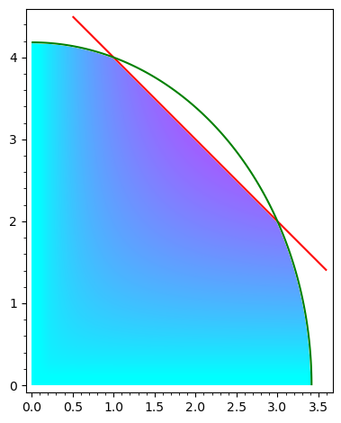

---

# Primer (pogoji KKT)

$$
\begin{alignedat}{3}
L(x, y, \lambda, \mu) &= {1 \over x} + {2 \over y} + \lambda (x + y &{} - 5) &+ \mu (3x^2 &{} + 2y^2 - 35) \qquad \\
\text{KKT:} \quad L_x &= -{1 \over x^2} + \lambda + 6 \mu x &&= 0 \\
L_y &= -{2 \over y^2} + \lambda + 4 \mu y &&= 0 \\
0 &= \lambda (x + y - 5) & \lambda &\ge 0 & x + y - 5 &\le 0 \\
0 &= \mu (3x^2 + 2y^2 - 35) & \mu &\ge 0 & 3x^2 + 2y^2 - 35 &\le 0
\end{alignedat}
$$

---

# Primer (1.)

$g_1(x, y) = x + y - 5 = 0$: $y = 5 - x$

$$
\begin{alignedat}{3}
L(x, 5 - x, \lambda, \mu) &= {1 \over x} + {2 \over 5 - x} + \mu (5x^2 - 20x &&+ 15) \qquad \\
\text{KKT:} \quad L_x &= -{1 \over x^2} + \lambda + 6 \mu x &&= 0 \\
L_y &= -{2 \over (5 - x)^2} + \lambda + 4 \mu (5 - x) &&= 0 \\
0 &= \mu (5x^2 - 20x + 15) && \lambda, \mu \ge 0 \qquad 5x^2 - 20x + 15 \le 0
\end{alignedat}
$$

---

# Primer (1.1.)

$g_2(x, 5 - x) = 0$: $x = 2 \pm 1$, $y = 3 \mp 1$

* 
  $$
  \begin{alignedat}{3}
  x = 1, y = 4: \\
  L(1, 4, \lambda, \mu) &= 1 + {1 \over 2} = {3 \over 2} &&\quad \lambda, \mu \ge 0 \\
  \text{KKT:} \quad L_x &= -1 + \lambda + 6 \mu &&= 0 \\
  L_y &= -{1 \over 8} + \lambda + 16 \mu &&= 0 \\
  \mu &= -{7 \over 80} < 0 &&\rightarrow\!\leftarrow
  \end{alignedat}
  $$

* 
  $$
  \begin{alignedat}{3}
  x = 3, y = 2: \\
  L(3, 2, \lambda, \mu) &= {1 \over 3} + 1 = {4 \over 3} &&\quad \lambda, \mu \ge 0 \\
  \text{KKT:} \quad L_x &= -{1 \over 9} + \lambda + 18 \mu &&= 0 \\
  L_y &= -{1 \over 2} + \lambda + 8 \mu &&= 0 \\
  \mu &= -{7 \over 180} < 0 &&\rightarrow\!\leftarrow
  \end{alignedat}
  $$

---

# Primer (1.2.)

$g_2(x, 5 - x) < 0$, $\mu = 0$:

* 
  $$
  \begin{alignedat}{3}
  L(x, 5 - x, \lambda, 0) &= {1 \over x} + {2 \over 5 - x} &&\ \lambda \ge 0 \\
  \text{KKT:} \quad L_x &= -{1 \over x^2} + \lambda &&= 0 \\
  L_y &= -{2 \over (5 - x)^2} + \lambda &&= 0 \\
  &\quad\ 5x^2 - 20x + 15 &&< 0
  \end{alignedat}
  $$

* 
  $$
  \begin{alignedat}{3}
  \lambda &= {1 \over x^2} = {2 \over (5 - x)^2} \\
  2x^2 &= (5 - x)^2 = x^2 -{} && 10x + 25 \\
  0 &= x^2 + 10x - 25 \\
  x &= -5 + 5\sqrt{2} \\
  y &= 10 - 5\sqrt{2} \\
  \lambda &= {1 \over 75 - 50 \sqrt{2}} &&> 0 \\
  5x^2 - 20x + 15 &= 490 - 350 \sqrt{2} &&< 0
  \end{alignedat}
  $$

* Po zgornji posledici je $(x^\ast, y^\ast) = (5(\sqrt{2} - 1), 5(2 - \sqrt{2}))$ globalni minimum.
* Ostalih možnosti nam ni potrebno preverjati.

---

# KKT za linearni program

* **_Primer._** Uporabimo Karush-Kuhn-Tuckerjeve pogoje za linearni program $\Pi$.

  $$
  \begin{aligned}
  \max \ c^\top x \\[1ex]
  \text{p.p.} \quad A x &\le b \\
  x &\ge 0
  \end{aligned}
  $$

* Zgornji linearni program zapišimo kot problem vezanega ekstrema z neenačbami.

  $$
  \begin{aligned}
  \min \ -c^\top x \\[1ex]
  \text{p.p.} \quad x &\in \mathbb{R}^n \\
  a_i^\top x - b_i &\le 0 & (1 &\le i \le m) \\
  -x_j &\le 0 & (1 &\le j \le n)
  \end{aligned}
  $$

* Ciljna funkcija in vezi so konveksne, torej imamo konveksni problem.

---

# KKT za linearni program (2)

* Zapišimo Lagrangeevo funkcijo in Karush-Kuhn-Tuckerjeve pogoje.

  

  $$
  \begin{alignedat}{3}
  L(x, \lambda, \mu) &= -c^\top x + \lambda^\top (A x -{} &{} b) &- \mu^\top x \\
  &= -\sum_{j=1}^n c_j x_j \ + \ \sum_{i=1}^m &{} \lambda_i &\Big(\sum_{j=1}^n a_{ij} x_j &{} - \ b_i \Big) &- \sum_{j=1}^n \mu_j x_j \\
  \text{KKT:} \quad L_j(x, \lambda, \mu) &= -c_j + \sum_{i=1}^n \lambda_i a_{ij} -{} &{} \mu_j &= 0 && (1 \le j \le n) \\
  \nabla L(x, \lambda, \mu) &= -c + A^\top \lambda - \mu &&= 0 \\
  \lambda^\top (A x - b) &= 0 & \lambda &\ge 0 & Ax - b &\le 0 \\
  -\mu^\top x &= 0 & \mu &\ge 0 & -x &\le 0
  \end{alignedat}
  $$

  

  

  * Ker velja $\mu = A^\top \lambda - c \ge 0$, vektor $\lambda$ ustreza ravno spremenljivkam dualnega linearnega programa $\Pi'$.
  * Iz izreka o dualnem dopolnjevanju sledi, da je $x^\ast$ optimalna rešitev linearnega programa $\Pi$ in $\lambda^\ast$ optimalna rešitev njegovega duala $\Pi'$ natanko tedaj, ko $(x^\ast, \lambda^\ast, \mu^\ast := A^\top \lambda^\ast - c)$ ustreza Karush-Kuhn-Tuckerjevim pogojem.

  

---

# Fisherjev model trga

* Imamo $m$ kupcev in $n$ dobrin.
* Naj bo:
  * $a_i > 0$ kapital, ki ga ima na voljo $i$-ti kupec,
  * $b_j > 0$ količina $j$-te dobrine na trgu, ter
  * $u_{ij} \ge 0$ zadovoljstvo $i$-tega kupca z enoto $j$-te dobrine ($1 \le i \le m$, $1 \le j \le n$).
* Imamo torej $a \in \mathbb{R}^m$, $b \in \mathbb{R}^m$ in $U = (u_{ij})_{i,j=1}^{m,n} \in \mathbb{R}^{m \times n}$.
* Predpostavimo še, da:
  * si vsak kupec želi vsaj ene dobrine (torej $\forall i \ \exists j: \ u_{ij} > 0$),
  * si vsake dobrine želita vsaj dva kupca (torej $\forall j \ \exists i_1, i_2: \ (i_1 \ne i_2 \land u_{i_1 j} > 0 \land u_{i_2 j} > 0)$).

---

# Pogoji

* Iščemo:
  * cene $p_j \ge 0$ $j$-te dobrine,
  * količine $x_{ij} \ge 0$ $j$-te dobrine, ki jo kupi $i$-ti kupec ($1 \le i \le m$, $1 \le j \le n$)
* Iščemo torej $p \in \mathbb{R}^n$ in $X = (x_{ij})_{i,j=1}^{m,n} \in \mathbb{R}^{m \times n}$, da velja:
  * $\forall i: \ \sum_{j=1}^n x_{ij} p_j = a_i$ oziroma $Xp = a$ (vsak kupec porabi ves svoj kapital)
  * $\forall j: \ \sum_{i=1}^n x_{ij} = b_j$ oziroma $X^\top \mathbf{1} = b$ (vsaka dobrina se proda v celoti)
  * pri cenah $p$ je zadovoljstvo $i$-tega kupca $u_i(X) = \sum_{j=1}^n u_{ij} x_{ij}$ maksimalno
* **_Definicija._** Cene $p$ so _ravnovesne_, če obstaja $X \in \mathbb{R}^{m \times n}$, da so izpolnjeni zgornji pogoji.

---

# Primer

$$
a = \begin{bmatrix} 20 \\ 60 \\ 100 \end{bmatrix} \qquad
b = \begin{bmatrix} 2 \\ 4 \end{bmatrix} \qquad
U = \begin{bmatrix} 8 & 10 \\ 5 & 30 \\ 5 & 20 \end{bmatrix}
$$

* Ali so cene $p = \begin{bmatrix} 18 \\ 36 \end{bmatrix}$ ravnovesne?

  $$
  \begin{aligned}
  18 x_{11} + 36 x_{12} &= 20 & x_{12} &= {5 \over 9} - {1 \over 2} x_{11} \\
  18 x_{21} + 36 x_{22} &= 60 & x_{22} &= {5 \over 3} - {1 \over 2} x_{21} \\
  18 x_{31} + 36 x_{32} &= 100 & x_{32} &= {25 \over 9} - {1 \over 2} x_{31} \\
  x_{11} + x_{21} + x_{31} &= 2 & x_{31} &= 2 - x_{11} - x_{21} \\
  x_{12} + x_{22} + x_{32} &= 4 & {45 \over 9} - 1 &= 4
  \end{aligned}
  $$

---

# Primer (2)

$$
\begin{aligned}
0 \le x_{11} &\le {10 \over 9} & 0 &\le x_{21} \le 2 & 0 &\le x_{31} \le 2 \\
u_1(X) &= 8 x_{11} + 10 x_{12} & u_2(X) &= 5 x_{21} + 30 x_{22} & u_3(X) &= 5 x_{31} + 20 x_{32} \\
&= 3x_{11} + {50 \over 9} &&= -10 x_{21} + 50 &&= -5 x_{31} + {500 \over 9} \\
x_{11} &= {10 \over 9} & x_{21} &= 0 & x_{31} &= 0 \ne 2 - x_{11} - x_{12} \\
u_1(X) &= {80 \over 9} & u_2(X) &= 50 && \rightarrow\!\leftarrow
\end{aligned}
$$

* Pogoji niso kompatibilni, zato cene niso ravnovesne.

* **_Vaja._** Dokaži, da so cene $p = \begin{bmatrix} 10 \\ 40 \end{bmatrix}$ ravnovesne.

---

# Optimalni sveženj

* **_Trditev._** Če ravnovesne cene $p$ obstajajo, potem so pozitivne in $b^\top p = \mathbf{1}^\top a$ (tj., vse dobrine se prodajo za ves kapital na voljo).

* _Dokaz._ Denimo, da za nek $j$ velja $p_j = 0$.
  * Ker obstajata taka različna $i_1, i_2$, da velja $u_{i_1 j}, u_{i_2 j} > 0$, sta kupca $i_1$ in $i_2$ najbolj zadovoljna, če dobita vso dobrino $j$, protislovje.
  * Nadalje velja $b^\top p = \mathbf{1}^\top Xp = \mathbf{1}^\top a$.

* **_Definicija._** _Zadovoljstvo $i$-tega kupca z $j$-to dobrino na denarno enoto_ je $z_{ij} := {u_{ij} \over p_j}$ ($1 \le i \le m$, $1 \le j \le n$).
  * Naj bo $z_i := \max\lbrace z_{ij} \mid 1 \le j \le n \rbrace$.
  * _Optimalni sveženj $i$-tega kupca_ je množica $S_i := \lbrace j \in \lbrace 1, 2, \dots, n \rbrace \mid z_{ij} = z_i \rbrace$.

---

# Optimalni sveženj in ravnovesnost

* **_Trditev._** Naj bosta $p > 0$ in $X \ge 0$takšna, da velja $Xp = a$ in $X^\top \mathbf{1} = b$. Če vsak kupec kupuje samo iz svojega optimalnega svežnja (tj., $\forall i, j: \ (x_{ij} > 0 \Rightarrow j \in S_i)$), potem so cene $p$ ravnovesne.

* **_Primer._**

  

  $$
  a = \begin{bmatrix} 20 \\ 60 \\ 100 \end{bmatrix} \qquad
  b = \begin{bmatrix} 2 \\ 4 \end{bmatrix} \qquad
  U = \begin{bmatrix} 8 & 10 \\ 5 & 30 \\ 5 & 20 \end{bmatrix}
  $$

  

  * Pokažimo, da so cene $p = \begin{bmatrix} 10 \\ 40 \end{bmatrix}$ ravnovesne.

    

    

    * 
      $$
      \begin{aligned}
      z_{11} &= {8 \over 10} & z_{12} &= {10 \over 40} & z_1 &= {4 \over 5} & S_1 &= \lbrace 1 \rbrace \\
      z_{21} &= {5 \over 10} & z_{22} &= {30 \over 40} & z_2 &= {3 \over 4} & S_2 &= \lbrace 2 \rbrace \\
      z_{31} &= {5 \over 10} & z_{32} &= {20 \over 40} & z_3 &= {1 \over 2} & S_3 &= \lbrace 1, 2 \rbrace
      \end{aligned}
      $$

    

    

    * 
      $$
      \begin{aligned}
      x_{11} &= {20 \over 10} = 2 & x_{12} &= 0 \\
      x_{21} &= 0 & x_{22} &= {60 \over 40} = {3 \over 2} \\
      x_{31} &= 0 & x_{32} &= {100 \over 40} = {5 \over 2}
      \end{aligned}
      $$

    

---

# Dokaz

* Če vsak kupec kupuje samo iz svojega optimalnega svežnja, potem velja $\forall i, j: \left(x_{ij} > 0 \Rightarrow z_i = z_{ij} = {u_{ij} \over p_j}\right)$. Za vsak $i$ torej velja

  

  $$
  u_i(X) = \sum_{j=1}^n u_{ij} x_{ij} = \sum_{j=1}^n z_i p_j x_{ij} = z_i \sum_{j=1}^n p_j x_{ij} = z_i a_i.
  $$

  

  * Naj bo <i>$X' = (x_{ij}')_{i,j=1}^{m,n}$</i> neka druga dopustna izbira kupljenih količin. Ker velja <i>$\forall i, j: z_{ij} = {u_{ij} \over p_j} \le z_i$</i>, za vsak $i$ sledi

    

    $$
    u_i(X') = \sum_{j=1}^n u_{ij} x'_{ij} \le \sum_{j=1}^n z_i p_j x'_{ij} = z_i a_i = u_i(X).
    $$

    

  * Vrednosti $u_i(X)$ so torej optimalne za vsak $i$.

* Vprašanji:
  * Ali ravnovesne cene obstajajo? **JA.**
  * Kako jih poiščemo? S **Karush-Kuhn-Tuckerjevimi pogoji**.

---

# Eisenberg-Galeov konveksni program (EGP)

* Brez škode za splošnost lahko predpostavimo, da za vsak $j$ velja $b_j = 1$ (oziroma $b = \mathbf{1}$) - tj., celotna količina vsake dobrine je $1$ enota.
  * Če temu ni tako, lahko $j$-ti stolpec matrike $U$ pomnožimo s staro vrednostjo $b_j$ (in podobno za dobljeno rešitev $X$).

* Pri Fisherjevem modelu trga želimo maksimizirati zadovoljstvo **vseh** kupcev.

* Kako iz $n$ funkcij dobimo eno? Kako iz $n$ števil dobimo eno? Nekaj možnosti:
  * ${x_1 + x_2 + \dots + x_n \over n}$ - aritmetična sredina
  * ${a_1 x_1 + a_2 x_2 + \dots + a_n x_n \over a_1 + a_2 + \dots + a_n}$ - utežena aritmetična sredina ($\forall i: a_i > 0$)
  * $\sqrt[n]{x_1 x_2 \cdots x_n}$ - geometrijska sredina ($\forall i: x_i > 0$)
  * $\sqrt[a_1 + a_2 + \dots + a_n]{x_1^{a_1} x_2^{a_2} \cdots x_n^{a_n}} \qquad\quad$ - utežena geometrijska sredina

---

# Ciljna funkcija

* Izkaže se, da je "prava" funkcija

  $$
  \left(\prod_{i=1}^m u_i(X)^{a_i}\right)^{1 \over \sum_{i=1}^m a_i}.
  $$

* Iskali bomo torej maksimum te funkcije.
* Za lažje delo bomo funkcijo logaritmirali; da jo obravnavamo kot ciljno funkcijo konveksnega problema, pa tudi negirali in iskali njen minimum.

---

# Konveksnost ciljne funkcije

* **_Trditev._** Funkcija

  $$
  f(X) = -\sum_{i=1}^m a_i \log(u_i(X))
  $$

  je konveksna.

* _Dokaz._ Pišemo lahko $f = \sum_{i=1}^m a_i \cdot ((-\log) \circ u_i)$.
  * Funkcija $-\log$ je konveksna (saj $(-\log)''(x) = {1 \over x^2} > 0$), za vsak $i$ pa je funkcija $u_i$ afina in $a_i > 0$.
  * Potem je za vsak $i$ funkcija $a_i \cdot ((-\log) \circ u_i)$ konveksna.
  * Funkcija $f$ je torej vsota konveksnih funkcij in je tako konveksna.

---

# Konveksni program

* Zapišimo torej **Eisenberg-Galeov konveksni program (EGP)**.

  $$
  \begin{alignedat}{2}
  \min \ -\sum_{i=1}^m &\ a_i \log(u_i(X)) \\[1ex]
  \text{p.p.} \quad X \in \Omega &= \lbrace X \in \mathbb{R}^{m \times n} &&\mid \forall i \in \lbrace 1, 2, \dots, m \rbrace: u_i(X) > 0 \rbrace \\
  \sum_{i=1}^m x_{ij} &\le 1 && (1 \le j \le n) \\
  x_{ij} &\ge 0 && (1 \le i \le m, 1 \le j \le n)
  \end{alignedat}
  $$

* Opazimo:
  - za vsak $i$ je $u_i$ linearna funkcija (torej afina in zvezna), tako da je $\Omega$ konveksna odprta množica
  - ciljna funkcija je konveksna in odvedljiva
  - vse vezi so afine (torej konveksne in odvedljive)

---

# Optimalnost EGP

* Karush-Kuhn-Tuckerjevi pogoji so torej **potrebni** in **zadostni** za optimalnost rešitve.

* Spomnimo se: množica $A \subseteq \mathbb{R}^n$ je kompaktna, ko je zaprta in omejena.
  - Zvezna funkcija na kompaktni množici doseže minimum in maksimum.

* **_Izrek._** Eisenberg-Galeov konveksni program je dopusten in optimalen.

* _Dokaz._ Pokažimo najprej, da je $\overline{x}_{ij} = {1 \over m}$ ($1 \le i \le m$, $1 \le j \le n$) dopustna rešitev.
  * Res, velja $u_i(\overline{X}) > 0$ ($1 \le i \le m$), <i>$\sum_{i=1}^m \overline{x}_{ij} = 1$</i> ($1 \le j \le n$) in <i>$\overline{x}_{ij} \ge 0$</i> ($1 \le i \le m$, $1 \le j \le n$).

---

# Dokaz

* Naj bo

  $$
  D = \left\lbrace X \in \Omega \mid \forall j \in \lbrace 1, 2, \dots, n \rbrace: \left(\sum_{i=1}^m x_{ij} \le 1 \land \forall i \in \lbrace 1, 2, \dots, m \rbrace: x_{ij} \ge 0\right)\right\rbrace
  $$

  množica dopustnih rešitev.

* Za $\epsilon > 0$ definirajmo še množico
  
  $$
  D_\epsilon = \lbrace X \in D \mid \forall i \in \lbrace 1, 2, \dots, m \rbrace: u_i(X) \ge \epsilon \rbrace.
  $$

* Množica $D_\epsilon$ je omejena (saj $\forall i, j: 0 \le x_{ij} \le 1$) in zaprta, torej je kompaktna.
* Funkcija $f$ je zvezna, torej doseže minimum na $D_\epsilon$.
* Vrednost $\epsilon$ bomo izbrali tako, da bo $\overline{X} \in D_\epsilon$ in $\forall X \in D \setminus D_\epsilon: f(X) > f(\overline{X})$.
  - To bo pomenilo, da funkcija $f$ doseže minimum na $D$.

---

# Dokaz (2)

* Da bo $\overline{X} \in D_\epsilon$, mora veljati

  $$
  \forall i \in \lbrace 1, 2, \dots, m \rbrace: \ \epsilon \le u_i(\overline{X}) = {1 \over m} \sum_{j=1}^n u_{ij}.
  $$

* Poleg tega bomo zahtevali še

  $$
  \forall h \in \lbrace 1, 2, \dots, m \rbrace: \ \epsilon \le e^{-{1 \over a_h}\left(f(\overline{X}) + \sum_{\substack{i = 1 \\ i \ne h}}^m a_i \log \left(\sum_{j=1}^n u_{ij}\right)\right)}.
  $$

* Naj bo $X \in D \setminus D_\epsilon$. Potem za nek $h_0$ velja $u_{h_0}(X) < \epsilon$. Z logaritmiranjem tako dobimo

  

  $$
  \begin{aligned}
  \log(u_{h_0}(X)) &< -{1 \over a_{h_0}}\left(f(\overline{X}) + \sum_{\substack{i = 1 \\ i \ne h_0}}^m a_i \log \left(\sum_{j=1}^n u_{ij}\right)\right) \\
  -a_{h_0} \log(u_{h_0}(X)) &> f(\overline{X}) + \sum_{\substack{i = 1 \\ i \ne h_0}}^m a_i \log\left(\sum_{j=1}^n u_{ij}\right)
  \end{aligned}
  $$

  

---

# Dokaz (3)

* Ker za vsak $i$ velja $u_i(X) = \sum_{j=1}^n u_{ij} x_{ij} \le \sum_{j=1} u_{ij}$, velja tudi

  $$
  -a_i \log(u_i(X)) \ge -a_i \log \left(\sum_{j=1}^n u_{ij}\right).
  $$

* Če k prejšnji neenakosti prištejemo zgornjo za vsak $i \ne h_0$, dobimo

  $$
  f(X) = -\sum_{i=1}^m a_i \log(u_i(X)) > f(\overline{X})
  $$

* Ker so vse zgornje meje za $\epsilon$ pozitivne, lahko torej izberemo tak $\epsilon$, da veljajo zgornji pogoji.
* Funkcija $f$ tako doseže minimum na $D$, zato je konveksni problem optimalen.

---

# Pogoji KKT za EGP

Zapišimo Karush-Kuhn-Tuckerjeve pogoje za Eisenberg-Galeov konveksni program:

$$
\begin{alignedat}{3}
L(X, p, \Lambda) &= \quad -\sum_{i=1}^m a_i & \log(u_i(X)) &+ \sum_{j=1}^n p_j \Big(\sum_{i=1}^m & x_{ij} &- 1\Big) - {} && \sum_{i=1}^m \sum_{j=1}^n \lambda_{ij} x_{ij} \\
L_{ij} := {\partial L \over \partial x_{ij}}(X, p, \Lambda) &= -a_i {u_{ij} \over u_i(X)} &{} + p_j - \lambda_{ij} &= 0 &&&& (1 \le i \le m, 1 \le j \le n) \\
p_j \left(\sum_{i=1}^m x_{ij} - 1\right) &= 0 & \sum_{i=1}^m x_{ij} &\le 1 & p_j &\ge 0 && (1 \le j \le n) \\
\lambda_{ij} x_{ij} &= 0 & x_{ij} &\ge 0 & \lambda_{ij} &\ge 0 && (1 \le i \le m, 1 \le j \le n)
\end{alignedat}
$$

---

# Ekvivalentnost FMT in EGP

**_Izrek._** Naj bosta $X \in \mathbb{R}^{m \times n}$ in $p \in \mathbb{R} ^m$. Sledeči trditvi sta ekvivalentni.

1. $X$ je optimalna razdelitev za Fisherjev model trga s cenami $p$, kjer vsak kupec kupuje le dobrine iz svojega optimalnega svežnja.
2. $X \in \Omega$ in $(X, p, \Lambda)$ zadošča Karush-Kuhn-Tuckerjevim pogojem, kjer $\Lambda = (\lambda_{ij})_{i,j=1}^{m,n} \in \mathbb{R}^{m \times n}$ ustreza

   $$
   \lambda_{ij} = \begin{cases}
   0 & \text{če $x_{ij} > 0$, in} \\
   p_j - a_i {u_{ij} \over u_i(X)} & \text{če $x_{ij} = 0$}
   \end{cases}
   $$

   (tj., $p$ so Lagrangeevi množitelji za vezi $\sum_{i=1}^m x_{ij} \le 1$ ($1 \le j \le n$)).

---

# Dokaz (1. $\Rightarrow$ 2.)

* Pogoji $\sum_{i=1}^m x_{ij} = 1$, $p_j \left(\sum_{i=1}^m x_{ij} - 1\right) = 0$, $p_j \ge 0$ ($1 \le j \le n$) ter $\lambda_{ij} x_{ij} = 0$, $x_{ij} \ge 0$ ($1 \le i \le m$, $1 \le j \le n$) so očitno izpolnjeni.
* Za vsaka $i, j$ ločimo dva primera, pri čemer bomo upoštevali $u_i(X) = z_i a_i$.
  * Če je $x_{ij} > 0$, potem je $\lambda_{ij} = 0$. Ker je $j \in S_i$, velja $u_{ij} = p_j z_i$, torej

    $$
    L_{ij} = -a_i {u_{ij} \over u_i(X)} + p_j - \lambda_{ij} = -a_i {p_j z_i \over z_i a_i} + p_j = 0.
    $$

  * Če je $x_{ij} = 0$, potem velja $L_{ij} = -a_i {u_{ij} \over u_i(X)} + p_j - \lambda_{ij} = 0$.
    - Ker velja $u_{ij} \le p_j z_i$, velja tudi $\lambda_{ij} \ge p_j - a_i {p_j z_i \over z_i a_i} = 0$.

* Za $(X, p, \Lambda)$ torej veljajo Karush-Kuhn-Tuckerjevi pogoji.

---

# Dokaz (2. $\Rightarrow$ 1.)

* Ker za vsako dobrino obstaja kupec, ki si je želi, za vsak $j$ obstaja $i$, da velja $p_j \ge a_i {u_{ij} \over u_i(X)} > 0$ in posledično $\sum_{i=1}^m x_{ij} = 1$ - tj., vsaka dobrina se proda v celoti.
* Sledi tudi $z_{ij} = {u_{ij} \over p_j} \le {u_i(X) \over a_i}$.
* Če velja $x_{ij} > 0$, potem velja $\lambda_{ij} = 0$ in velja enakost v prejšnji neenakosti - tj., vsak kupec kupuje le dobrine iz svojega optimalnega svežnja.
* Nazadnje za vsak $i$ izpeljemo še

  $$
  \begin{aligned}
  \sum_{j=1}^n a_i u_{ij} x_{ij} &= \sum_{j=1}^n p_j u_i(X) x_{ij} \\
  a_i u_i(X) &= u_i(X) \sum_{j=1}^n p_j x_{ij}
  \end{aligned}
  $$

* Velja torej $a_i = \sum_{j=1}^n p_j x_{ij}$ - tj., vsak kupec je porabil ves svoj kapital.

---

# Poenostavljeni pogoji KKT za EGP

Zapišimo še poenostavljene Karush-Kuhn-Tuckerjeve pogoje za Eisenberg-Galeov konveksni program:

$$
\begin{aligned}
a_i {u_{ij} \over u_i(X)} + \lambda_{ij} &= p_j & x_{ij} &\ge 0 && (1 \le i \le m, 1 \le j \le n) \\
\sum_{i=1}^m x_{ij} &= 1 & p_j &> 0 && (1 \le j \le n) \\
\lambda_{ij} x_{ij} &= 0 & \lambda_{ij} &\ge 0 && (1 \le i \le m, 1 \le j \le n)
\end{aligned}
$$

---

# Primer

$$
a = \begin{bmatrix} 2 \\ 1 \end{bmatrix} \qquad
U = \begin{bmatrix} 2 & 2 \\ 1 & 2 \end{bmatrix}
$$

* S Karush-Kuhn-Tuckerjevimi pogoji dobimo sledečo rešitev:

  $$
  p = \begin{bmatrix} {3 \over 2} \\ {3 \over 2} \end{bmatrix} \qquad
  X = \begin{bmatrix} 1 & {1 \over 3} \\ 0 & {2 \over 3} \end{bmatrix}
  $$

* Trdimo, da so tudi $p' = \begin{bmatrix} 1 \\ 2 \end{bmatrix}$ ravnovesne cene.

---

# Primer (2)

$$
\begin{alignedat}{4}
x'_{11} + 2 x'_{12} &= 2 &&& x'_{12} &= 1 \,-\, {1 \over 2} & x'_{11} \\
x'_{21} + 2 x'_{22} &= 1 &&& x'_{22} &= {1 \over 2} - {1 \over 2} & x'_{21} &= {1 \over 2} x'_{11} \\
x'_{11} + x'_{21} &= 1 &&& x'_{21} &= 1 - x'_{11} \\
x'_{12} + x'_{22} &= 1 &&& 0 &\le x'_{11} \le 1 \\
u_1(X') &= 2 x'_{11} &{} + 2 x'_{12} &= x'_{11} + 2 &\qquad u_2(X') &= x'_{21} + 2 & x'_{22} &= 1 \\
x'_{11} &= 1 & x'_{12} &= {1 \over 2} & x'_{21} &= 0 & x'_{22} &= {1 \over 2} \\
u_1(X') &= 3 &&& u_2(X') &= 1 \\
z'_1 &= 2 & S'_1 &= \lbrace 1 \rbrace & z'_2 &= 1 & S'_2 &= \lbrace 1, 2 \rbrace
\end{alignedat}
$$

* Ravnovesne cene torej niso enolične!
* V tem primeru prvi kupec kupuje tudi izven svojega optimalnega svežnja.

---

# Primer (3)

Izkaže se, da so pri teh podatkih vse možne ravnovesne cene

$$
\begin{gathered}
\tilde{p} = \begin{bmatrix} \lambda \\ 3 - \lambda \end{bmatrix} \qquad
\tilde{X} = \begin{bmatrix} 1 & {2 - \lambda \over 3 - \lambda} \\ 0 & {1 \over 3 - \lambda} \end{bmatrix} \qquad
\left(\lambda \in \left[1, {3 \over 2}\right]\right) \\
u_1(\tilde{X}) = 4 - {2 \over 3 - \lambda} \qquad
u_2(\tilde{X}) = {2 \over 3 - \lambda}
\end{gathered}
$$
