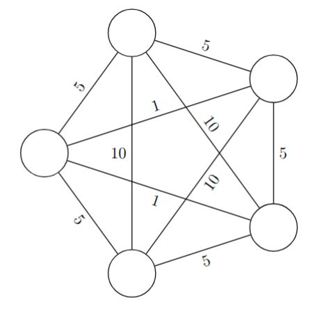
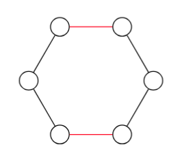
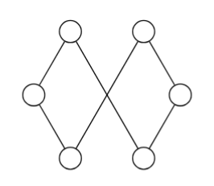
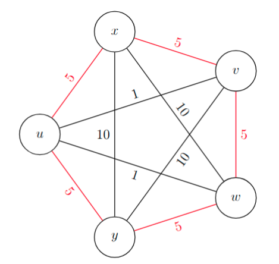
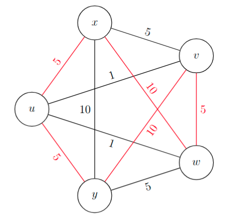
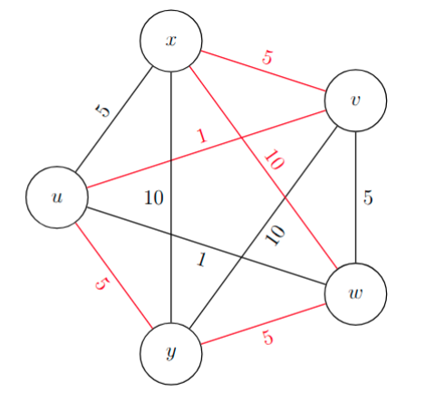
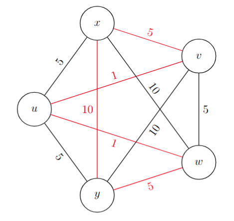

# Lokalna optimizacija

* Lokalna optimizacija je pristop, ki ga običajno uporabimo pri reševanju "težkih" problemov, npr. problema potujočega trgovca.

* **_Primer._**

  

* Za graf z $n$ vozlišči imamo $(n-1)!$ dopustnih rešitev.

  | $n$ | $(n-1)!$                     |
  | --- | ---------------------------- |
  | 5   | 24                           |
  | 10  | 3.6 &#8729; 105   |
  | 20  | 1.2 &#8729; 1017  |
  | 50  | 6.1 &#8729; 1062  |
  | 100 | 9.3 &#8729; 10155 |

* Ideja: iščemo "lokalne optimume" in upamo, da so tudi globalni optimumi.

---

# Relacija sosednosti

* **_Definicija._** Naj bo $X$ množica. Relacija $S \subseteq X \times X$ je _relacija sosednosti_, če je refleksivna ($\forall x \in X: \ x \, S \, x$) in simetrična ($\forall x, y \in S: (x \, S \, y \Rightarrow y \, S \, x)$).
  * Za element $x \in X$ je množica $S[x] := \lbrace y \in X \mid x \, S \, y \rbrace$ _soseščina_ elementa $x$.
  * Element $x \in X$ je _$S$-lokalni minimum_ (_$S$-lokalni maksimum_) funkcije $f: X \to \mathbb{R}$, če velja $\forall y \in S[x]: \ f(y) \ge f(x)$ ($\forall y \in S[x]: \ f(y) \le f(x)$).
* **_Definicija._** Relacija $S$ je _natančna_ za $f$, če je $S$-lokalni minimum tudi globalni minimum.

---

# Metoda za iskanje globalnih minimumov

* Izberemo naključen $x_0 \in X$, in nastavimo $i := 0$.
* Preverimo, če je $x_i$ $S$-lokalni minimum - če je, postopek končamo
* Sicer obstaja $x_{i+1} \in S[x_i]$, da $f(x_{i+1}) < f(x_i)$.
* Postavimo $i := i+1$ in ponavljamo.
* Če se postopek konča, smo našli $S$-lokalni minimum.
* Postopek večkrat ponovimo in izberemo najboljšega izmed dobljenih $S$-lokalnih minimumov.

---

# Primeri

* 1\. $X = \mathbb{R}^n$, izberemo $\epsilon > 0$. Naj bo $x \, S \, y \Leftrightarrow \Vert x - y \Vert < \epsilon$.
  * Relacija $S$ ni natančna za splošne $f$, je pa natančna za konveksne $f$.

* 2\. Množica dopustnih rešitev $D$ linearnega programa $\Pi$ je politop (angl. _polytope_).
  * Globalni minimum in maksimum sta dosežena na ekstremni točki, torej na oglišču.
  * Naj bo torej $X$ množica oglišč $D$ in definirajmo relacijo $S$ tako, da velja $x \, S \, y$ natanko tedaj, ko sta $x$ in $y$ na istem robu.
  * Prej opisana metoda za $S$ je ravno simpleksna metoda.
  * Relacija $S$ je natančna za ciljno funkcijo $\Pi$.

---

# Primer: najcenejše vpeto drevo

3\. $G = (V, E)$ povezan graf, $c : E \to \mathbb{R}$ uteži povezav.

* Naj bo $X$ množica (množic povezav $E' \subseteq E$) vpetih dreves $T = (V, E')$ v $G$ in $f(E') = \sum_{e \in E'} c(e)$ funkcija cene vpetega drevesa.
* To je **problem najcenejšega vpetega drevesa** - za reševanje lahko uporabimo Primov ali Kruskalov algoritem.
* Definiramo relacijo $S$, tako da velja $E'_1 \, S \, E'_2 \Leftrightarrow \vert E'_1 \oplus E'_2 \vert \le 2$.
* Relacija $S$ je natančna za $f$ (brez dokaza).

---

# Primer: problem potujočega trgovca

4\. **Problem potujočega trgovca:** $G = (V, E)$ povezan graf, $c : E \to \mathbb{R}$ uteži povezav.

* Naj bo $X$ množica Hamiltonovih ciklov v $G$ in $f(C) = \sum_{e \in C} c(e)$ funkcija cene Hamiltonovega cikla.
* Relacijo $S$ definiramo tako, da sta dva Hamiltonova cikla sosedna, če lahko "prevežemo" dve povezavi na ciklu.

  

  

  

  

  

  $S$

  

  

  

  

  

---

# Nenatančnost relacije

* Relacija $S$ **ni** natančna.
* Naj bo $G = K_n = (V, {V \choose 2})$, $u, v, w, x, y \in V$ in $C$ Hamiltonov cikel z $uv, uw, xy \not\in C$, $vw, ux, uy \in C$ ter

  $$
  \begin{aligned}
  \forall e \in C: \ c(e) &= 5 \\
  c(uv) = c(uw) &= 1 \\
  \forall e \not\in C \cup \lbrace uv, uw \rbrace: \ c(e) &= 10
  \end{aligned}
  $$

* Potem velja:

  $$
  \begin{aligned}
  f(C) &= 5n \\
  \forall C' \in S[C]: f(C') &= 5(n-2) + 2 \cdot 10 \lor f(C') = 5(n-2) + 10 + 1 \\
  \forall C' \in S[C]: f(C') &> f(C) \\
  f(C \oplus \lbrace ux, uy, vw, uv, uw, xy \rbrace) &= 5(n-3) + 10 + 2 \cdot 1 = 5n - 3 < f(C)
  \end{aligned}
  $$

* $C$ je torej $S$-lokalni minimum, ni pa tudi globalni minimum.

---

# Protiprimer

* Začetna rešitev:

  

  - Cena: 25

* Prva vrsta soseda:

  

  - Cena: 35

---

# Protiprimer (2)

* Druga vrsta soseda:

  

  - Cena: 26

* Optimalna rešitev:

  

  - Cena: 22

