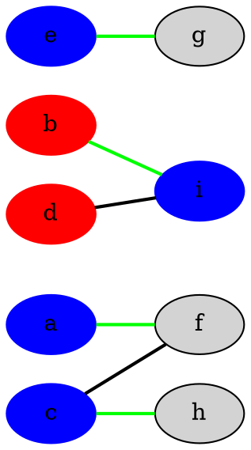
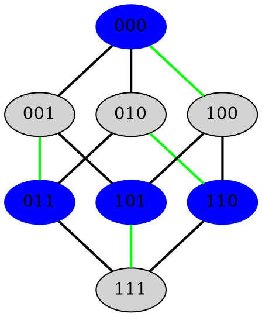
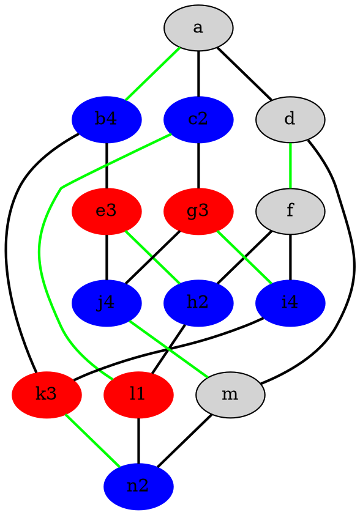
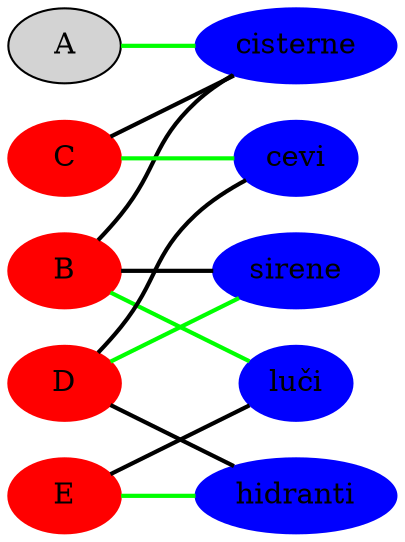
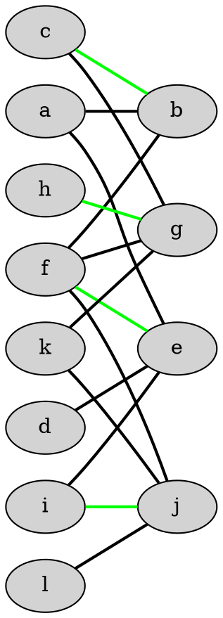
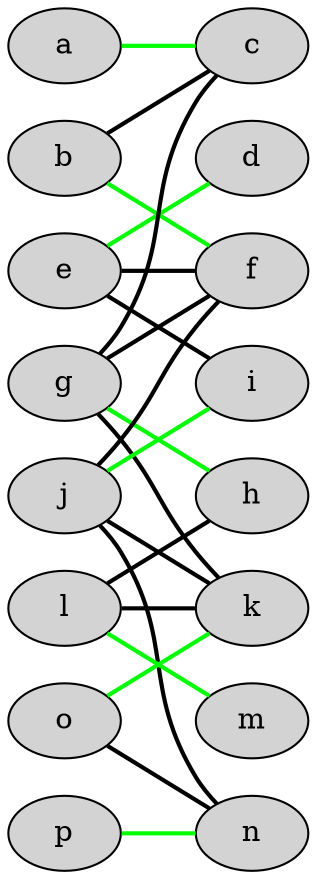
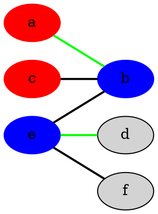
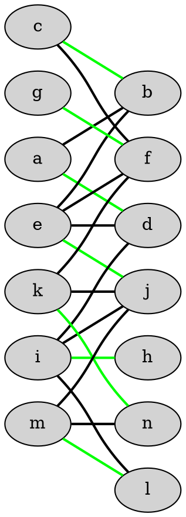

# Optimizacijske metode - vaje 10.4.2020

---

## Prirejanja v dvodelnih grafih

* dvodelen graf: <i>$G = (V, E)$</i> neusmerjen graf, <i>$V = A + B$</i>, <i>$uv \in E \Rightarrow u \in A, v \in B$</i>

* prirejanje: <i>$M \subseteq E$</i>, vsako vozlišče iz <i>$V$</i> se pojavi kot krajišče največ ene povezave iz <i>$M$</i>

* pokritje: <i>$C \subseteq V$</i>, vsaka povezava iz <i>$E$</i> ima vsaj eno krajišče iz <i>$C$</i>

* <i>$|M| \le |C|$</i>

* dvodelni grafi: <i>$M^*$</i> maksimalno prirejanje, <i>$C^*$</i> minimalno pokritje:

  $$
  |M^*| = |C^*|
  $$

---

### Naloga 1

Poišči največja prirejanja in najmanjša pokritja v danih dvodelnih grafih.

* Maksimalno prirejanje: <i>$M^* = \{af, bi, ch, eg\}$</i>
* Minimalno pokritje: <i>$C^* = \{a, c, e, i\}$</i>

----

* Maksimalno prirejanje: <i>$M^* = \{\{000, 100\}, \{001, 011\}, \{010, 110\}, \{101, 111\}\}$</i>
* Minimalno pokritje: <i>$C^* = \{000, 011, 101, 110\}$</i>

----

* Maksimalno prirejanje: <i>$M^* = \{ab, df, eh, gi, cl, jm, kn\}$</i>
* Minimalno pokritje: <i>$C^* = \{a, e, f, g, k, l, m\}$</i>

---

### Naloga 2

Gasilsko društvo v Spodnjem Birtniku je organizirano v več odborov. Predsednik odbora za cisterne je Anton, tajnik odbora je Bogdan, blagajnik pa Cene. Odboru za cevi predseduje Cene, blagajnik je David, tajnika pa odbor zaradi racionalizacije nima. V odboru za sirene si Bogdan predsedstvo deli z Davidom, v odboru za utripajoče luči pa z Evgenom. David in Evgen sta hkrati tudi predsednik in namestnik predsednika v odboru za hidrante.

Na redni letni skupščini se najprej izvoli delovno predsedstvo, v katerem mora vsak odbor imeti svojega predstavnika, nihče pa ne sme zastopati dveh odborov. Kdo naj predstavlja kateri odbor?

----

---

### Naloga 3

Katere izmed naslednjih plošč se da v celoti pokriti z dominami velikosti 1 × 2?

----

----

----

----

---

### Naloga 4

Sledečo dvojno stohastično matriko zapiši kot konveksno kombinacijo permutacijskih matrik:

$$
\begin{aligned}
\begin{pmatrix}
\fbox{0.3} & 0.4 & 0.1 & 0.2 \\
0.3 & 0.1 & \fbox{0.6} & 0   \\
0.3 & \fbox{0.4} & 0   & 0.3 \\
0.1 & 0.1 & 0.3 & \fbox{0.5}
\end{pmatrix} &= \\
0.3 \begin{pmatrix}
1 & 0 & 0 & 0 \\
0 & 0 & 1 & 0 \\
0 & 1 & 0 & 0 \\
0 & 0 & 0 & 1
\end{pmatrix}
+
\begin{pmatrix}
0   & \fbox{0.4} & 0.1 & 0.2 \\
\fbox{0.3} & 0.1 & 0.3 & 0   \\
0.3 & 0.1 & 0   & \fbox{0.3} \\
0.1 & 0.1 & \fbox{0.3} & 0.2
\end{pmatrix} &= \\
0.3 \begin{pmatrix}
1 & 0 & 0 & 0 \\
0 & 0 & 1 & 0 \\
0 & 1 & 0 & 0 \\
0 & 0 & 0 & 1
\end{pmatrix}
+
0.3 \begin{pmatrix}
0 & 1 & 0 & 0 \\
1 & 0 & 0 & 0 \\
0 & 0 & 0 & 1 \\
0 & 0 & 1 & 0
\end{pmatrix}
+
\begin{pmatrix}
0   & 0.1 & 0.1 & \fbox{0.2} \\
0   & 0.1 & \fbox{0.3} & 0   \\
\fbox{0.3} & 0.1 & 0   & 0   \\
0.1 & \fbox{0.1} & 0   & 0.2
\end{pmatrix} &= \\
0.3 \begin{pmatrix}
1 & 0 & 0 & 0 \\
0 & 0 & 1 & 0 \\
0 & 1 & 0 & 0 \\
0 & 0 & 0 & 1
\end{pmatrix}
+
0.3 \begin{pmatrix}
0 & 1 & 0 & 0 \\
1 & 0 & 0 & 0 \\
0 & 0 & 0 & 1 \\
0 & 0 & 1 & 0
\end{pmatrix}
&+ \\
+
0.1 \begin{pmatrix}
0 & 0 & 0 & 1 \\
0 & 0 & 1 & 0 \\
1 & 0 & 0 & 0 \\
0 & 1 & 0 & 0
\end{pmatrix}
+
\begin{pmatrix}
0   & \fbox{0.1} & 0.1 & 0.1 \\
0   & 0.1 & \fbox{0.2} & 0   \\
\fbox{0.2} & 0.1 & 0   & 0   \\
0.1 & 0   & 0   & \fbox{0.2}
\end{pmatrix} &= \\
0.3 \begin{pmatrix}
1 & 0 & 0 & 0 \\
0 & 0 & 1 & 0 \\
0 & 1 & 0 & 0 \\
0 & 0 & 0 & 1
\end{pmatrix}
+
0.3 \begin{pmatrix}
0 & 1 & 0 & 0 \\
1 & 0 & 0 & 0 \\
0 & 0 & 0 & 1 \\
0 & 0 & 1 & 0
\end{pmatrix}
+
\begin{pmatrix}
0   & 0.1 & 0.1 & \fbox{0.2} \\
0   & 0.1 & \fbox{0.3} & 0   \\
\fbox{0.3} & 0.1 & 0   & 0   \\
0.1 & \fbox{0.1} & 0   & 0.2
\end{pmatrix} &= \\
0.3 \begin{pmatrix}
1 & 0 & 0 & 0 \\
0 & 0 & 1 & 0 \\
0 & 1 & 0 & 0 \\
0 & 0 & 0 & 1
\end{pmatrix}
+
0.3 \begin{pmatrix}
0 & 1 & 0 & 0 \\
1 & 0 & 0 & 0 \\
0 & 0 & 0 & 1 \\
0 & 0 & 1 & 0
\end{pmatrix}
+
0.1 \begin{pmatrix}
0 & 0 & 0 & 1 \\
0 & 0 & 1 & 0 \\
1 & 0 & 0 & 0 \\
0 & 1 & 0 & 0
\end{pmatrix}
&+ \\
+
0.1 \begin{pmatrix}
0 & 1 & 0 & 0 \\
0 & 0 & 1 & 0 \\
1 & 0 & 0 & 0 \\
0 & 0 & 0 & 1
\end{pmatrix}
+
\begin{pmatrix}
0   & 0   & 0.1 & \fbox{0.1} \\
0   & 0.1 & \fbox{0.1} & 0   \\
0.1 & \fbox{0.1} & 0   & 0   \\
\fbox{0.1} & 0   & 0   & 0.1
\end{pmatrix} &= \\
0.3 \begin{pmatrix}
1 & 0 & 0 & 0 \\
0 & 0 & 1 & 0 \\
0 & 1 & 0 & 0 \\
0 & 0 & 0 & 1
\end{pmatrix}
+
0.3 \begin{pmatrix}
0 & 1 & 0 & 0 \\
1 & 0 & 0 & 0 \\
0 & 0 & 0 & 1 \\
0 & 0 & 1 & 0
\end{pmatrix}
+
0.1 \begin{pmatrix}
0 & 0 & 0 & 1 \\
0 & 0 & 1 & 0 \\
1 & 0 & 0 & 0 \\
0 & 1 & 0 & 0
\end{pmatrix}
&+ \\
+
0.1 \begin{pmatrix}
0 & 1 & 0 & 0 \\
0 & 0 & 1 & 0 \\
1 & 0 & 0 & 0 \\
0 & 0 & 0 & 1
\end{pmatrix}
+
0.1 \begin{pmatrix}
0 & 0 & 0 & 1 \\
0 & 0 & 1 & 0 \\
0 & 1 & 0 & 0 \\
1 & 0 & 0 & 0
\end{pmatrix}
+
0.1 \begin{pmatrix}
0   & 0   & 1   & 0   \\
0   & 1   & 0   & 0   \\
1   & 0   & 0   & 0   \\
0   & 0   & 0   & 1
\end{pmatrix} &
\end{aligned}
$$

---

### Naloga 5

Dopolni spodnji kvadrat tako, da bodo v vsaki vrstici in v vsakem stolpcu vsa števila od <i>$1$</i> do <i>$9$</i>.

|   |   |   |   |   |   |   |   |   |
| - | - | - | - | - | - | - | - | - |
| 2 | 4 | 9 | 8 | 7 | 5 | 3 | 1 | 6 |
| 4 | 1 | 6 | 9 | 3 | 2 | 7 | 8 | 5 |
| 9 | 7 | 2 | 1 | 8 | 4 | 5 | 6 | 3 |
| 1 | 2 | 3 | 4 | 5 | 6 | 9 | 7 | 8 |
| 6 | 9 | 1 | 2 | 4 | 3 | 8 | 5 | 7 |
| 7 | 3 | 5 | 6 | 1 | 8 | 4 | 2 | 9 |
| 3 | 6 | 8 | 5 | 9 | 7 | 1 | 4 | 2 |
| 8 | 5 | 4 | 7 | 6 | 9 | 2 | 3 | 1 |
| 5 | 8 | 7 | 3 | 2 | 1 | 6 | 9 | 4 |

