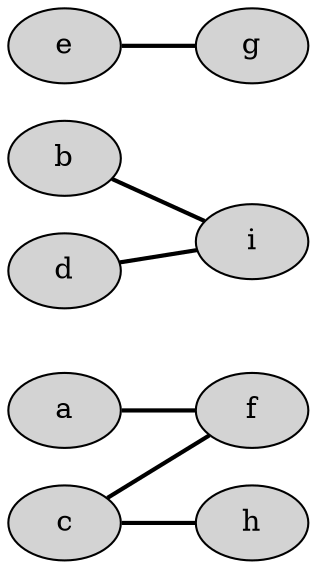
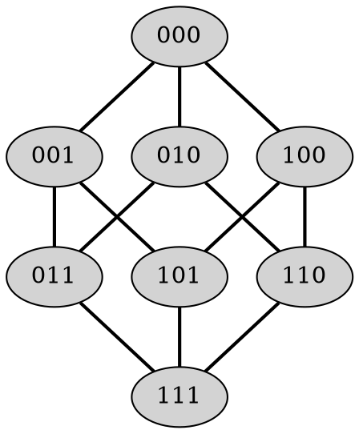
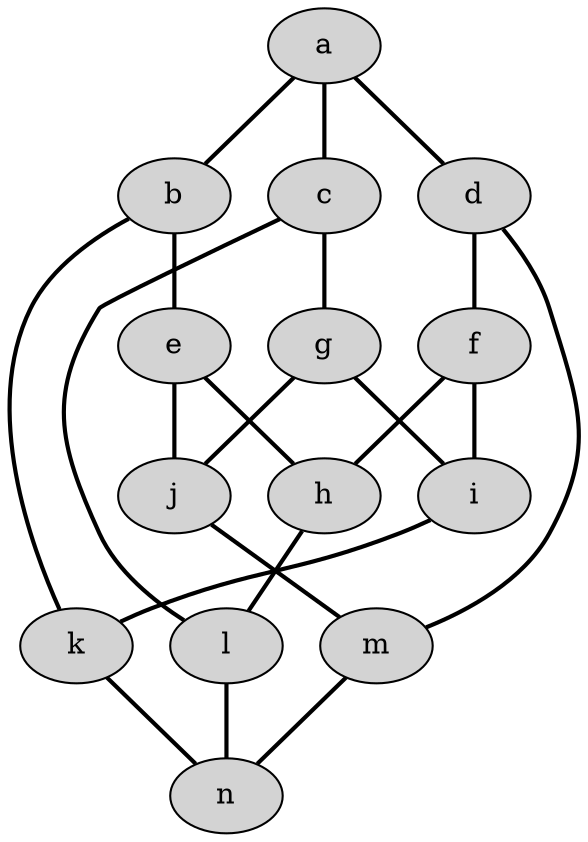

# Optimizacijske metode - vaje 10.4.2020

---

## Prirejanja v dvodelnih grafih

### Naloga 1

Poišči največja prirejanja in najmanjša pokritja v danih dvodelnih grafih.

----

----

---

### Naloga 2

Gasilsko društvo v Spodnjem Birtniku je organizirano v več odborov. Predsednik odbora za cisterne je Anton, tajnik odbora je Bogdan, blagajnik pa Cene. Odboru za cevi predseduje Cene, blagajnik je David, tajnika pa odbor zaradi racionalizacije nima. V odboru za sirene si Bogdan predsedstvo deli z Davidom, v odboru za utripajoče luči pa z Evgenom. David in Evgen sta hkrati tudi predsednik in namestnik predsednika v odboru za hidrante.

Na redni letni skupščini se najprej izvoli delovno predsedstvo, v katerem mora vsak odbor imeti svojega predstavnika, nihče pa ne sme zastopati dveh odborov. Kdo naj predstavlja kateri odbor?

---

### Naloga 3

Katere izmed naslednjih plošč se da v celoti pokriti z dominami velikosti 1 × 2?

---

### Naloga 4

Sledečo dvojno stohastično matriko zapiši kot konveksno kombinacijo permutacijskih matrik:

$$
\begin{pmatrix}
0.3 & 0.4 & 0.1 & 0.2 \\
0.3 & 0.1 & 0.6 & 0   \\
0.3 & 0.4 & 0   & 0.3 \\
0.1 & 0.1 & 0.3 & 0.5
\end{pmatrix}
$$

---

### Naloga 5

Dopolni spodnji kvadrat tako, da bodo v vsaki vrstici in v vsakem stolpcu vsa števila od <i>$1$</i> do <i>$9$</i>.

|   |   |   |   |   |   |   |   |   |
| - | - | - | - | - | - | - | - | - |
| 2 | 4 | 9 | 8 | 7 | 5 | 3 | 1 | 6 |
| 4 | 1 | 6 | 9 | 3 | 2 | 7 | 8 | 5 |
| 9 | 7 | 2 | 1 | 8 | 4 | 5 | 6 | 3 |
| 1 |   |   |   |   |   |   |   |   |
| 6 |   |   |   |   |   |   |   |   |
| 7 |   |   |   |   |   |   |   |   |
| 3 |   |   |   |   |   |   |   |   |
| 8 |   |   |   |   |   |   |   |   |
| 5 |   |   |   |   |   |   |   |   |
